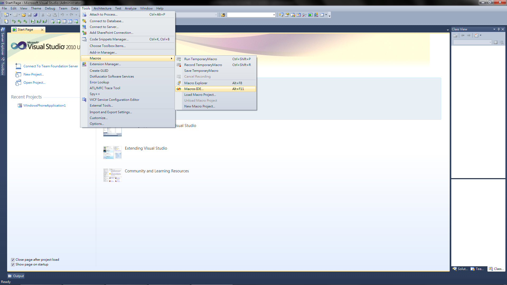
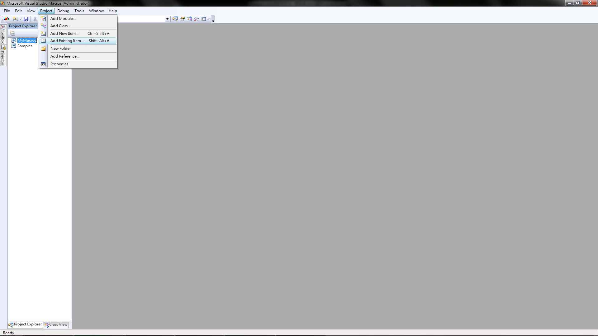
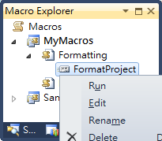
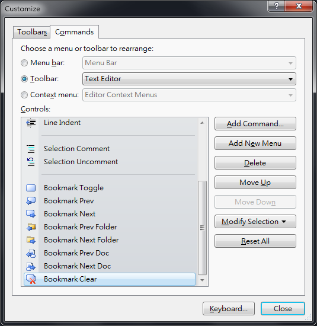
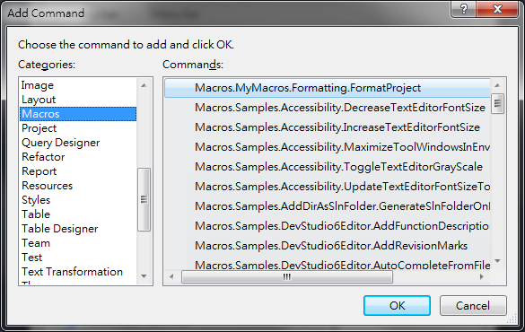
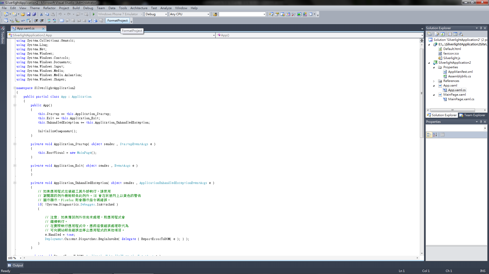

上篇講到了怎麼做 Source Code 的自動格式化，但是用內建的功能，其實有個不太方便的地方 -- 一次只能格式化一個檔案，這個問題對於我來說就頭很大了，通常一個專案不太可能只有兩三個檔，動不動就要每個檔案都開來自動格式化一下也是很累人而且浪費時間的一件事，這時候，整個專案裡面的檔案都可以自動格式化的功能就變成是必備的了!!

<!--truncate-->

有這種東西嗎??當然有，不然寫這篇幹嘛，不過 Visual Studio 並沒有內建這個功能。

很好運的，有個佛心來的外國人幫我們寫好這個功能的巨集，該巨集的網址為：<http://github.com/timabell/vs-formatter-macro>

只要下載 Formatting.vb 檔，並且使用 Visual Studio 的巨集編輯功能，將其匯入，就可以更輕鬆的做 Source Code 自動格式化的工作啦，操作步驟如下：

1. 點選 **`Tools`** -> **`Macros`** -> **`Macros IDE*`**
   

2. 點選 **`Project Explorer`** 中的 **`MyMacors`** ，再點選 **`Project`** -> **`Add Existing Item`**
   

3. 於檔案選取視窗中選擇 Formatting.vb 檔，並按下 Add 鈕，完畢之後，點選 **`Tools`** -> **`Macros`** -> **`Macro Explorer`** (快捷鍵 **`Alt+F8`** )，如果看到 Macro Explorer 中有出現剛剛新增的巨集，就代表成功匯入巨集了。

4. 要執行該巨集，只需要在巨集上按下右鍵，選擇 Run 即可。
   

5. 額外附送，利用自訂工具列的功能執行該巨集：點選 **`Tools`** -> **`Customize`** -> **`Commands`** 頁籤 -> **`Toolbar`** -> **`Text Editor`**
   

6. 點選 **`Add Command`** 按鈕，在 **`Categories清單`** 中的 **`Macros`** ，並選取 **`Commands清單`** 中的 **`Macros.MyMacros.Formatting.FormatProject`** 項目，再來按下 OK。
   

7. 最後可依個人喜好使用 Move Up/Move Down 或 Modify Selection 按鈕來調整巨集按鈕的位置，就大功告成啦!!以後只要按下該按鈕，就可以一次格式化整個專案喔!!
   
