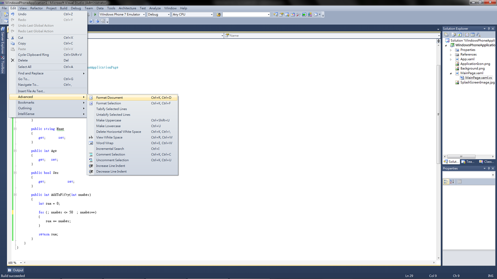
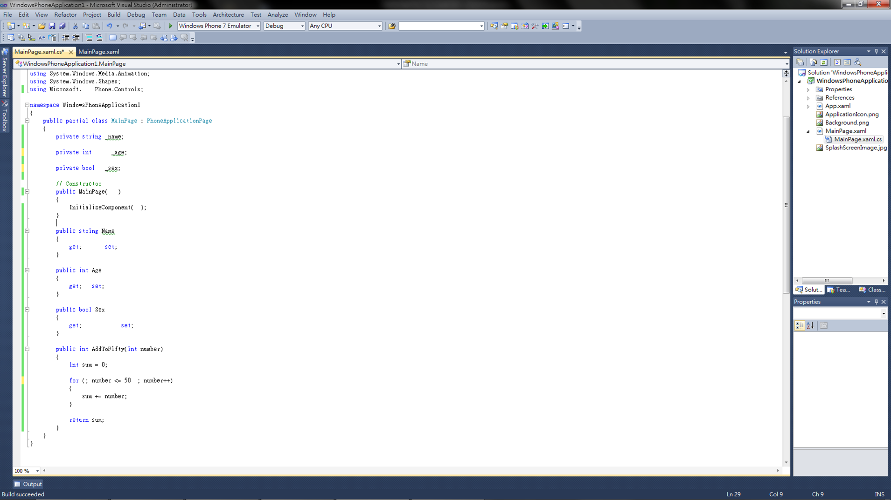
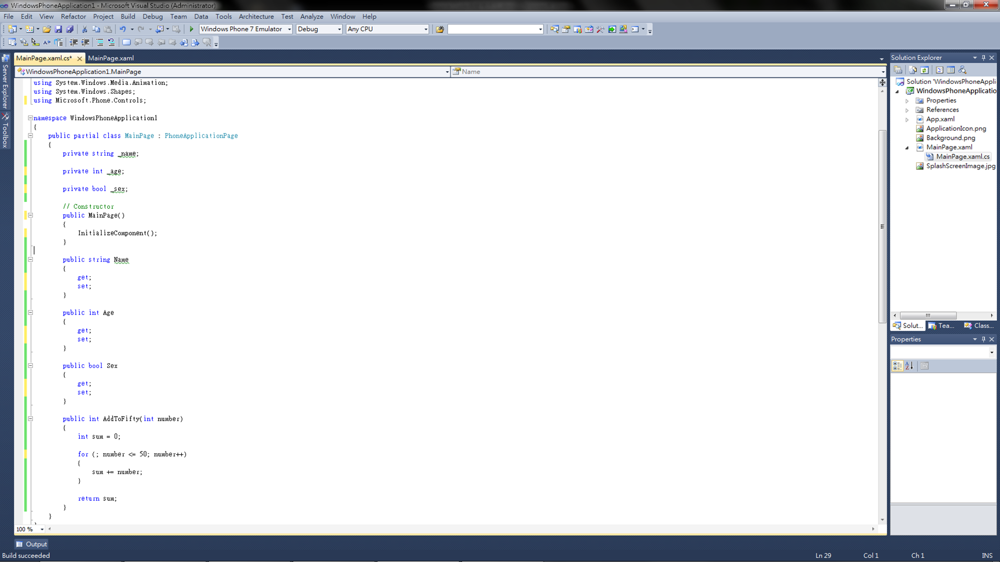
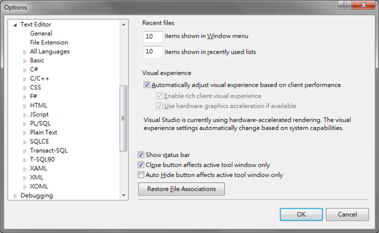
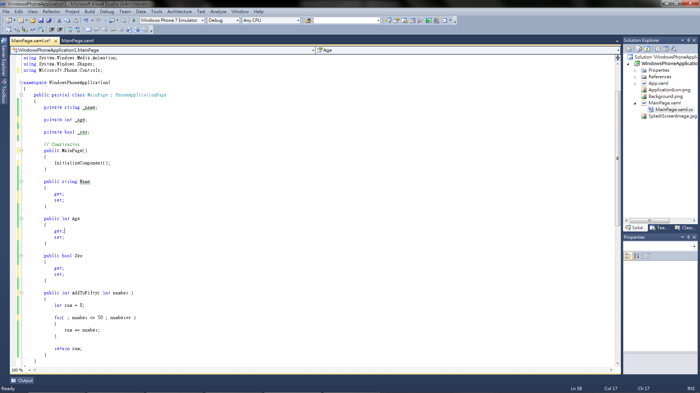
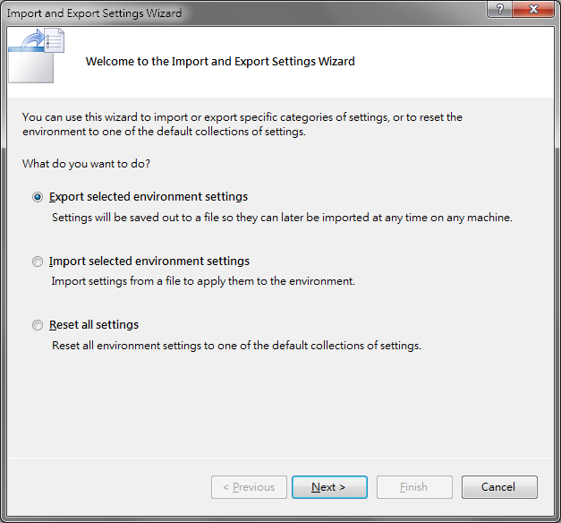
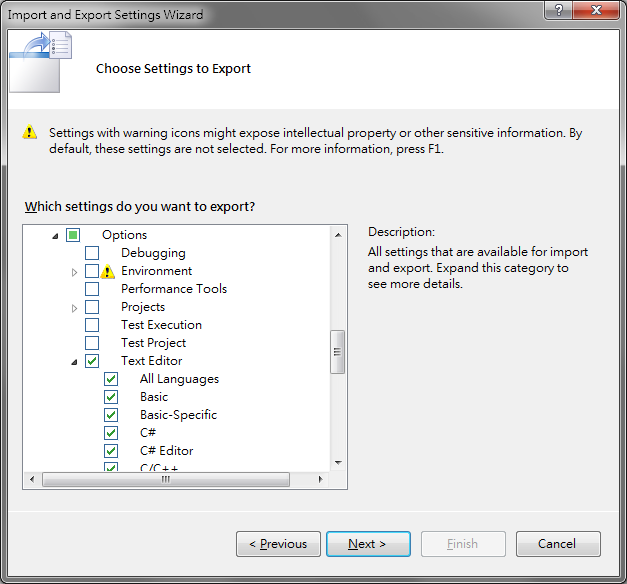
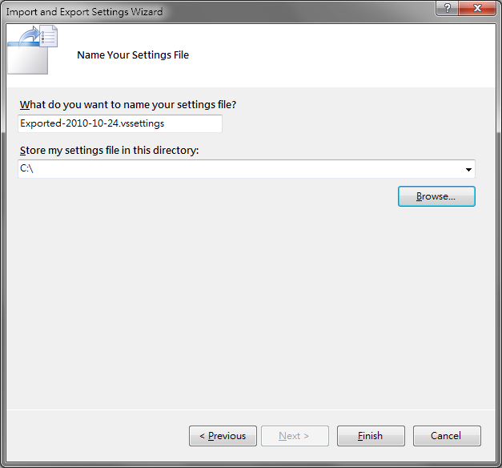

通常自己一個人在寫 Code 的時候，想怎麼編排就怎麼排，自己看得懂、看得開心就好；但是遇到多人協力開發的專案，程式碼可能會來自不同的人手上，如果沒有事先規範好程式碼的編排規則的話，那讀別人的 Code 就會很吃力了，更別說要接手下去改，這個時候， Visual Studio 內建的格式化工具就很管用了。

<!--truncate-->

而使用內建的格式化工具的方式非常的簡單，只要點選 **`Edit`** -> **`Advanced`** -> **`Format Document`** (快捷鍵為 **`Ctrl+K`** -> **`Ctrl+D`** )就可以啦。

有圖有真相，讓大家看看整容前和整容後的程式碼。

整容前：

整容後：

是不是完全不費吹灰之力呢?

不過!!!!

戲還沒唱完，只介紹這樣的功能就真的太虛了，你可能會說，可是他自動排版出來的樣子跟原來習慣的排版格式和我們組規定的格式差太多了啊!!

沒關係，自動排版的格式是可以設定的，只要選取 **`Tools`** -> **`Options...`** ->在 Options 視窗中 **`展開 Text Editor`** 選項，你就會看到如下的畫面：

是什麼巫術!!?

沒錯，各種語言的排版格式都是可以設定的，你可以針對不同的語言，設定它的排版規則，比較基本的例如大括弧是不是要換行、變數的對齊方式、細到連 for 迴圈裡面分號和條件式之間是否要空格、變數和運算符號間是否要空格都可以設定。

設定好成為你要的格式規則之後，按下 OK 鈕，再來個 **`Ctrl+K`** -> **`Ctrl+D`** ，噹噹!!就變成你要的格式了吧!!

下圖就是我個人習慣使用的格式。

有的人會說，難道我不能用自己喜歡的方式排版，等到要傳給別人或是要上傳到 Source Control 的時候再重新排嗎?

當然可以!!可是每次都要這樣改規則，不是很累嗎?這時候，就又可以利用設定檔的匯入/匯出功能啦!!

只要選取 **`Tools`** -> **`Import and Export Settings...`** 就會看到如下的視窗：

現在就可以依照不同的需求，進行匯入/匯出的工作，選擇匯入或匯出之後，會看到如下的畫面，可以依照自己的需求去選取要匯入/匯出的設定部份，這邊我們就只要勾選 Options 下面的 Text Editor 項目就可以把排版格式的部份匯出囉。

按下下一步按鈕之後，輸入要存檔的檔名和路徑就大功告成啦!!

匯入/匯出設定檔的功能其實在很多地方是很好用的，例如說，你工作的小組希望有一致的 Coding Style ，那只要把設定檔提供給大家匯入，就可以不費吹灰之力做到囉!!
