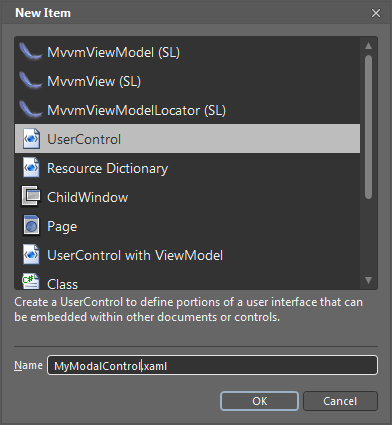
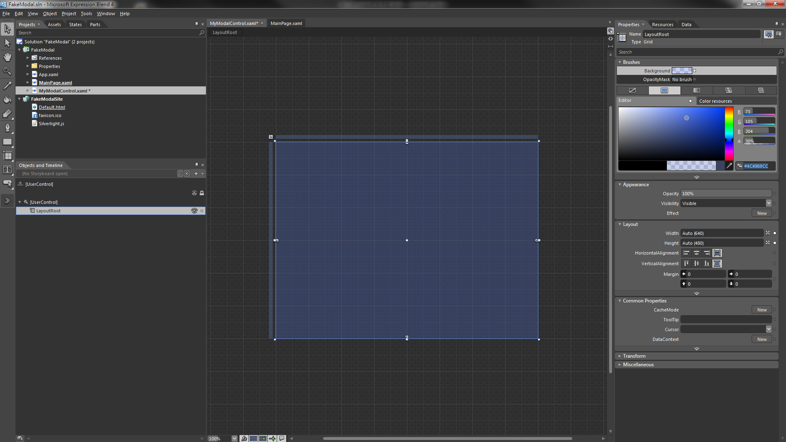
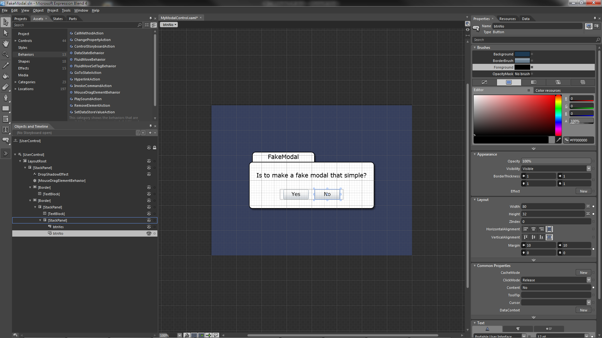
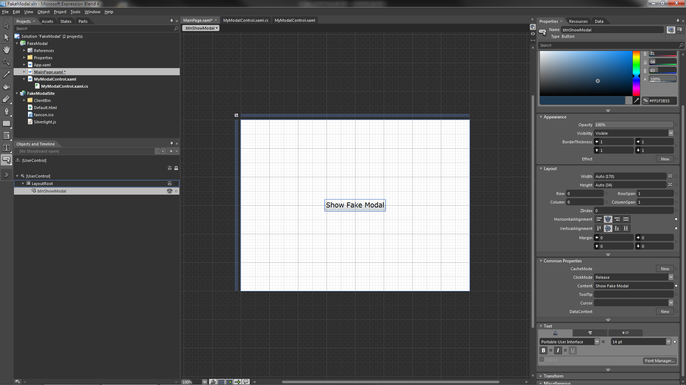
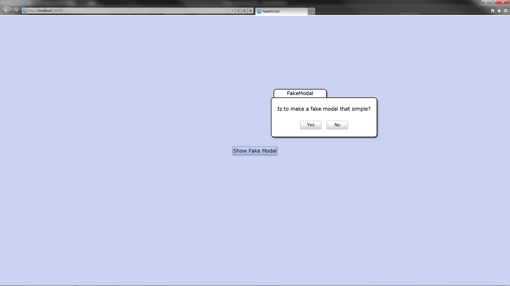

有使用過 Silverlight/WPF 的朋友們不知道有沒有遇過一個問題：有時候想要跳出一個元件跟使用者互動，而且要鎖住原來的主畫面，等使用者操作完才能繼續操作主畫面，可是用 MessageBox 的話功能不夠，用 ChildWindow 的話功能又太多或是太複雜之類的問題...

<!--truncate-->

難道就不能自訂一個元件，當它顯示的時候，會自動讓主畫面被鎖住，而且該元件的外觀和操作方式都可以自訂嗎?其實只要善用 Grid 容器，就可以簡單的做到這個功能喔!!

方法如下：

## 步驟一

首先我們打開一個標準的 Silverlight+Web 專案( WPF 也可以喔)，接著增加一個 UserControl (範例中取名為 MyModalControl )。



接著修改 MyModalControl.xaml 的內容，將 `控制項本身` 與 LayoutRoot 這個 Grid 的 `寬和高都設為 Auto`。

## 步驟二

修改 `LayoutRoot` 的 `背景色為 #4C4969CC`(透明度為 30%)



## 步驟三

放置要和使用者互動的元件，為了精簡教學過程，怎麼做的這邊就不詳述，完成後如下圖。



## 步驟四

加入按鈕的 Click 事件，並加入移除這個控制項的程式碼，完成後的 xaml 與 cs 檔如下：

```xml
<UserControl x:Class="FakeModal.MyModalControl"
             xmlns="http://schemas.microsoft.com/winfx/2006/xaml/presentation"
             xmlns:x="http://schemas.microsoft.com/winfx/2006/xaml"
             xmlns:d="http://schemas.microsoft.com/expression/blend/2008"
             xmlns:ei="http://schemas.microsoft.com/expression/2010/interactions"
             xmlns:i="http://schemas.microsoft.com/expression/2010/interactivity"
             xmlns:mc="http://schemas.openxmlformats.org/markup-compatibility/2006"
             d:DesignHeight="480"
             d:DesignWidth="640"
             mc:Ignorable="d">
<Grid x:Name="LayoutRoot"
          Background="#4C4969CC">
<StackPanel HorizontalAlignment="Center"
                    VerticalAlignment="Center">
<StackPanel.Effect>
<DropShadowEffect Opacity="0.5" />
</StackPanel.Effect>
<i:Interaction.Behaviors>
<ei:MouseDragElementBehavior ConstrainToParentBounds="True" />
</i:Interaction.Behaviors>
<Border Width="200"
                    Height="32"
                    Margin="10,0,0,0"
                    HorizontalAlignment="Left"
                    Background="White"
                    BorderBrush="Black"
                    BorderThickness="2,2,2,0"
                    CornerRadius="10,10,0,0">
<TextBlock HorizontalAlignment="Center"
                           VerticalAlignment="Center"
                           FontSize="18.667"
                           Text="FakeModal"
                           TextWrapping="Wrap" />
</Border>
<Border Width="400"
                    Height="150"
                    Background="White"
                    BorderBrush="Black"
                    BorderThickness="2"
                    CornerRadius="10">
<StackPanel HorizontalAlignment="Center"
                            VerticalAlignment="Center">
<TextBlock Margin="0"
                               FontSize="18.667"
                               Text="Is to make a fake modal that simple?"
                               TextWrapping="Wrap" />
<StackPanel Margin="0,30,0,0"
                                HorizontalAlignment="Center"
                                VerticalAlignment="Center"
                                Orientation="Horizontal">
<Button x:Name="btnYes"
                                Width="80"
                                Height="32"
                                Margin="10,0"
                                Click="btnYes_Click"
                                Content="Yes"
                                FontSize="16" />
<Button x:Name="btnNo"
                                Width="80"
                                Height="32"
                                Margin="10,0"
                                Click="btnNo_Click"
                                Content="No"
                                FontSize="16" />
</StackPanel>
</StackPanel>
</Border>
</StackPanel>
</Grid>
</UserControl>
```

```csharp
using System.Windows.Controls;

namespace FakeModal
{
public partial class MyModalControl : UserControl
{
public MyModalControl()
{
InitializeComponent();
}

     private void btnYes_Click(object sender, System.Windows.RoutedEventArgs e)
     {
      //you can do something here.
      (this.Parent as Panel).Children.Remove(this);
     }

     private void btnNo_Click(object sender, System.Windows.RoutedEventArgs e)
     {
      //you can do something here.
      (this.Parent as Panel).Children.Remove(this);
     }
    }

}
```

## 步驟五

到這邊就算是完成啦，再來就是讓它上場表演的時候了，在 MainPage.xaml 放一個 Button 叫它出來吧!!



```xml
<UserControl x:Class="FakeModal.MainPage"
             xmlns="http://schemas.microsoft.com/winfx/2006/xaml/presentation"
             xmlns:x="http://schemas.microsoft.com/winfx/2006/xaml"
             Width="Auto"
             Height="Auto">

    <Grid x:Name="LayoutRoot"
          Background="White">
        <Button x:Name="btnShowModal"
                HorizontalAlignment="Center"
                VerticalAlignment="Center"
                Click="btnShowModal_Click"
                Content="Show Fake Modal"
                FontSize="18.667" />
    </Grid>

</UserControl>
```

```csharp
using System.Windows.Controls;

namespace FakeModal
{
public partial class MainPage : UserControl
{
public MainPage()
{
InitializeComponent();
}

     private void btnShowModal_Click(object sender, System.Windows.RoutedEventArgs e)
     {
      this.LayoutRoot.Children.Add( new MyModalControl());
     }
    }

}
```

大功告成!!



專案原始碼：
[](https://github.com/Ouch1978/Samples/tree/master/SL_FakeModal)

專案打包下載：
[](silverlight-fake-modal-dialog.rar)
