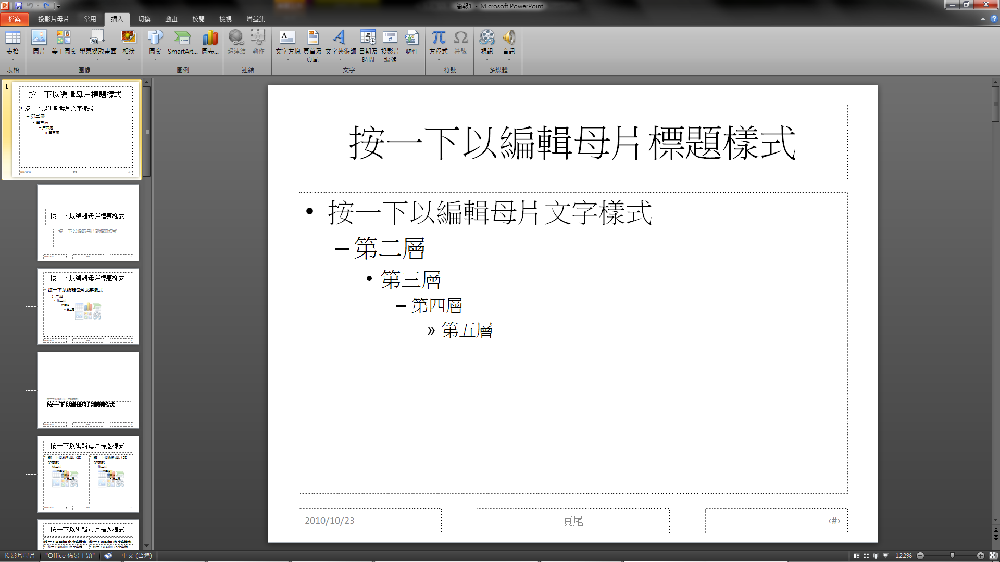
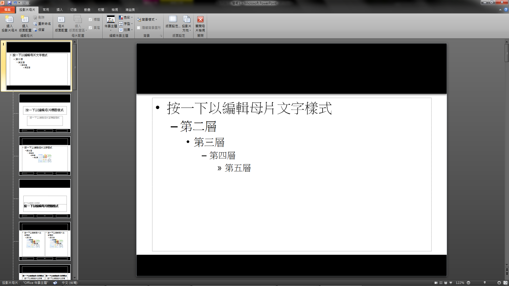
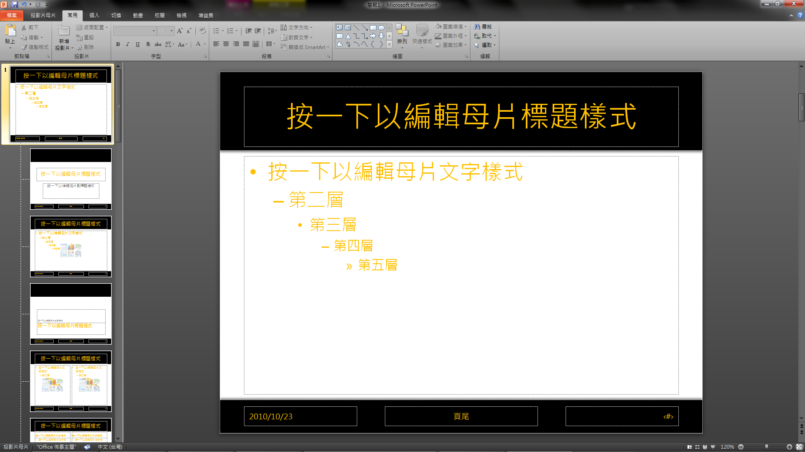
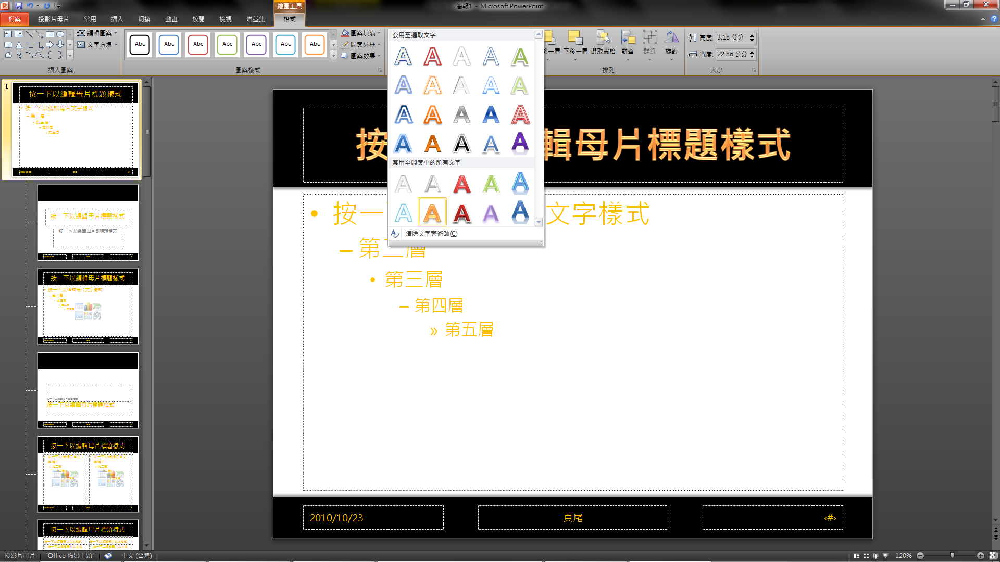
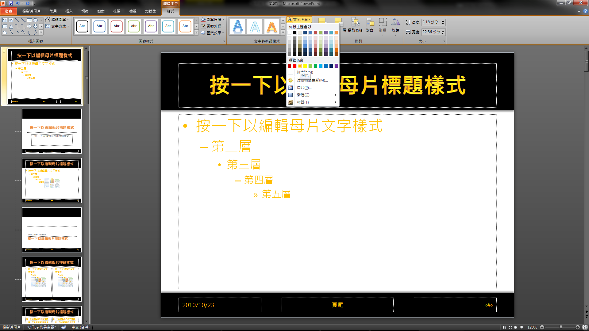
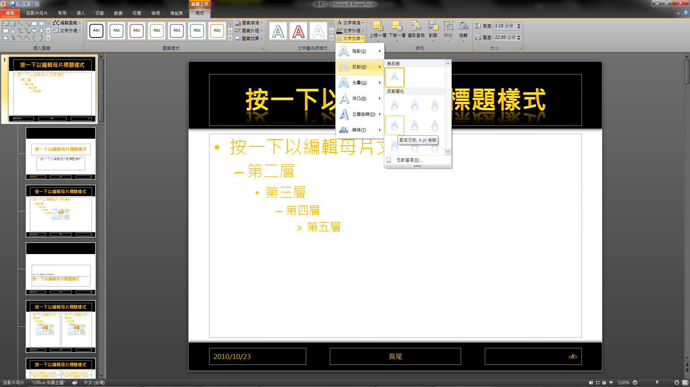
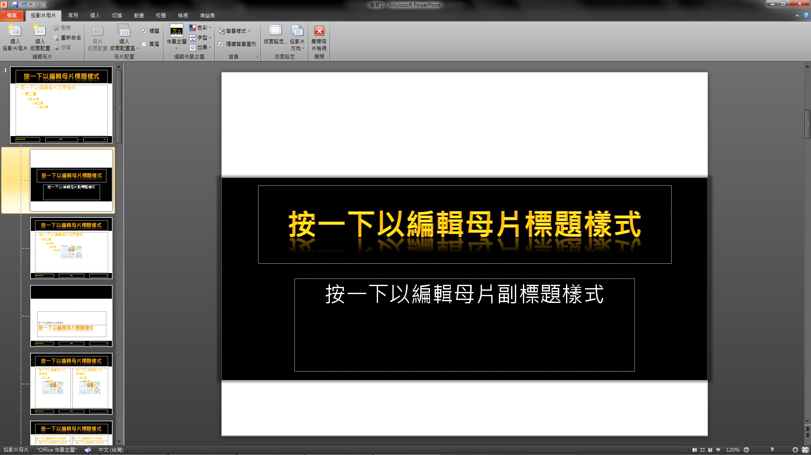
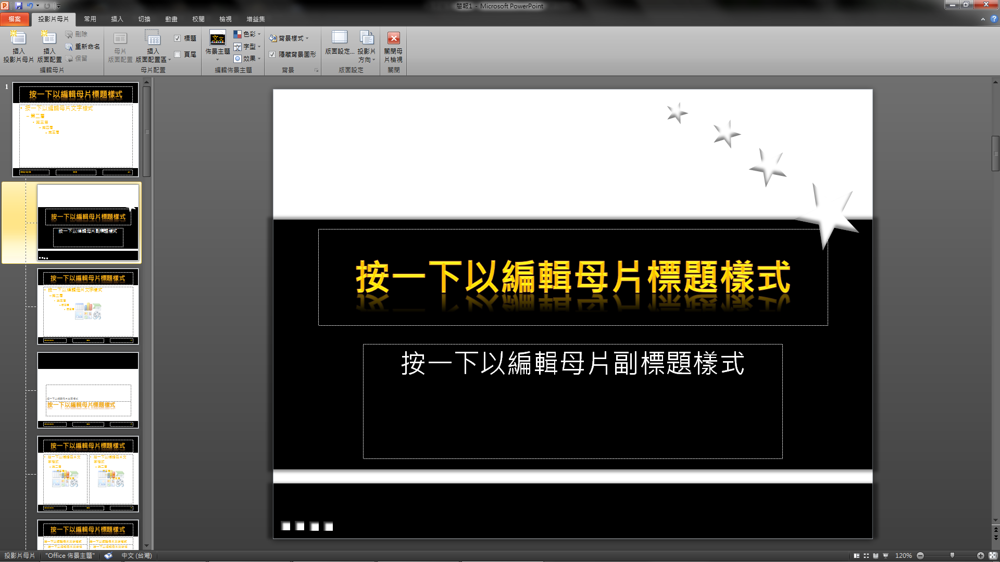
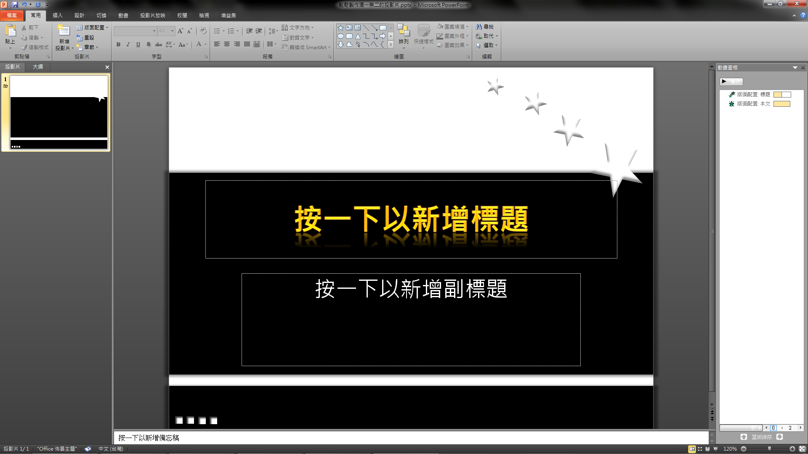
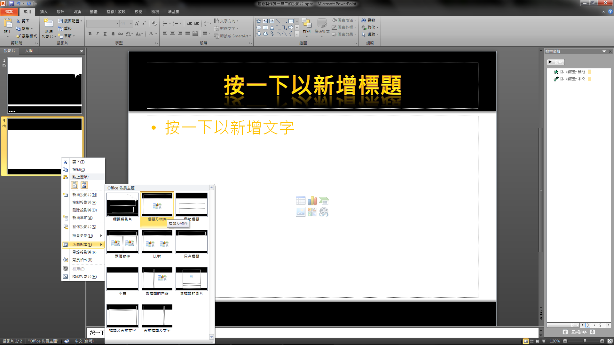

相信 Power Point 大家都會用，但是真的要自己從無到有，`不使用任何別人做好的樣板或是美工圖片`，快速的製作出一份「看起來」有一定的專業程度的簡報，應該就會難倒某些人吧!?

其實沒那麼難，只要善用母片編輯的功能，再改變一下製作投影片的習慣，就可以輕鬆辦到囉!!

<!--truncate-->

進入投影片母片的編輯的方法是：按下工具列的「**`檢視`**」 -> 「**`投影片母片`**」按鈕。

進入母片編輯模式後，原來在左邊的投影片縮圖窗格會變成如下的樣子。

左邊最上面那張比較大的投影片，就是投影片的母片，也就是說，在他下面的投影片，都會繼承它的長相和屬性；而在它下面的，則是提供不同用途使用的各種版面配置，例如投影片標題頁、章節標題頁，以及內容頁面等等。

請記得一個重點「**`一切都從母片開始`**」。所以先點選母片，開始來進行美化吧!!

我們先使用矩形工具(「**`插入`**」 -> 「**`圖案`**」 -> 「**`矩形`**」)，在母片上加入兩個黑色的矩形，分別位於標題和頁尾處，如下圖。

再來**`分別將兩個矩形加入陰影特效`**，上面的矩形加入下陰影，下面的加入上陰影，並且**`將兩個矩形移到最下層`**(在**`矩形上按滑鼠右鍵`**，點選「**`移到最下層`**」)

以讓標題和頁尾不會被蓋住。

接著按下**`Ctrl+A`**鍵，將畫面上的物件全選起來，進行**`字型更改`**的動作，將**`文字設定為橘色`**，並且**`使用微軟正黑體`**，如下圖。

再來**`使用文字藝術師`**的功能，把標題改成有鍍金質感的感覺。

這樣其實還不太像金色，把**`文字的填滿色改為橙色`**就可以得到如下圖的效果了。

接著把標題文字加入**`倒影`**的特效，讓它更炫一點，如下圖。

整個母片的編輯到這個地方算是完成了一半，再來就可以針對標題頁和內容頁的樣版和動畫下手了。

基於龜毛的個性，我想要標題頁和內頁是有所不同的，所以我們來對標題頁進行編輯。

首先**`點選左邊的標題投影片樣版`**，再於**`投影片母片頁籤`**中**`將頁尾的打勾取消`，**以及**`將隱藏背景圖形勾選起來`**。

再來使用先前用過的矩形工具，再**`加入一個矩形`**並將他**`移到最下層`**當背景(若想增加層次感，一樣可以加入陰影特效)，如下圖。

如果覺得畫面單調，可以再使用插入圖案的功能，做出一些變化。

最後就是進行動畫的設定了，我們只要**`在每種頁面樣版中設定好動畫`**，正式製作投影片時所有的頁面就都會自動套上動畫喔!!(這邊非常的重要，我發現很多人在製作投影片的時候，動畫都是一頁一頁去設定，這樣太累了，而且也容易讓每頁看起來不一致)

都編輯好之後，就可以結束母片編輯模式(**`投影片母片頁籤`** -> **`關閉母片檢視`**)，享受剛才辛苦的成果啦!!

接下來只要在每個區塊輸入我們想呈現的文字，就可以輕鬆做完整份投影片囉!!

如果想改變投影片使用的樣版，可以在**`投影片上按下滑鼠右鍵`** -> **`版面配置`**，來快速的進行樣版的切換，大功告成啦!!

這次的教學到此結束，希望對大家有所幫助喔!!
