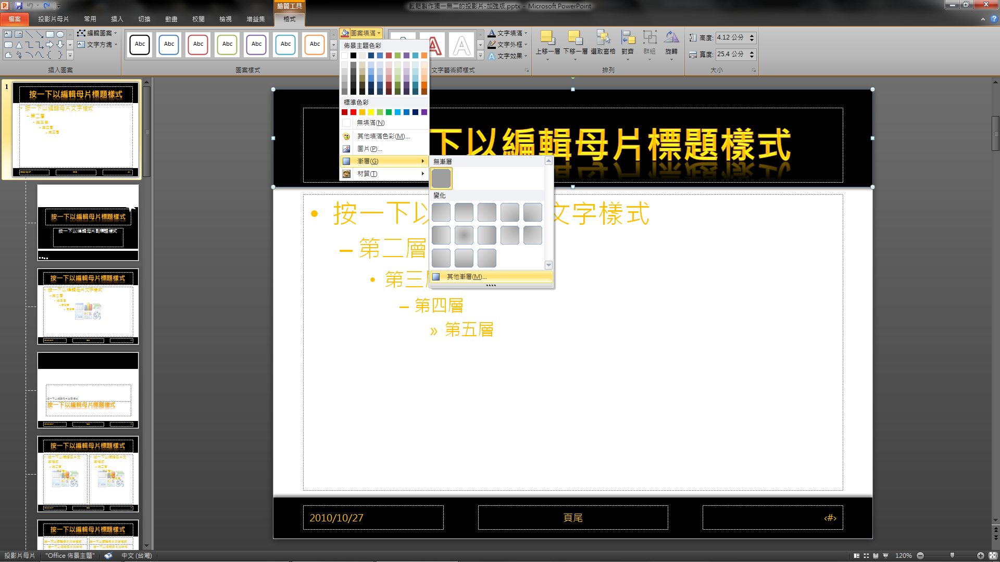
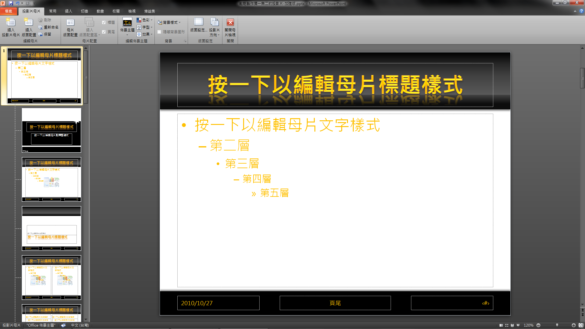
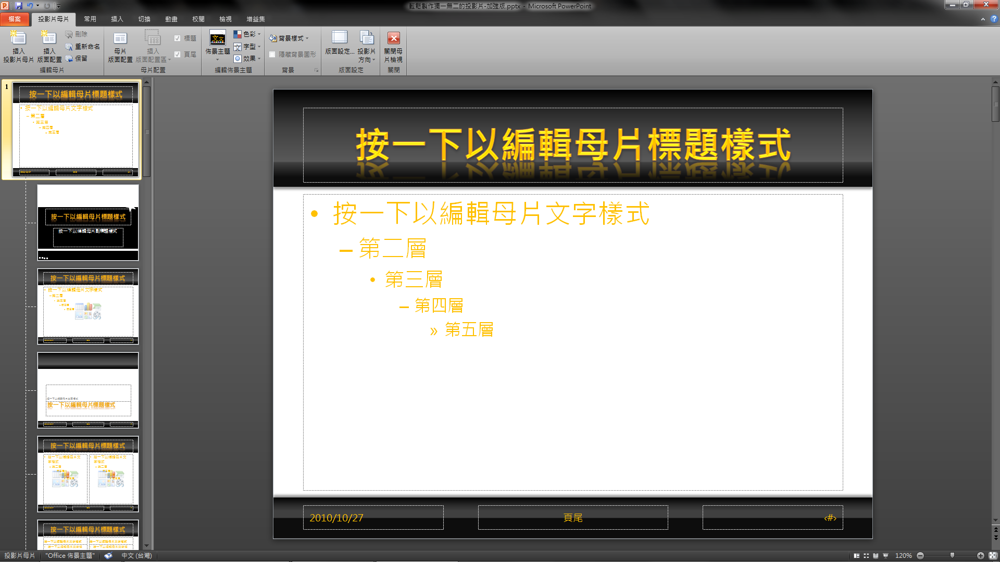
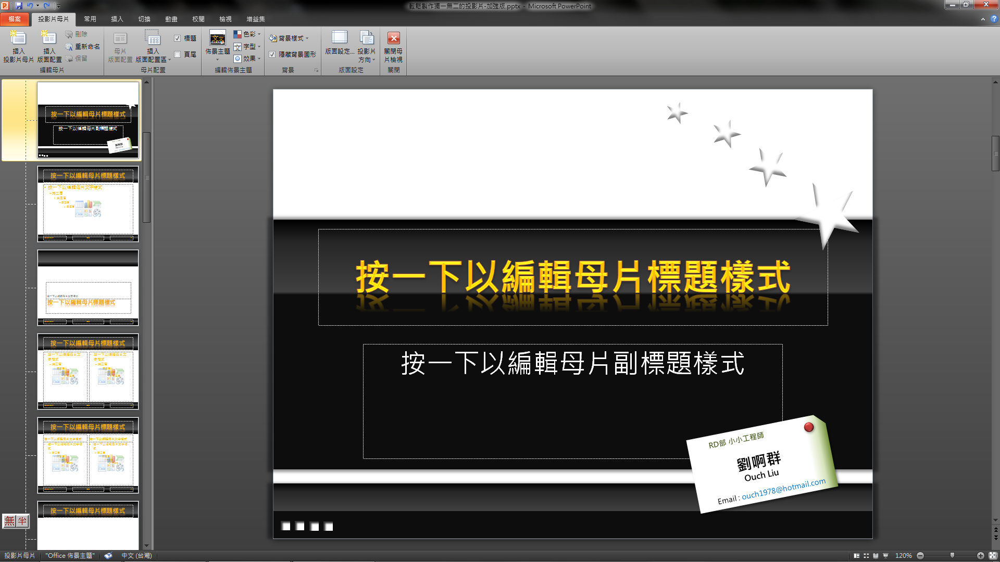
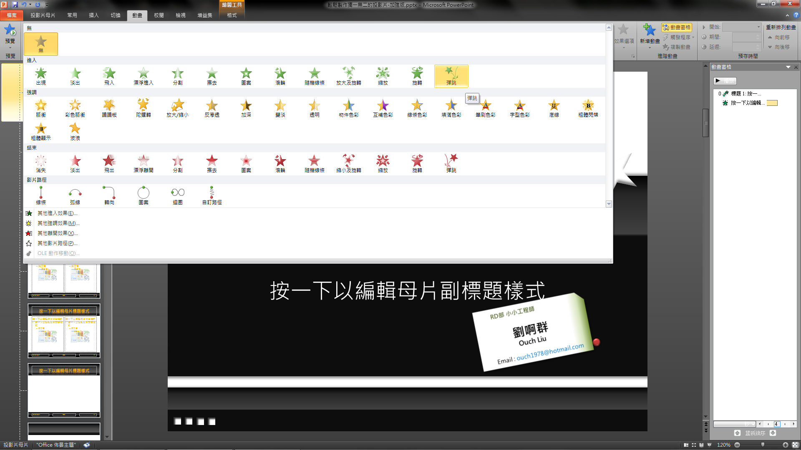
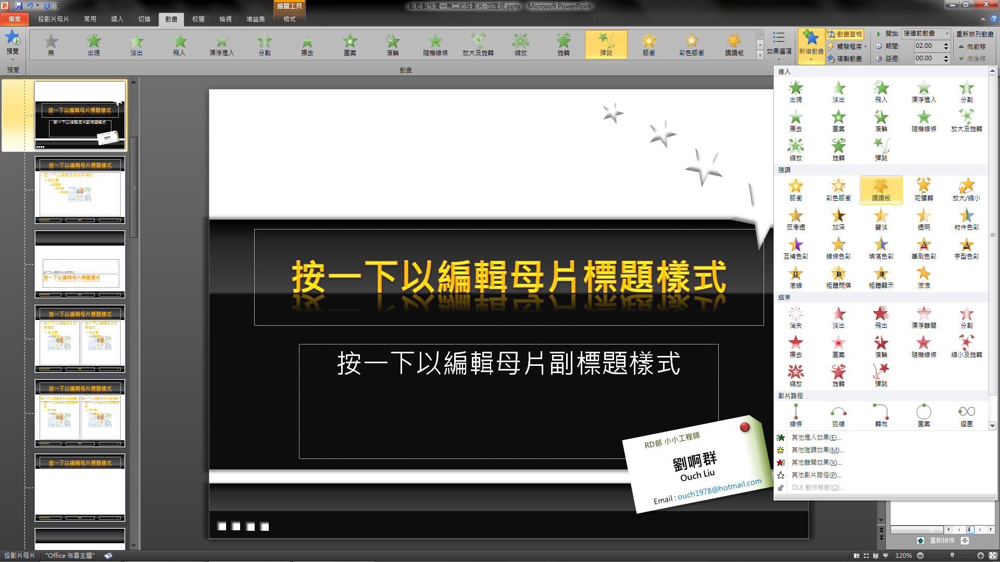
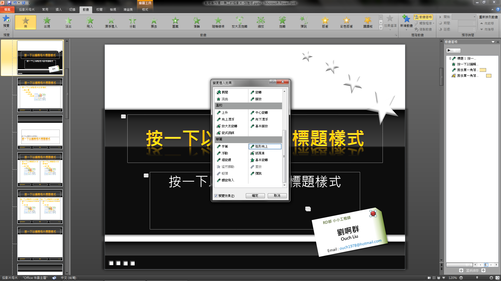

上次跟各位介紹了母片的應用，這次再來介紹兩個小撇步，一樣只利用 PowerPoint 原生的功能，`不借助任何外部圖片`，做出類似璃鏡面的效果，以及可以放在標題頁的自我介紹小卡片。

我們沿用上次範例的 pptx 檔，來針對純黑的色塊動手腳，加入類似玻璃的反光效果，讓它看起來不再那麼單調。

<!--truncate-->

**`「一切都從母片開始」!!!`**所以我們先進入母片編輯模式，選取位於母片上面的黑色矩形，選取工作列的**`格式`** -> **`圖案填滿`** -> **`漸層`** -> **`其他漸層`**。

在跳出來的**`格式化圖案`**視窗中選取**`漸層填滿`**，並且依以下設定漸層停駐點：

- **`位置0%，黑色，亮度0%`**
- **`位置20%，黑色，亮度15%`**
- **`位置40%，黑色，亮度25%`**
- **`位置74%，黑色，亮度35%`**
- **`位置75%，黑色，亮度25%`**
- **`位置90%，黑色，亮度5%`**

  完成後的長相會如下圖，是不是更有質感了呢?

  

  當然上面的改了，下面也要來一下：

  - **`位置0%，黑色，亮度0%`**
  - **`位置20%，黑色，亮度15%`**
  - **`位置35%，黑色，亮度25%`**
  - **`位置50%，黑色，亮度25`%**
  - **`位置51%，黑色，亮度5%`**

  

  這邊有一個重點，就是亮部和暗部要靠得很近，而且亮度要有足夠的反差，才能做出反光的感覺，亮部和暗部位置和顏色的拿捏，是影響整個質感最大的關鍵，為了讓各位練習，標題頁就交給各位自行發揮了。

  接著來做說好的自我介紹小卡片。切換到標題投影片的母片編輯模式，切換到**`插入`**頁籤，插入一個「**`剪去單一角落矩形`**」於右下角。

  

  把該矩形的外框拿掉，並且重新填色與加入陰影，完成後如下圖。

  漸層填滿的設定值為：

  - **角度 180 度`**
  - **位置 0%，橄欖綠，亮度-25%`**
  - **位置 7%，橄欖綠，亮度 60%`**
  - **位置 15%，白色，亮度 0%`**

  

  再來**`把最重要的部門單位、姓名、聯絡方式打上去`**，然後把名片稍稍**`旋轉`**並且**`調整一下位置`**，變成如下圖的樣子。

  

  斜斜的好像有點怪怪的，加個圖釘讓它看起來自然一點好了，**`插入一個圓形`**，並且將它調出**`浮凸`**的立體感，再調整一下**`陰影`**，讓它看起來自然一點。

  

  嗯~~大功告....還沒完!!怎麼可以草草結束呢!?再來要加入動畫，讓名片出場有魄力一點(這個步驟是異常的有意義的，它可以讓名片可以比較吸引觀眾的目光)。

  切換到動畫頁籤，對我們的名片加入**`彈跳`**動畫，並設置開始條件為「**`接續前動畫`**」。

  

  繼續對名片物件使用「**`新增動畫`**」選項，這次使用「**`翹翹板`**」效果，開始條件一樣設定為「**`接續前動畫`**」。

  

  最後，真的是最後一步了，幫圖釘加上「**`弧形向上`**」動畫效果(**`新增動畫`** -> **`其他進入效果`** -> **`弧形向上`**)，並設定其開始條件為「**`與前動畫同時`**」。

  

  傳說中的加強版誕生了，請服用!!
