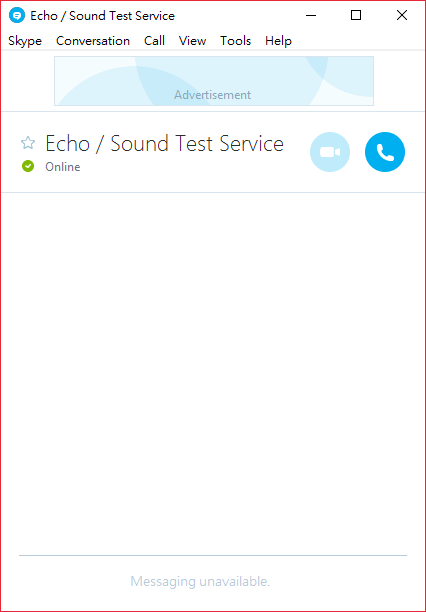
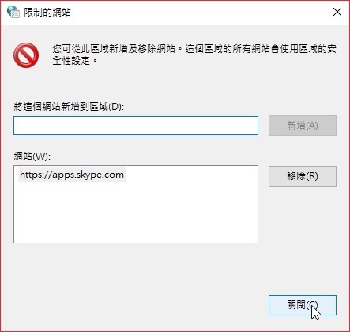
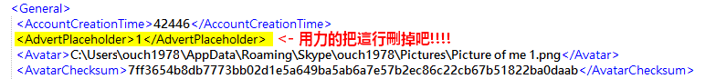
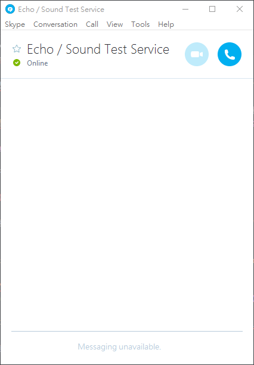

最近新版的 Skype 預設都會開啟對話視窗和主視窗的廣告功能，佔掉不小的版面，實在是有點惱人。這邊就跟大家分享怎麼把討人厭的廣告移乾淨吧。

廢話不多說，我們直接來看看該怎麼把這個討人厭的東西給消滅掉~

<!--truncate-->

## 方法一：治標不治本的方法

可能大部份的朋友們都知道透過「網際網路選項」裡面的「限制的網站」功能來阻止廣告的顯示，但是光靠它來阻止廣告顯示，Skype 視窗還是會被佔掉不小一塊區域。

不過還是分享一下這個方法，如果你不介意像上圖一樣出現一個空空的廣告區的話，這個方法就可以滿足你啦。

方法很簡單，只要到 **`控制台`** -> **`網際網路選項`** -> **`安全性`** -> 點選 **`限制的網站`** 之後 -> 按下下方的 **`網站`** 按鈕之後，在出現的視窗中加入 **`https://apps.skype.com`** 就行囉。

如此一來，廣告區就不會再出現廣告，只會有空空一片了。

不過，上面這個方法應該還是滿足不了看到空白的廣告區也會抓狂的人吧？如果你連空白的廣告區也不想看到的話，請跟著這樣作：

---

## 方法二：徹底移除廣告區的方法

使用任一文字編輯器開啟 **`%UserProfile%\AppData\Roaming\Skype\你的帳號\config.xml`** 檔。

尋找 **`AdvertPlaceholder`** 關鍵字，將該行刪除之後存檔。(如果怕 Skype 更新之後又被改回來的話，可以直接把該檔案設定成唯讀。)

再開啟 Skype 的對話視窗看看，是不是舒服多了呢??

