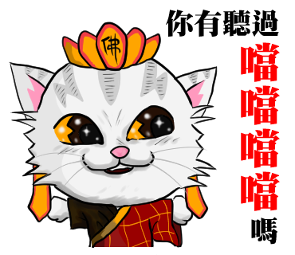

其實我早在兩年前就一直想要畫以我家的喵星人們為主題的 Line 貼圖了，但是夢想總是美好的，現實是殘酷的。一直拖到了今年，才有空真的動筆下去生出四十張一組的貼圖。

更殘酷的是，就算很開心的衝完了四十張，上架的過程也不如想像中順利，兩組貼圖來來回回被退了三次。(我不禁想大喊：**Line 的審查人員們，我真的搞不懂你們的標準和邏輯啊！！！！**)

不過，看到辛苦畫出來的圖片出現在對話裡，還是很有成就感的啊～

目前上架的貼圖有兩組，還請大家多多支持和捧場～

## [尼古這一家](https://store.line.me/stickershop/product/1265613 "尼古這一家")

## [尼古這一家 之 鄉民來了](https://store.line.me/stickershop/product/1279302 "尼古這一家 之 鄉民來了")

<!--truncate-->

> 連結已經給你了，還不快買！？

---

以下是很心酸被退的圖，無緣上架，只好放在這邊曬一曬...

