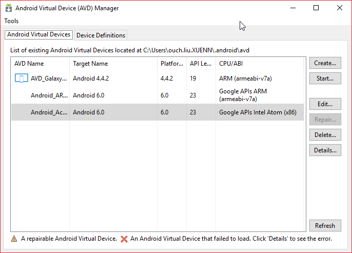
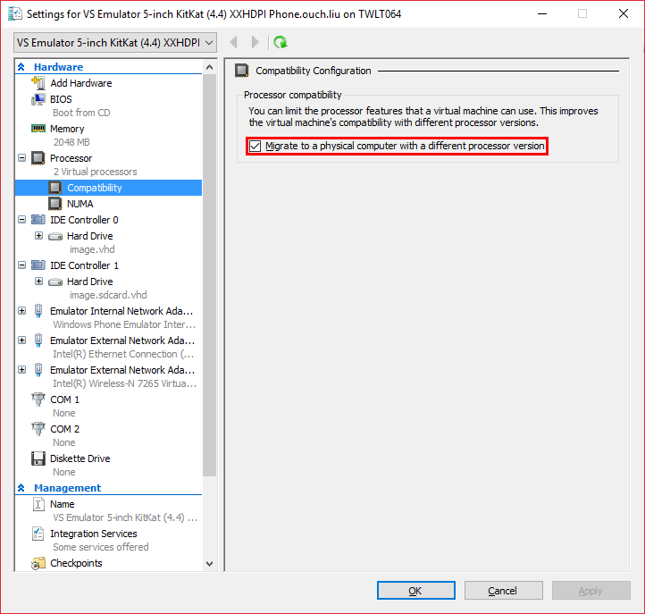
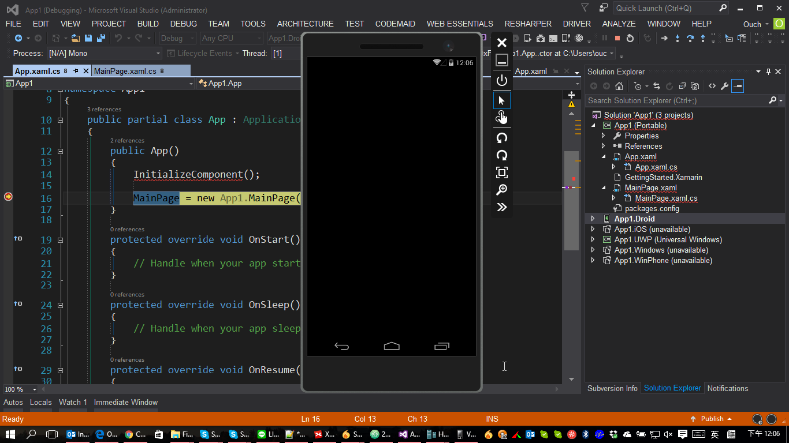

很開心的可以成功建置出Android應用程式之後...咦!? 怎麼不能Debug!!??Visual Studio把應用程式佈署到模擬器之後就不管了??哪招啊!?

相信大家應該都知道Visual Studio 2015裡面很佛心的包含了多種Android裝置的模擬器，讓我們在開發Android應用程式的時候也可以透過它來進行除錯。

我們也可以透過Visual Studio選單裡的 -> **`Tools`** -> **`Android`** -> **`Android Emulator Manager`** 來建立虛擬的Android裝置以便於進行除錯。

<!--truncate-->

正常的情況下，應用程式被佈署到模擬器之後，Visual Studio應該還是會處於在除錯的模式下，但是我遇到的神奇狀況是這樣：應用程式的確有被佈署到模擬器中，但是Visual Studio就自動結束了除錯模式了，而且模擬器裡的應用程式也會自動被送到背景去。

經過Google大神的協助，原來這個問題是出在Hyper-V裡虛擬機器的設定上。

只需要開啟 **`Hyper-V Manager`** ，在Android虛擬機上按下滑鼠右鍵，點選 **`Settings...`**，然後進入 **`Processor`** 的 **`Compatibility`** 設定項目中，把 **`Migrate to a physical computer with a different processor version`** 勾選起來就行啦。

喔耶，除錯模式回來了，設好的中斷點也不會再被無視了，Happy Coding~

