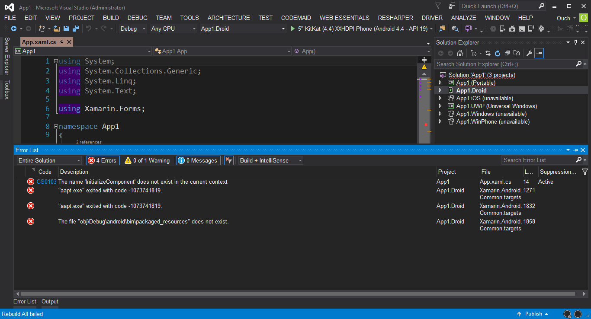
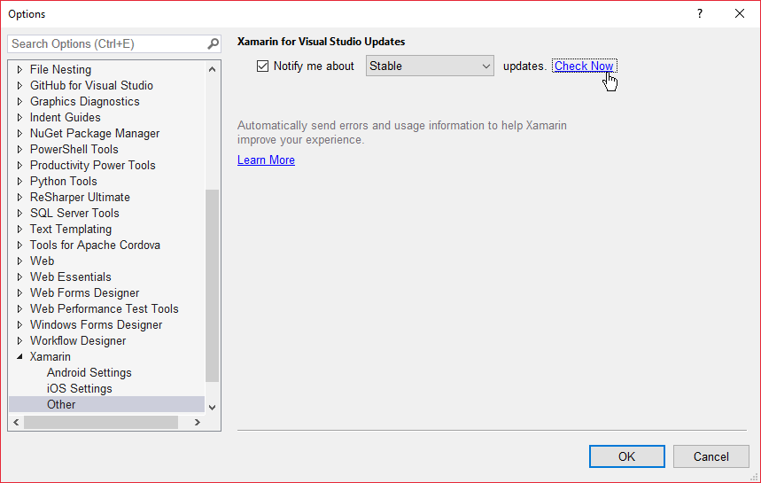
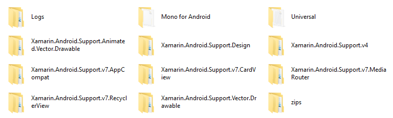
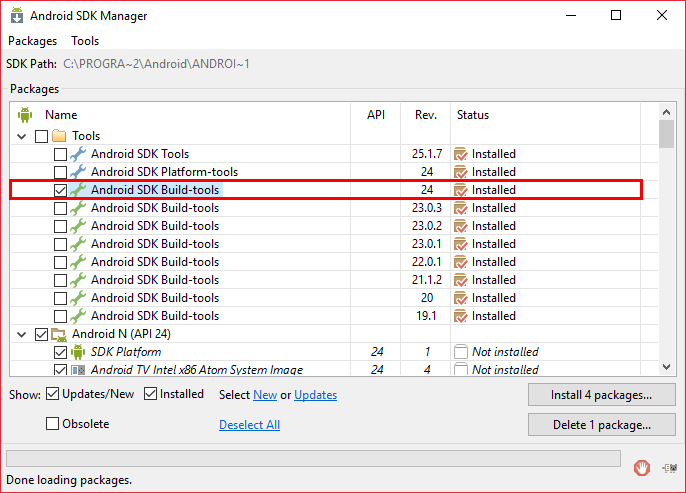
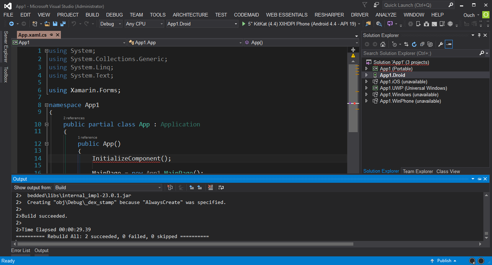

日前微軟公開了收購 Xamarin 的消息，也很佛心的把它提供給 Visual Studio 的使用者們使用，這麼佛心的東西，怎麼可以不玩看看呢?

這樣想的我，很開心的在安裝完 Visual Studio 2015 Update 3 之後，就隨手建了一個 Xamarin Form 的專案想來玩看看。

但是，故事的發展永遠沒有想像得那麼簡單...

<!--truncate-->

專案成功建立了，但是 Android 專案建置失敗!!! **`Build Failed! Build Failed!! Build Failed!!!`**

誠心的求助 Google 大神之後，循著幾個方向去嘗試，最後總算是成功了，以下是我親嘗百草的各種偏方：

## 檢查 Xamarin 更新

其實我也試過了解除安裝 Xamarin 之後重新安裝，但是一樣無解。後來發現就算從 Xamarin 官網上下載的安裝檔也不見得會是最新的，要更新的話還是得透過 Visual Studio 比較保險。 檢查 Xamarin 更新的方式為：點選 Visual Studio 的選單中點選 **`Tools`** -> **`Options`** -> **`Xamarin`** -> **`Other`** -> 再點選 **`Check Now`** 即可。

## 刪除 Xamarin.Android.Support 相關檔案

還有很多次在建置專案的時候出現了找不到 **`"Xamarin.Android.Support.Design"`** 相關檔案的錯誤訊息，而經過 Google 大神的指示，只要把 **`%UserProfile%\AppData\Local\Xamarin`** 下的資料夾砍掉，再重新進行建置，就會自動下載完相關的檔案了。(這也是為什麼第一次進行建置都會花特別久的原因，所以千萬別以為它掛掉了就按下停止建置的按鈕。)

## 檢查 Android SDK

在 Visual Studio 的選單中點選 **`Tools`** -> **`Android`** -> **`Android SDK Manager`** 就可以看到已經安裝了哪些 SDK 或是建置工具。 而我遇到的問題呢，是因為我很開心的安裝了 **`Android SDK Build-tools Rev 24`** 的關係。

把它移除之後，就可以順利的建置 Android 專案囉!!

以上。
