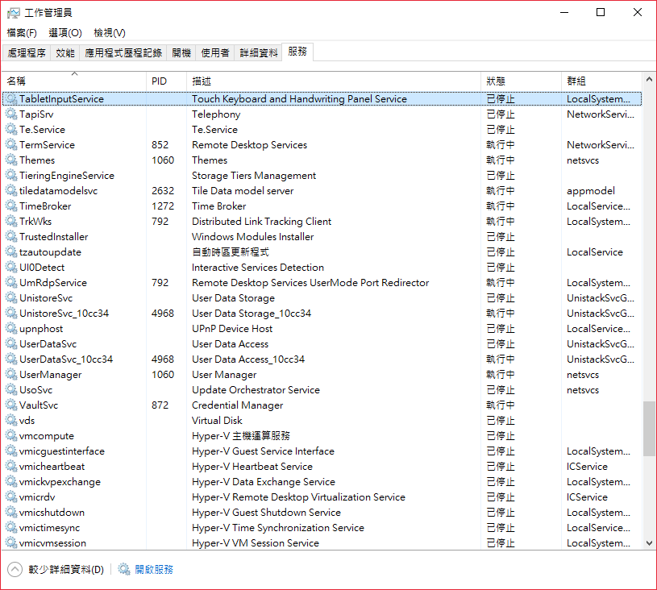

放假的時候想要玩個遊戲放鬆一下，但是遊戲卻動不動就自己閃退，在事件檢視器中看到失敗的模組名稱為 XAudio2_7.dll_unloaded ，這邊就來分享解決之道。

<!--truncate-->

### 直接講結論： **`關閉 TabletInputService`**

是的，你沒看錯，我也不懂為什麼平板輸入服務會影響到音效模組...

如果你也在事件檢視器中看到如下的資訊：

那就不妨也試看看這樣作能不能解決這個問題吧~(至少我個人這樣作是成功的啦...)

首先開啟工作管理員，並且找到 TabletInputService 這個服務，確認它的狀態是否為執行中，如果是的話，直接在它上面按下滑鼠右鍵，透過彈出式選單將它停止即可。

是的，就是這麼簡單。

但是為什麼平板輸入服務會影響到音效模組呢??

不要問，很可怕。我們還是乖乖打電動吧~
