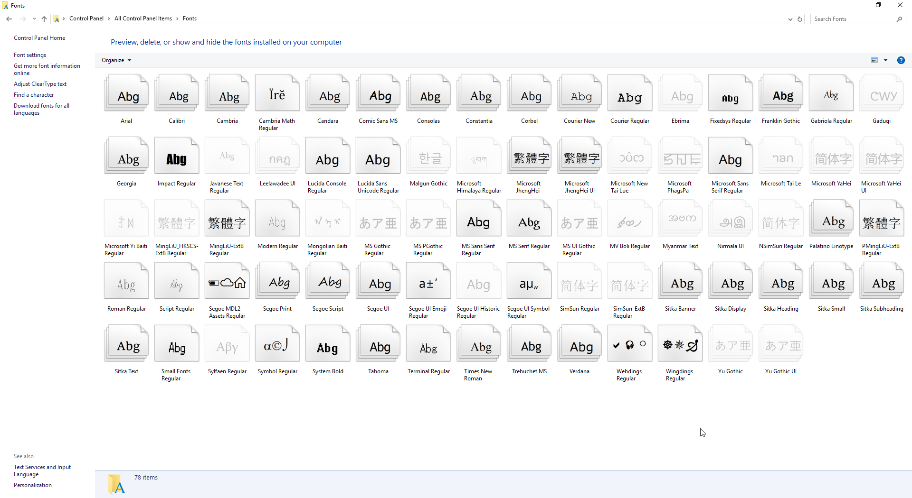

話說，之前重灌工作機的時候，試了不同的 Windows 10 版本，一開始安裝的是 10586(1511) 英文版，但是發現非 Unicode 的中文無法正常顯示。

<!--truncate-->

## 症狀

只要是 Non-Unicde 的中文部份，全部都變成了一個一個的方塊。

## 直接講結論

其實解法非常簡單，只要 **`手動安裝新細明體和標楷體字型`** 就可以解決這個問題了。
但是這一連串的插波休停 (Trouble Shooting) 的過程可是花了我好幾個小時啊!!!~

## 對我插波休停過程有興趣的請繼續往下閱讀

1. 通常，遇到中文沒辦法正常顯示的情況都會先檢查 Non-Unicode Language 的設定。很好，我的確有選繁中，台灣。
   

2. 設了沒效的話，再到語言設定裡面加入中文(台灣)看看囉。
   

3. [Microsoft Community 上有一篇文章](http://answers.microsoft.com/en-us/windows/forum/windows_10-start/some-fonts-are-missing-after-upgrade/95839dfa-0df2-4bc0-875a-fd6b57e61fe4 "Some fonts are missing after upgrade")說 Windows 10 的部份字型被挪到選用功能去了。那...透過新增選用功能的方式來看看有沒有救好了...很好!!因為 Group Policy 的關係不能用!!
   

4. 還是不行!? 那我下載繁體中文語言包來安裝，總該行了吧!!? 蝦毀!? 一樣 GG 啊!!!!~~~ (崩潰中...)
   

5. 好吧...看看是不是有缺什麼字型才沒辦法正常顯示...
   咦!? **`沒有新細明體和標楷體! 沒有新細明體和標楷體!! 沒有新細明體和標楷體!!!`**
   

6. 死馬當活馬醫看看，從別台電腦複製這兩個字型過來裝吧。
   

7. 喔耶!! 中文回來了~~大家都回來了!!
   

## 後記

這真的是一件很神奇的事...

1. 乾淨安裝 10240 再升上 10586(1511) -> 不會有這個問題。

2. 乾淨安裝年度更新版(1607) -> 不會有這個問題。

3. 乾淨安裝 10586(1511) -> **`中標`**。

4. 乾淨安裝 10586(1511) 再升上年度更新版(1607) -> **`中標`**。

我只能說，我真的是搞不懂你啊~~
