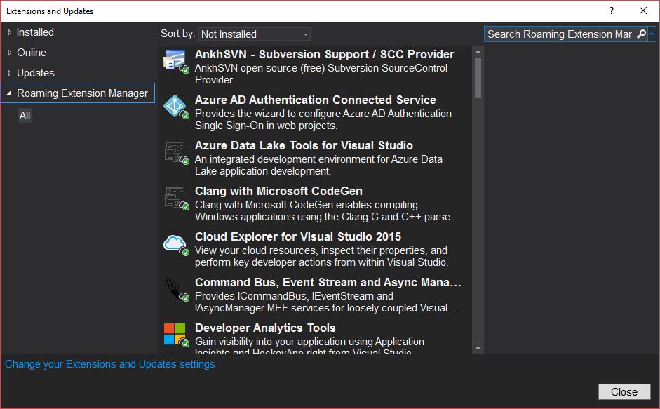

常常在工作的時候找到不錯用的 Visual Studio 擴充功能，但是往往回家又得再安裝一次，有時候忙過頭隔個幾天想安裝就忘記名字叫什麼了。一直在想說怎麼沒有一個功能可以在不同的電腦之間同步安裝過的擴充功能，果不其然，還真的有耶!!

前一陣子重灌了工作機的作業系統，也重新安裝了 Visual Studio 2015 ，雖說 Visual Studio 會自動透過 Microsoft Account 把我的設定同步回來，但是卻不包含擴充功能的同步，所以之後又得要再手動把之前裝過的擴充功能一個一個安裝回來，真的是蠻花時間也蠻讓我頭痛的。

向谷歌大神求救之後，發現有不少人有相同的問題，而微軟也從善如流的就開發出了這樣的一個擴充功能，也就是我們今天的主角 -- [Roaming Extension Manager](https://visualstudiogallery.msdn.microsoft.com/7b421a95-c32c-4433-a2be-a41b276013ab "Roaming Extension Manager")

安裝了這個擴充功能之後，在 Visual Studio 2015 的擴充功能管理視窗裡面會多出現一個名為 `Roaming Extension Manager` 的分類。

而所有已安裝的擴充功能上都會多出一個小圖示，以用來顯示它被同步的狀態為何，圖示與狀態共有三種，分別如下：

- ：此擴充功能已同步到你的雲端設定中，但是尚未在目前的機器上安裝該擴充功能。可以透過右邊的 `Download` 按鈕進行下載安裝。

- ：此擴充功能已經同步到雲端設定，並且也已經安裝到本機。可以透過右方的 `Stop Roaming` 按鈕停止同步。

- ：此擴充功能已經安裝到本機，但是並未同步到雲端設定。可以透過右方的 `Start Roaming` 按鈕進行同步。

以上。希望能幫到有需要的朋友喔!!~
