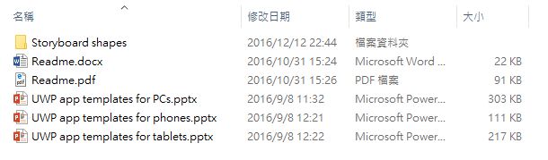
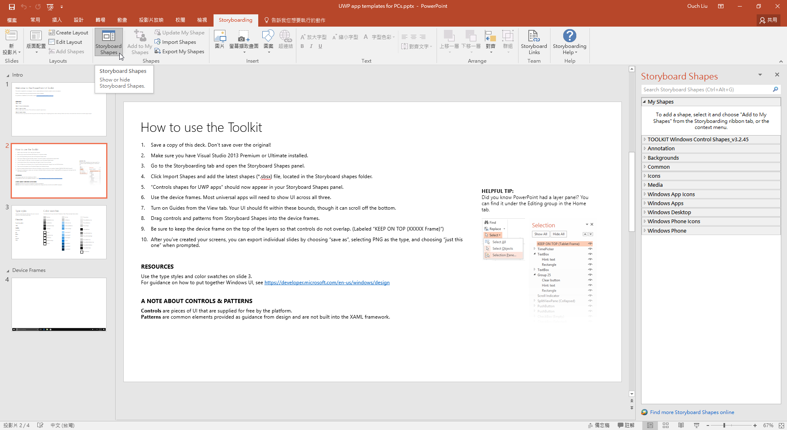
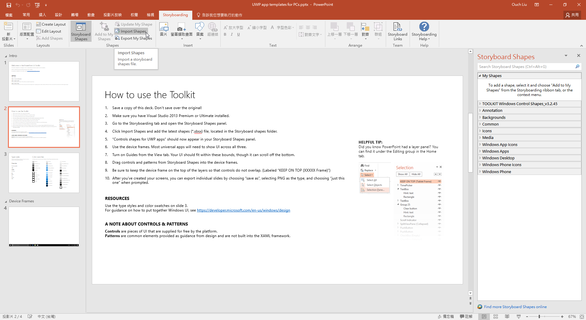
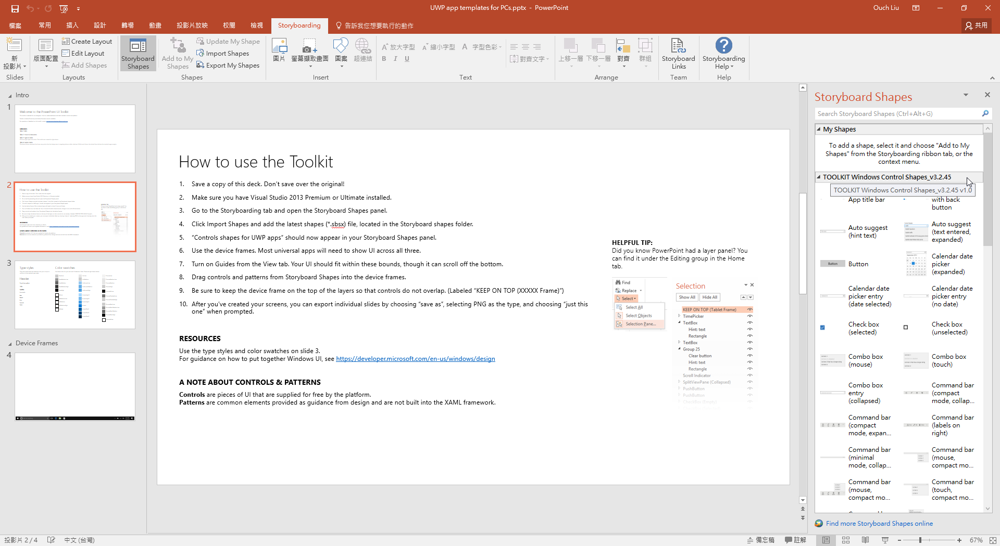
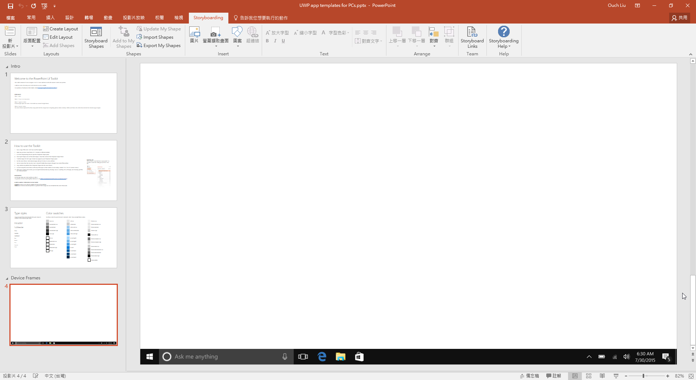
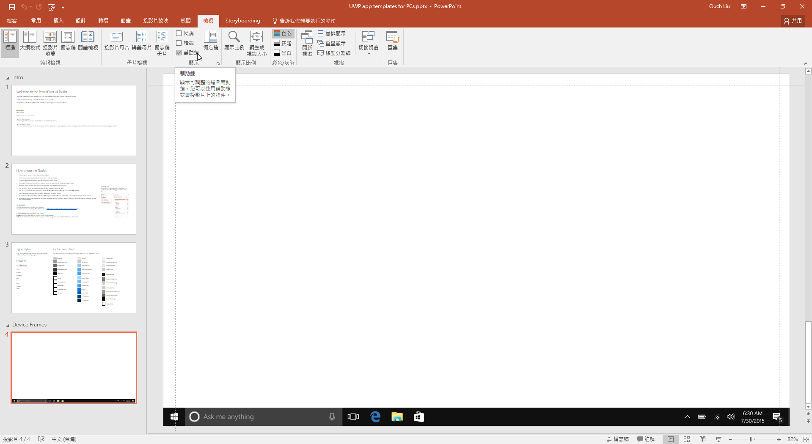
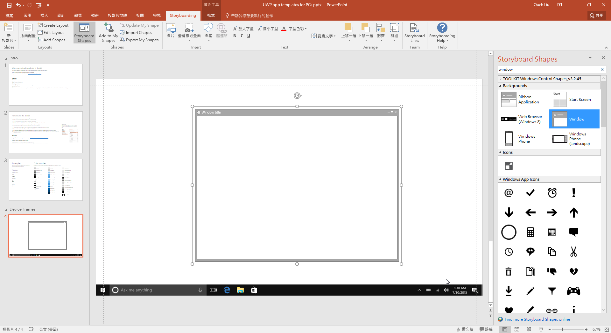
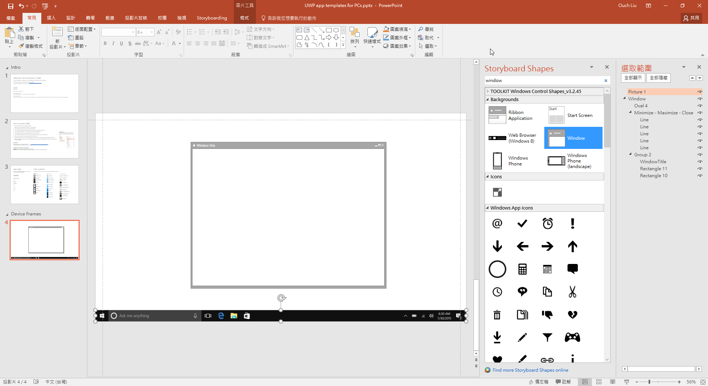
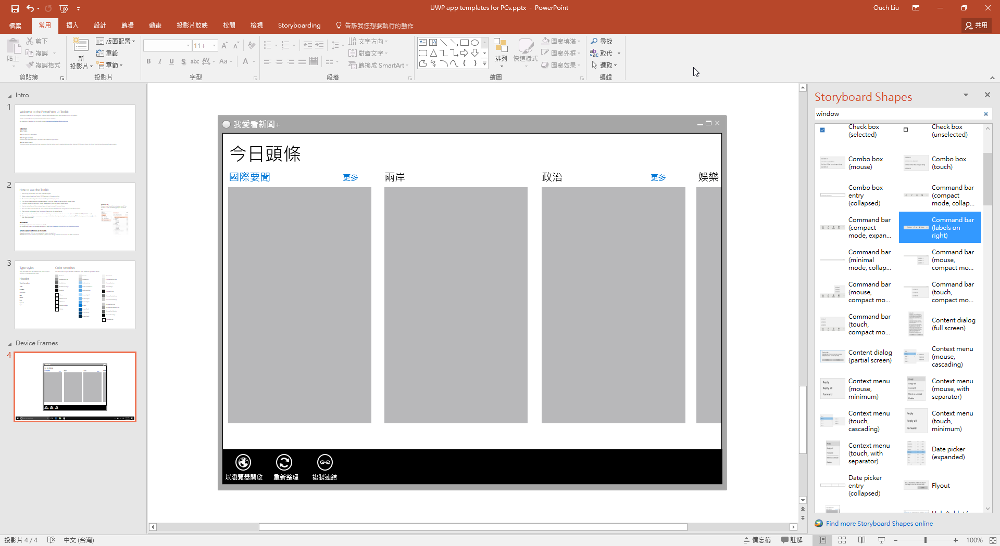

設計和點子這種東西往往都是靈光一閃，在那一閃的瞬間往往只能透過紙筆來勾勒出心中的想法，但是對於像我這種懶人來說，如果能有一個方便製作/記錄雛型的工具，應該會是很有幫助的一件事。

最好是裡面包含了所有 UWP 裡能使用的控制項，讓我只要透過簡單的拖拉就可以把我的想法清楚的描述出來。

而在 Dev Center 裡就有這麼一個神奇的東西，可以讓我們透過再也熟悉不過的工具 - PowerPoint 來刻出 UI 的雛型。

其實這個樣版已經存在蠻久的了，只是可能大部份的人可能不是找不到它，就是會忽略它，或是不知道該怎麼使用它。

<!--truncate-->

## 下載

在 Windows 開發人員中心裡的 [UWP app 的設計下載](https://msdn.microsoft.com/windows/uwp/design-downloads/index "UWP app 的設計下載") 一區裡面其實有不少設計相關的資源。

例如給 PhotoShop 和 Illustrator 使用的設計範本、磚與圖示產生器，以及 UWP App 的範例等等。

而今天的主角呢，就是我個人覺得很方便的 [PowerPoint 設計範本](https://go.microsoft.com/fwlink/p/?LinkId=534632 "點此直接下載") 啦。

## 使用說明

該檔案下載下來是一個壓縮檔，解壓縮之後會看到裡面有`兩個說明檔`，`三個給不同平台使用的 PowerPoint pptx 檔`，以及一個名為 `Storyboard shapes` 的資料夾。

打開任何一個 PowerPoint 檔 (接下來，以設計 PC 版的 App 為例，打開 UWP app templates for PCs.pptx ) 之後，應該會看到裡面包含了四張投影片。

蝦毀，內容都是英文!!? 沒關係，先喝杯茶壓壓驚，基本上裡面也是在講解該怎麼使用這份投影片。

簡單翻譯如下：

1. 將投影片`另存新檔`，注意別蓋到原來的檔案。

2. 確認你已經安裝了 `Visual Studio 2013 Premium 或以上`的版本。

3. 切換到 `Storyboarding` 頁籤，並且打開 `Storyboard Shapes` 面板。
   

4. 按下 `Import Shapes` 並且選取 Storyboard shapes 中的 `Windows Controls Shapes.sbsx` 檔進行控制項圖庫的匯入。
   

5. Storyboard Shapes 面板中應該會多出一個名為 `TOOLKIT Windows Control Shapes_vX.x.x.x` 的分類。
   

6. 使用名為 `Device Frames` 的頁面來設計你的 UI。
   

7. 在`檢視`頁籤中開啟`輔助線`功能，並確保你設計的 UI 不要超出輔助線的邊界。
   

8. 從 Storyboard Shapes 面板中透過拖拉的方式把控制項放到 Device Frames 頁面中。
   

9. 透過`常用` -> `選取` -> `選取窗格` 面板確認你的 Device Frame 圖層為置頂圖層。
   

10. 當你完成設計之後，可以透過另存新檔的功能，將設計好的畫面另存為 PNG 檔 (匯出投影片時選擇`僅此投影片`)。

另外，你也可以透過投影片裡面的 Type styles 和 Color swatches ，來作為字體大小和配色的參考喔!!

大功告成啦!!~

是不是很方便呢!?
