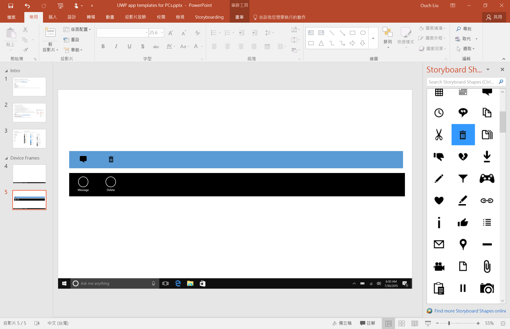
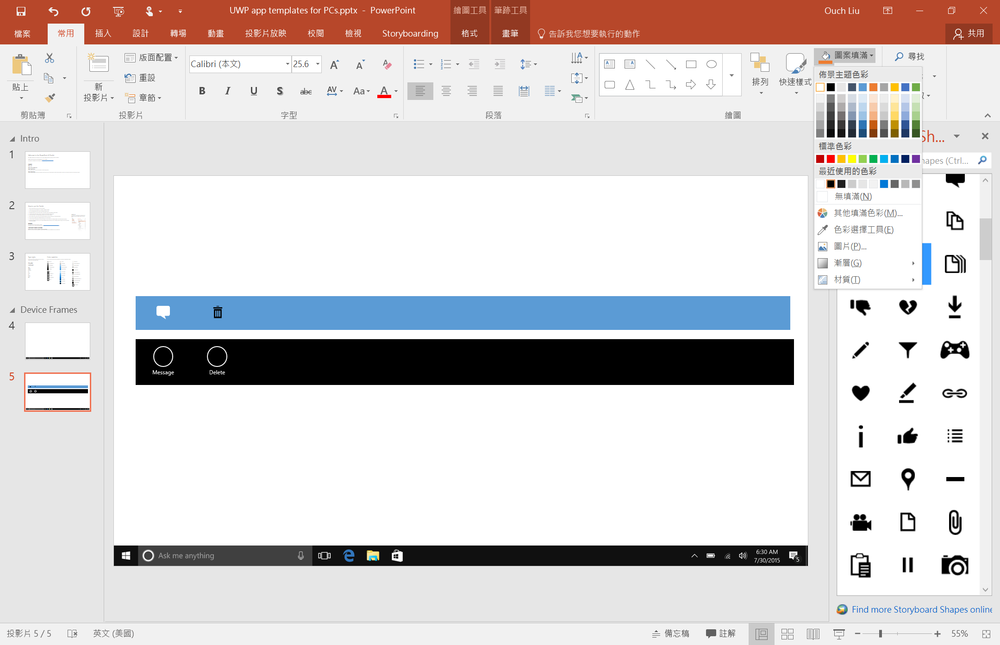
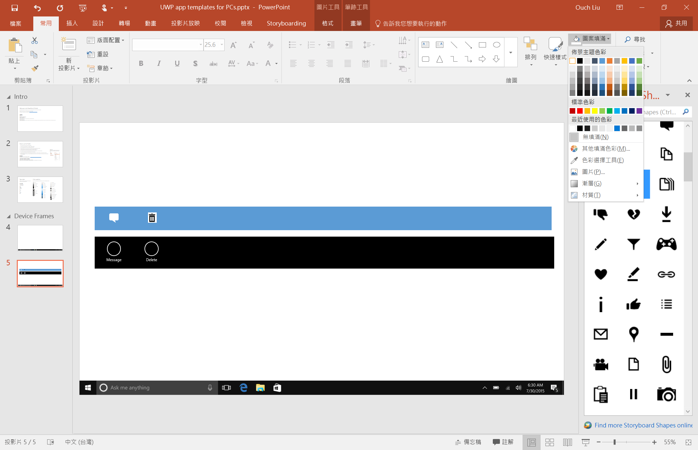
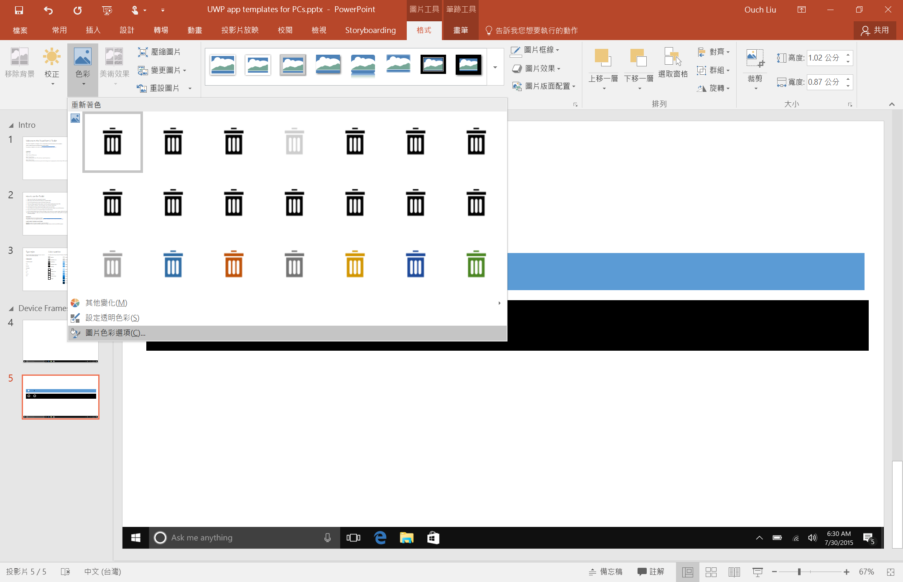
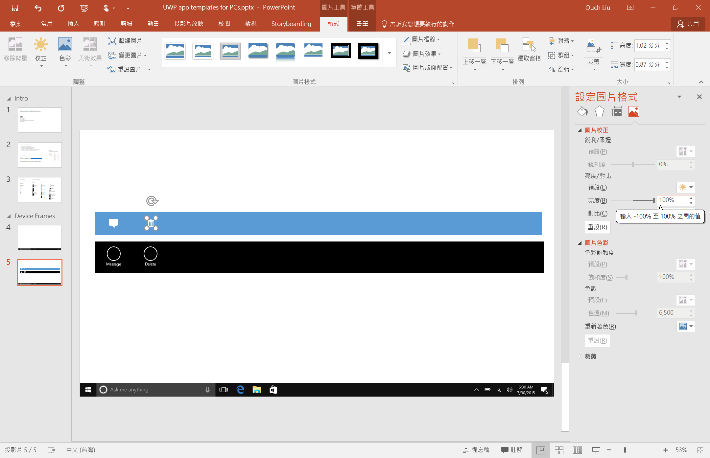
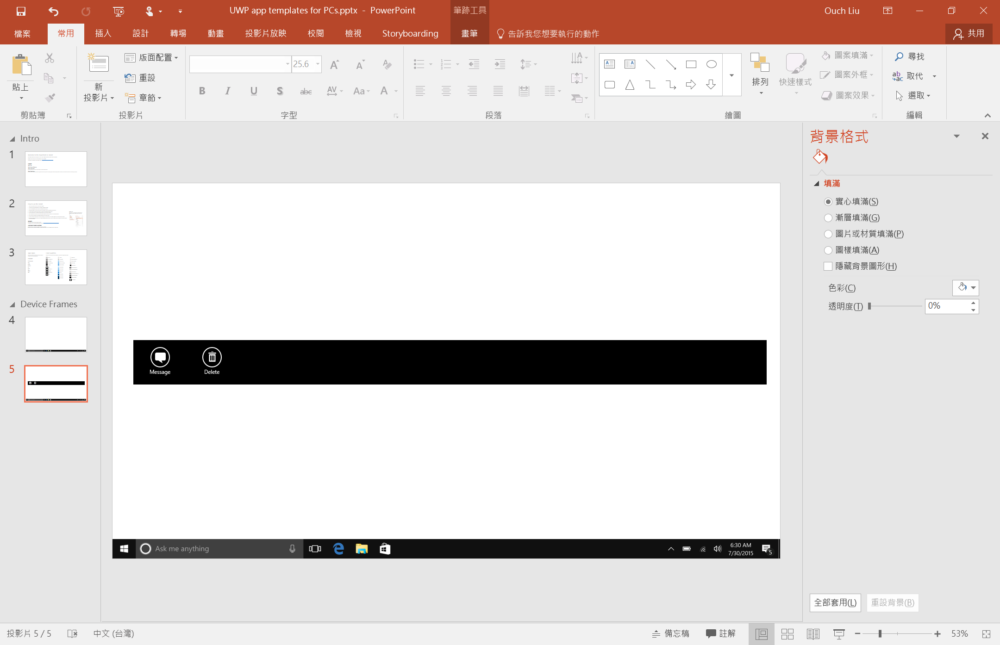

之前介紹的 UWP 的 PowerPoint 設計範本裡面內建了不少設計 App 時所需要的圖示。然而，它們有部份是圖形元件，可以直接修改顏色；但是有些是圖片，沒有辦法直接透過填色功能來改變它的顏色。

內建的圖示都是黑色的，但是很不幸的，預設的 AppBar 是黑底，所以得搭配白色的圖示。

這個時候，怎麼把圖片從黑轉白，或是從白轉黑，甚至改成其它的色彩，考驗的就是使用 PowerPoint 的功力啦。

說穿了，只要把圖片重新上色，再調整它的亮度和對比就可以達到我們的目的，而且這些功能 PowerPoint 都有內建，不用透過其他的繪圖軟體就能辦到囉。

<!--truncate-->

這邊就透過下面的例子來作示範，看看怎麼把一個黑色的圖示改成白的：

先從 Storyboad 內建的 Windows App Icon 圖示中拉出訊息和刪除這兩個圖示。

左邊的訊息圖示是圖形元件，可以直接透過圖案填滿的功能來修改它的顏色。

右邊的是圖片，直接使用圖案填滿的功能的話只會改到背景色。

這時候，我們就可以開啟工具列的 `格式` -> `色彩` 選單來進行初步的顏色調整，點選下面的`圖片色彩選項`。(也可以透過重新著色的功能改變成其它顏色喔!!)

接著在設定圖片格式面板中調整圖片的`亮度`，把亮度調整為`100`就是白色啦!!

噹噹，大功告成!!

是不是很簡單啊!?

這個小技巧不只能使用在設計 App 的階段，平常製作投影片的時候也是很實用的喔!!~
