在 2016 年的 11 月，微軟藉由 Connect 大會發佈了"地表最強開發工具" Visual Studio 2017 的 RC (發行候選)版本。

> Visual Studio 2017 支援的平台和相容性可以參考 [這個連結](https://www.visualstudio.com/zh-tw/productinfo/vs2017-compatibility-vs "Visual Studio 2017 平台目標及相容性")
>
> `這個版本的 Visual Studio 不支援 Silverlight 專案。 若要維護 Silverlight 應用程式，請繼續使用 Visual Studio 2015。`
>
> `這個版本不支援 Windows 市集 8.1 和 8.0 以及 Windows Phone 8.1 和 8.0 專案。 若要維護這些應用程式，請繼續使用 Visual Studio 2015。 若要維護 Windows Phone 7.x 專案，請使用 Visual Studio 2012。`
>
> 已哭...

如果沒什麼意外的話，應該在接下來的一兩個月裡面，我們就可以看到正式版出現了。

在正式版出現之前，先用相對穩定的 RC 版來熟悉一下之後將要使用的工具是蠻值得一試的一件事。

接下來就各位分享一下安裝和試用的心得。

<!--truncate-->

## 下載

首先，這次釋出的 RC 版和之前的版本有些不同，在官網上並沒有官方的 ISO 檔可供下載，也沒有官方的離線安裝檔，只有線上安裝檔可供下載。

下載連結如下：

[Visual Studio Community 2017 RC](https://aka.ms/vs/15/release/vs_Community.exe "下載 Visual Studio Community 2017 RC")

[Visual Studio Professional 2017 RC](https://aka.ms/vs/15/release/vs_Professional.exe "下載 Visual Studio Professional 2017 RC")

[Visual Studio Enterprise 2017 RC](https://aka.ms/vs/15/release/vs_Enterprise.exe "下載 Visual Studio Enterprise 2017 RC")

> 雖然說官方並不提供離線安裝檔，但還是很佛心的寫了一篇文章教我們怎麼[製作離線安裝檔](https://docs.microsoft.com/zh-tw/visualstudio/install/create-an-offline-installation-of-visual-studio "Create an offline installation of Visual Studio 2017 RC")。

## 安裝

接下來，就安裝 Enterprise 版來體驗一下吧!!

打開安裝檔之後，出現的是和以往截然不同設計的版權聲明畫面。
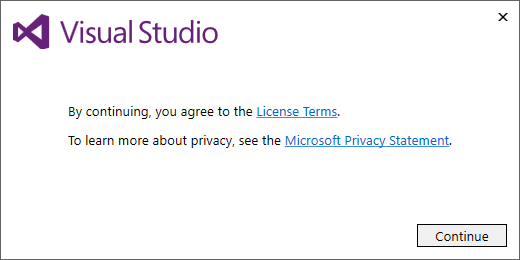

按下同意按鈕的話，就會出現如下的畫面。(注意：`安裝之前請先關閉其它版本的 Visual Studio` ，否則可能會因為衝突而無法繼續安裝。)
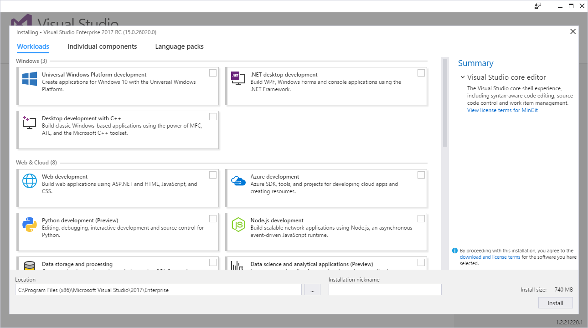

和之前的版本有很大差異的地方是，這次的版本所有的功能都是以模組化的方式在 Workloads 頁籤中選擇是否要進行安裝。
如果所有項目都不勾選，只安裝核心的編輯功能的話，大約會佔用 740 MB 的磁碟空間。

> 眼尖的朋友們可能會發現畫面上有一個 Installation nickname 的文字輸入欄位，那是因為 Visual Studio 2017 支援不同版本共存，所以可以透過它來自訂開始功能表上顯示的名稱，例如 VS2017 Ent RC。

在 Individual components 頁籤中可以針對細項進行微調。
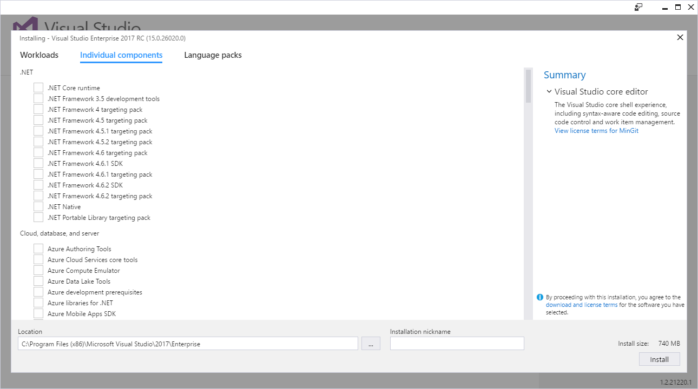

也可以在 Language packs 頁籤中選取想安裝的語言包。
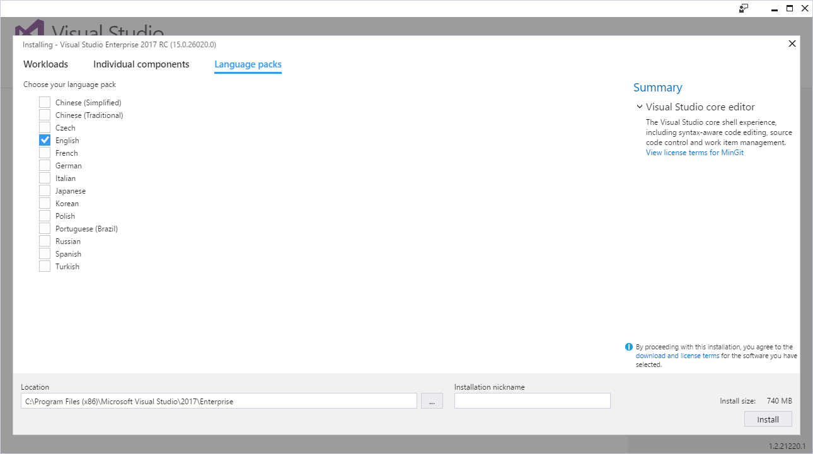

若選取 Universal Windows Platform development、.NET desktop development 、Web development 和 Mobile development with .NET (Preview) 這幾個項目的話，則會佔用 19.76 GB 的磁碟空間。

另外發現一個好玩的點，如果按下 Esc 鈕的話，還可以選擇不同的版本來安裝(所以不同版本的安裝檔只是預先幫我們選好該版本的意思?)。
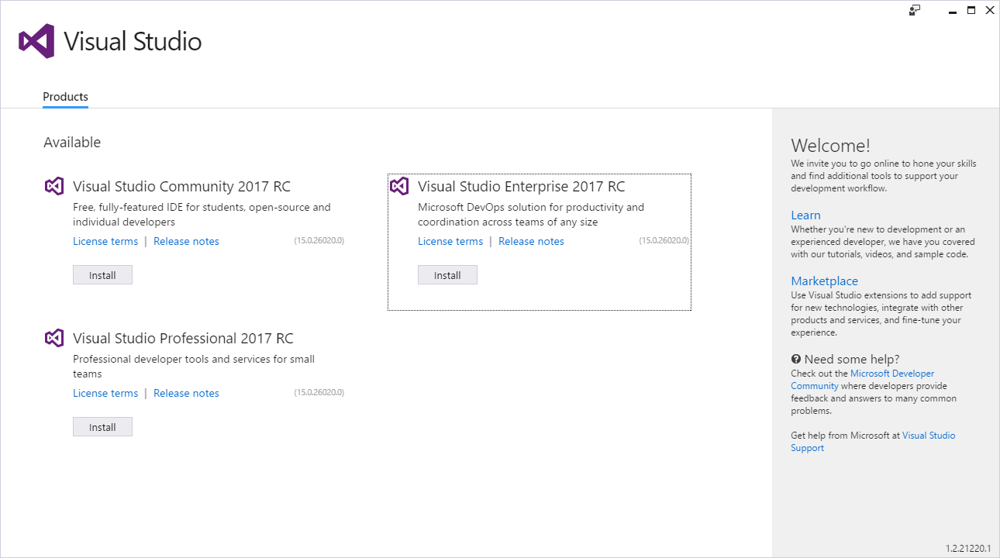

為了省硬碟，我就以上述的項目直接進行安裝啦。安裝畫面如下(看到下面還有兩個 Install 鈕可以按，讓我很好奇，難道可以同時安裝不同的版本嗎!?答案是不行...)：
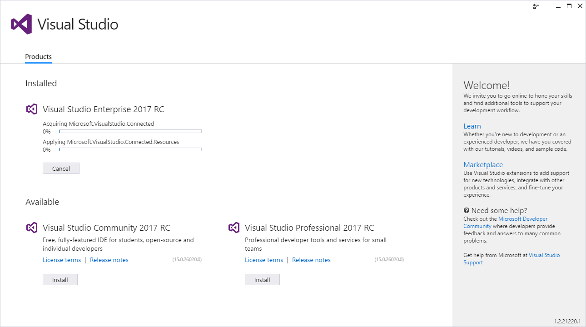

> 若想以其它語系進行安裝的話，可以透過命令提示視窗執行安裝檔，在後方加入 --locale 參數並且指定語系。
> 如 vs_Enterprise.exe --locale zh-TW ，就可以用中文模式進行安裝。
>
> 目前支援的語系有 zh-CN, zh-TW, cs-CZ, en-US, fr-FR, de-DE, it-IT, ja-JP, ko-KR, pl-PL, pt-BR, ru-RU, es-ES, and tr-TR

安裝完成之後，會需要重新開機。
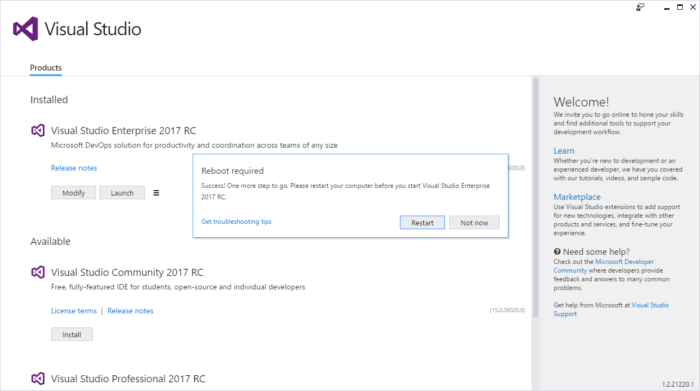

## 心得

依照我選擇的功能，整個安裝的過程大約花了一個小時出頭，還包含各功能模組的下載時間，整個安裝的體驗比之前的版本要來得流暢許多。

首先，吸引到我眼球的是 Visual Studio 2017 的 Logo。新版 Logo 的莫比烏斯環看起來很明顯的比 Visual Studio 2015 的來得瘦了不少，不知道是不是有想要隱喻安裝所需要的硬碟空間變小的意味?變瘦的莫比烏斯環看起來也有比較敏捷的感覺。

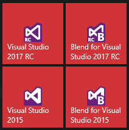

再來，Visual Studio 2017 RC 開啟的速度也很明顯的比 Visual Studio 2015 快了許多(不知道是不是因為還沒裝什麼擴充功能的關係?)，大概差了有十秒以上。

而且整個開始畫面也和 Visual Studio 2015 有蠻明顯的差異，資訊和每個項目之間的間距拉大了，看起來比較沒有壓迫感。

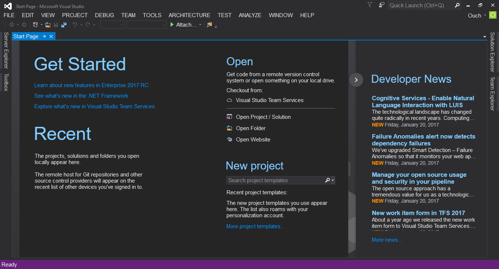

建立新專案時對話視窗的專案分類也和 Visual Studio 2015 有蠻大的差異，因為支援的專案類型變少了的關係，所以分類看起來也更加的簡潔了不少。
不過我一直很期待看到的 UWP 懶人專案樣版還是沒有出現...

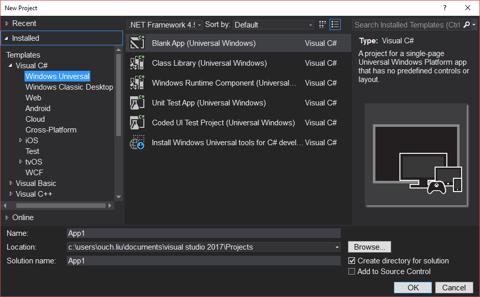

關於 Blend for Visual Studio 2017 RC 呢... 連開始畫面裡面的內容和連結都還是連到 2015 版的網頁(不過畫面上的確是寫著 2017 啦)...
嗯~就之後再觀查看看囉!!

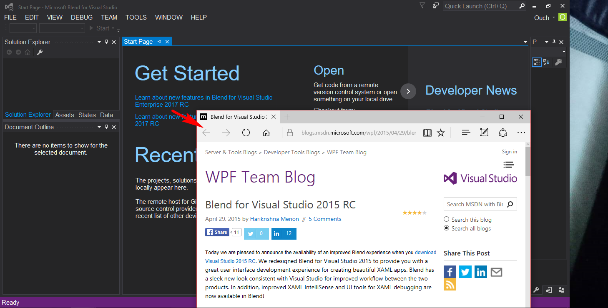

以上是我簡短的安裝心得，有興趣的朋友也不妨安裝玩玩吧。
