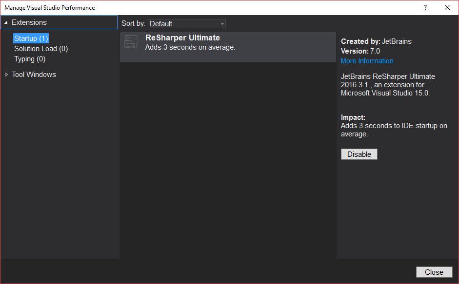
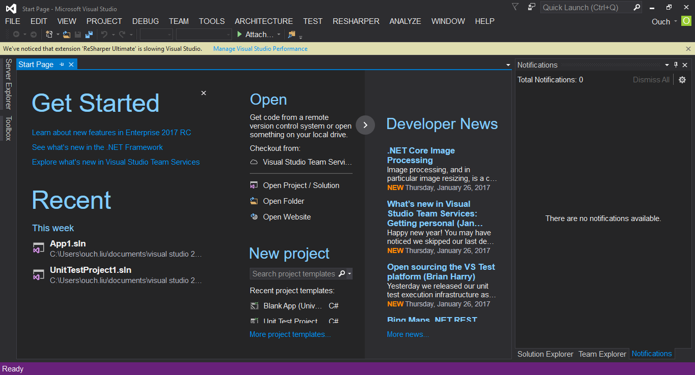
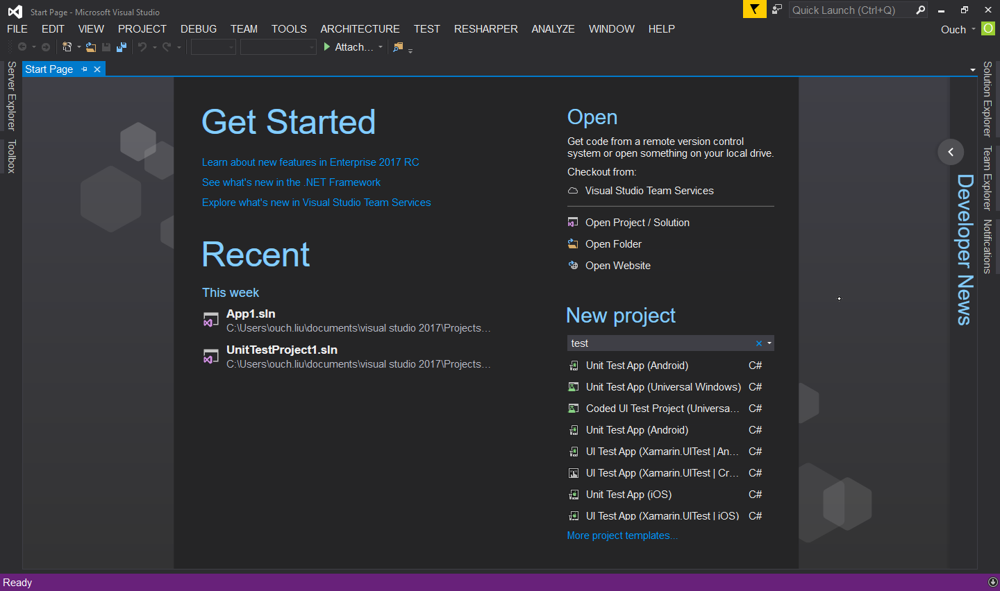
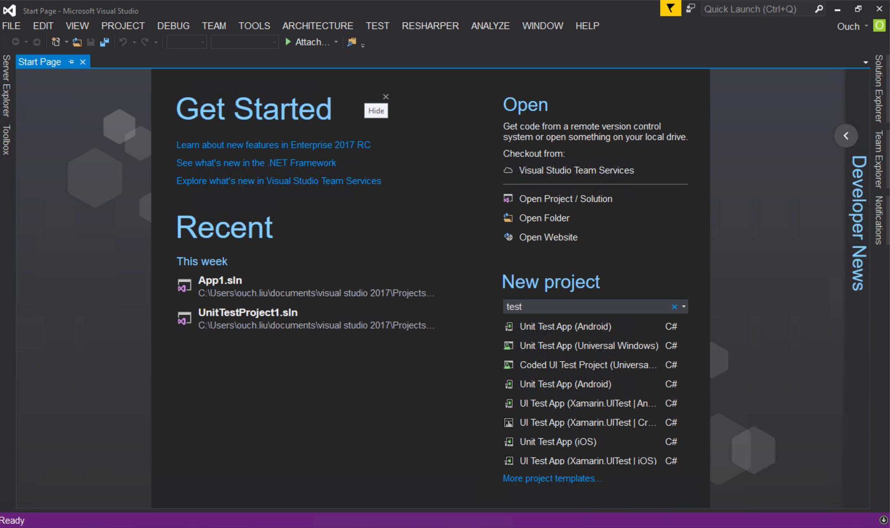
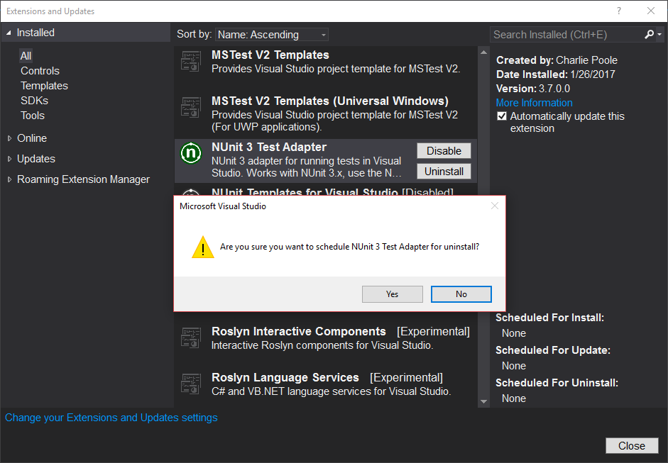
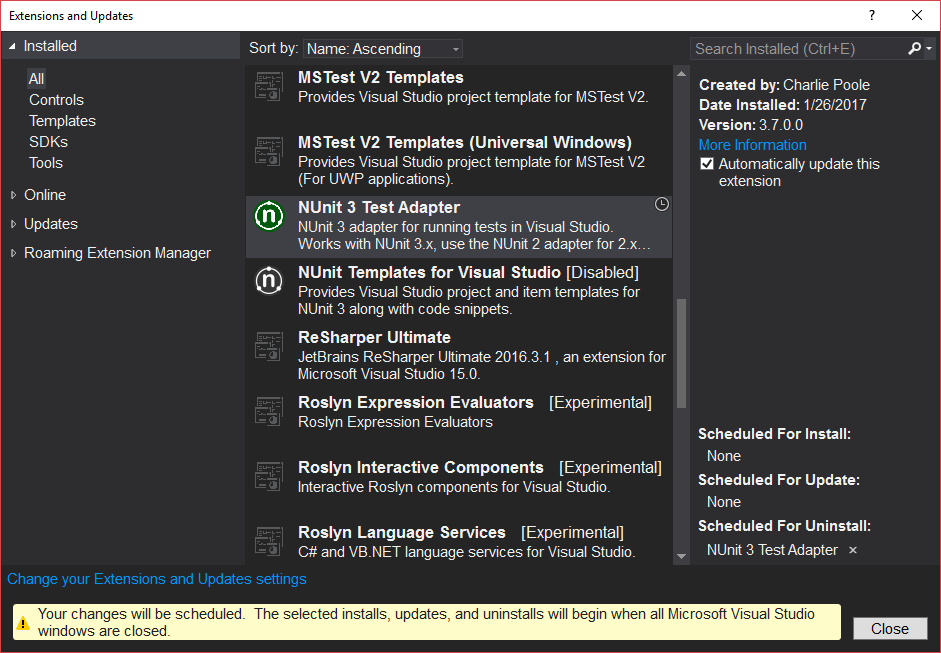
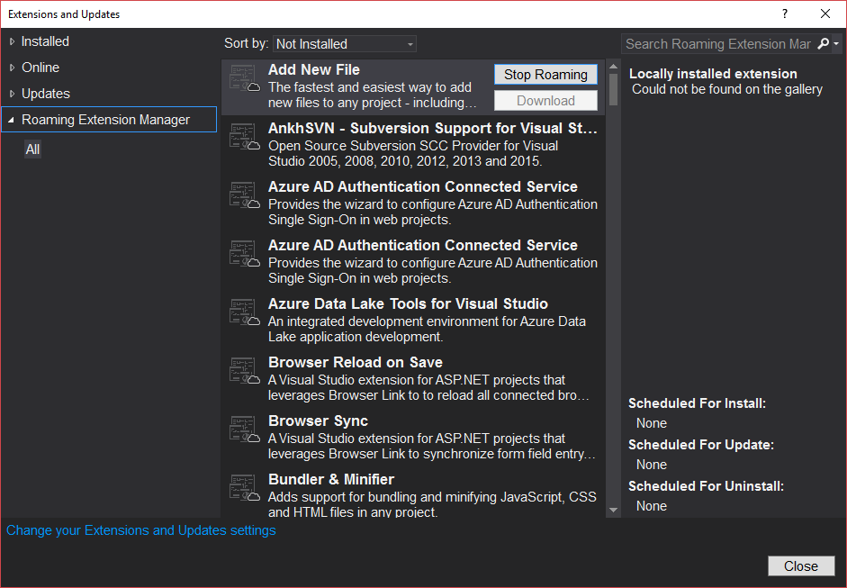
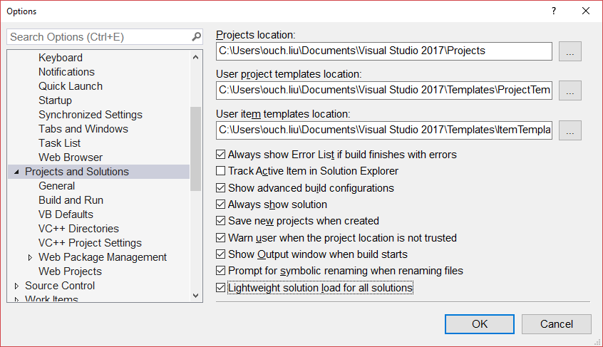
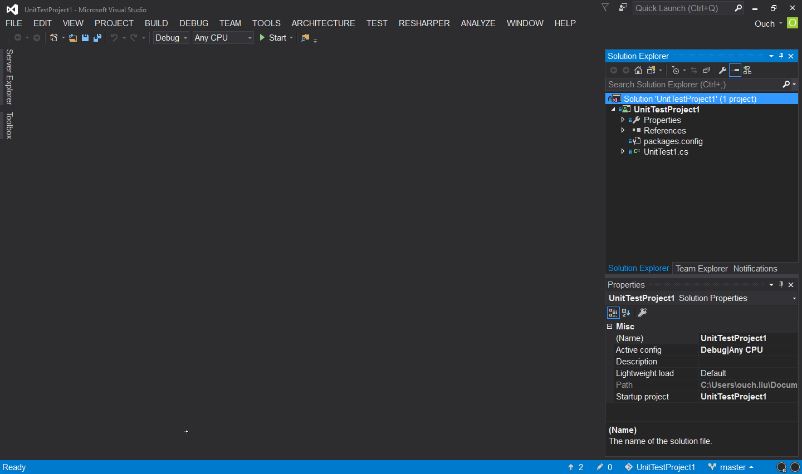
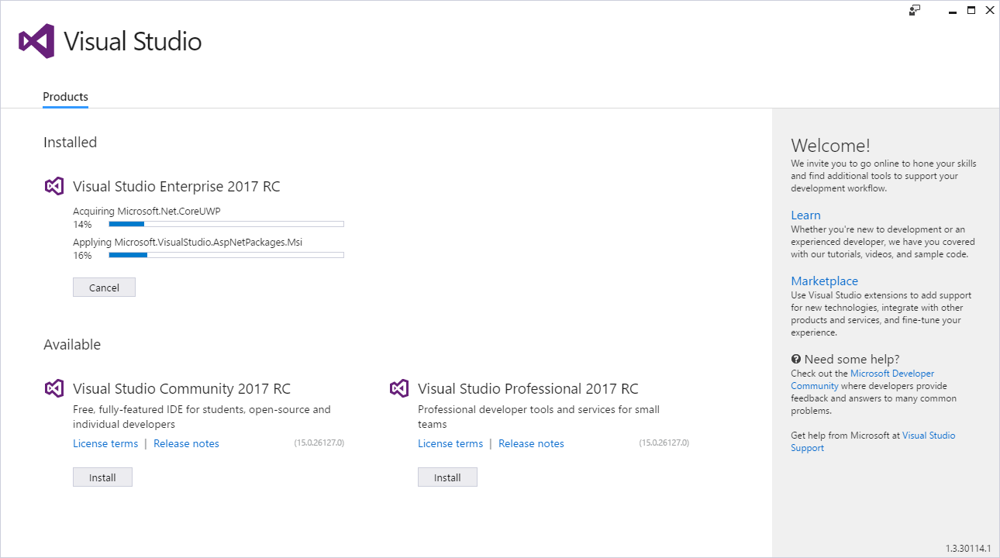

[installation]: http://ouch1978.github.io/2017/01/20/first-look-on-vs2017-rc-installation/ "初探 VISUAL STUDIO 2017 RC - 安裝篇"

在 [初探 VISUAL STUDIO 2017 RC - 安裝篇][installation] 分享了 Visual Studio 2017 RC 的安裝體驗，這篇就要針對基本 IDE 的使用者體驗增強部份來作一些分享。

<!--truncate-->

## 程式啟動與開啟專案的速度提升

根據官方的說法，Visual Studio 2017 的啟動速度比 Visual Studio 2015 提升了 50% 以上，如同 [初探 VISUAL STUDIO 2017 RC - 安裝篇][installation] 文末所提的，我親自實測 Visual Studio 2015 和 Visual Studio 2017 RC 從點下圖示到出現開始畫面的時間分別為 19.45 秒和 9.23 秒。
分別用 Visual Studio 2015 和 Visual Studio 2017 RC 開啟同一個包含八個專案的方案，前者完全開啟得花將近 30 秒，後者只花了 10 秒左右，不需要透過其他的測量工具就可以感受到非常明顯的差異。

另外，在 Visual Studio 2017 RC 裡面也加入了一個類似之前在 IE 裡面檢查 Plug-in 載入時間的功能，我們可以透過功能表的 Help -> Manage Visual Studio Performance 來隨時監控是不是有哪個 Plug-in 會拖慢啟動速度或是執行時期的效能，以方便我們進行微調。

如果偵測到任何會拖累執行效能的兇手，也會出現提示喔!!

## 開始畫面的優化

除了 [初探 VISUAL STUDIO 2017 RC - 安裝篇][installation] 文末提到的開始畫面有重新設計的介面之外，新版的開始畫面還多了以下幾項方便的功能：

- 可以透過 VSTM 或是強化的最近開啟的檔案工具(MRU) 更輕鬆的開啟本地的專案或是解決方案。
- 新版的開始畫面的最近開啟的檔案工具會顯示你最近從別的裝置上複製(Clone) 的檔案庫，讓你能更輕易的將它們也複製到本機上來。
- 可以透過可搜尋的專案樣版來建立新專案，並且最近使用過的專案樣版會透過您的個人帳號進行同步。
  

- 可以透過開始畫面上的 "Check out from VSTS" 選項快速啟動由 VSTS 上複製的專案。
- 可以將 Get Started 區域隱藏起來
- 新聞(News) 區現在可以收合了
  

  - 新聞中的項目若有更新時將有小圖示提示
  - 當新聞區收合且有新聞項目更新時，收合控制項上將會顯示小圖示提示。

## 可批次修改多個擴充功能的設定

我們可以在 Visual Studio 2017 的 Extensions and Updates 對話視窗的右下角，為那些需要重新啟動 Visual Studio 才能進行安裝、更新或是解除安裝的擴充功能設定排程；若要解除排程的話，只需要按下旁邊的 X 按鈕就可以囉!!

當 VSIX 安裝包偵測到 Visual Studio 關閉之後，就會自動完成排程中設定的工作或修改喔!!

## 內建 Roaming Extension Manager

[extension-manager]: http://ouch1978.github.io/2016/11/01/roaming-extension-manager/ "透過 ROAMING EXTENSION MANAGER 在不同機器上同步 VISUAL STUDIO 2015 的擴充功能"

Visual Studio 2017 這次直接內建了方便的擴充功能同步元件 - Roaming Extension Manager 啦!!~ 之後只要使用同一個開發者帳號，就可以在多部不同的機器上面使用相同的擴充元件進行開發囉!! (關於 Roaming Extension Manager 的介紹，可以參考 [透過 ROAMING EXTENSION MANAGER 在不同機器上同步 VISUAL STUDIO 2015 的擴充功能][extension-manager] 一文)

## 輕量化解決方案載入(Lightweight Solution Load)

為了解決龐大解決方案載入費時的問題，微軟這次研發出了"輕量化解決方案載入"功能。在載入龐大解決方案的時候，可以透過這個功能大幅的縮短載入時間以及記憶體的使用量。不過這個功能預設是關閉的，可以透過功能選單裡面的來開啟這個功能。

輕量化解決方案載入功能特別適合於使用 C# 或是混合 C# 與 C++ 開發的專案。當偵測到您正嘗試開啟符合條件的解決方案時，Visual Studio 也會很貼心的提示您開啟這個功能，以增進整體的使用者體驗喔!!

## 狀態列對版本控管的優化

Visual Studio 2017 的狀態列也特別針對版本控管的部份加入了幾項訊息的提示，以及整合，是我個人覺得非常貼心的設計。而且不單純是只有文字的提示而已，點擊每個項目的話都會出現相關的功能可以作更進一步的動作。
例如點擊向上箭頭就可以開啟 Push 功能面板，是不是非常方便啊!?

## 後記

就在寫這篇文章的過程中(要利用零碎的時間來孵文章的關係，這篇文章的生產週期跨了快一個星期，淚...)，微軟很開心的在 2017 年 1 月 26 日(換算成台灣時間的話應該是 1 月 27 日)推送了 Build 26127.00 版的更新(是要給我們當除夕禮物的嗎?)，我也藉此體驗到了新版 Visual Studio 更新的使用者經驗。
和以往相同的，在功能選單的 Tools -> Extensions and Updates 下會看到 Visual Studio 有更新，點選了更新之後，會提示我們得要更新安裝工具，更新了安裝工具之後就會看到如下的更新畫面啦~

[vs2017-relnotes]: https://www.visualstudio.com/en-us/news/releasenotes/vs2017-relnotes "Release Notes of Visual Studio 2017"

除了本文介紹的相關改進之外，其實 Visual Studio 2017 還有很多其它的加強，有興趣的朋友們不妨直接參閱 [Visual Studio 2017 的官方產品介紹頁面][vs2017-relnotes]。
