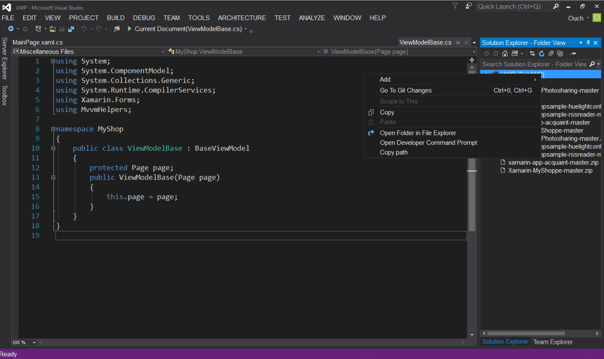

繼兩篇分別討論安裝與使用者體驗增強的文章之後，接下來要和大家分享的是 Visual Studio 2017 RC 在程式碼撰寫體驗增強的部份。

<!--truncate-->

## 強化的程式碼巡覽功能

Visual Studio 2017 RC 在程式碼巡覽的功能方面有不少的加強，之前有些得要安裝 Resharper 才能達到的功能現在都內建了。不過要特別注意的是，若您已經有安裝 Resharper 的話，部份熱鍵會被 Resharper 的功能取代，在使用上得特別注意一下。

- Go To (熱鍵為 `Ctrl + T` 或 `Ctrl + ,`) ：可以針對不同種類的範圍進行查找並且前往，可以透過點選圖示切換目標種類或是直接在文字框中輸入前置字元切換搜尋範圍。

  - Go to All ：針對所有支援的範圍進行查找並前往。

    

  - Go to Line (熱鍵為 `Ctrl + G` ，前置字元為 `:` )：直接前往指定的行數。

    

  - Go to File (熱鍵為 `Ctrl + 1 -> Ctrl + F` ，前置字元為 `f` )：前往指定的檔案。

    

  - Go to Type (熱鍵為 `Ctrl + 1 -> Ctrl + T` ，前置字元為 `t` )：前往指定的型別。

    

  - Go to Member (熱鍵為 `Ctrl + 1 -> Ctrl + M` ，前置字元為 `m` )：前往指定的成員。

    

  - Go to Symbol (熱鍵為 `Ctrl + 1 -> Ctrl + S` ，前置字元為 `#` )：前往指定的符號。

    

  另外，Go To 的功能也可以在功能表中的的 Edit 項目下面找到喔!!

  

- Find All References (熱鍵為 `Shift + F12`，目前支援 C# 、 VB 和 C++ 三種語言) ： Find All References 經過這次改版的翻修之後，除了針對 C# 和 VB 兩種語言提供搜尋結果上色功能的支援之外，還有下列實用的功能：

  - 提供了更進一步的群組、篩選、排序相關的功能。

    

  - 針對結果進行再度的搜尋功能。

    

  - 可以透過 `Keep Results` 按鈕來保留目前搜尋的結果。

    

  - 當滑鼠游標移到搜尋結果的項目上時，會出現參考到該部份的程式碼內容。

    功能的程式碼內容"

- 內建的程式碼對齊線功能：以往透過類似像 Indent Guides 之類的擴充功能才能擁有的對齊線功能，現在在 Visual Studio 2017 RC 中也內建囉!!目前這個功能支援 C# 、 VB 和 XAML 以及透過 TextMate 語法支援的檔案也可以使用喔!!

  這個功能若被關閉的話，可以透過功能選單中的 `Tools` -> `Options` -> `Text Editor` > `General` -> 勾選 `Show structure guide lines` 核選方塊即可。

  

  

## 支援 Editor Config

Visual Studio 2017 從 RC1 起就內建對 .editorconfig 檔的支援了。若您有在多種不同 IDE 撰寫程式的習慣，而且希望能在各不同工具裡保持一致的程式碼風格的話，不妨參考使用 Editor Config 來達到這個目的。而且好消息是， Resharper 也有計劃在未來支援 .editorconfig 檔喔!!

不過，目前還有一些還沒解決的 bug 存在，使用上可能得要稍微注意喔!! 如果對於在 Visual Studio 中使用 Editor Config 有興趣的話，也可以參考
[Github - Editor Config for Visual Studio][editor config for visual studio]。

[editor config for visual studio]: https://github.com/editorconfig/editorconfig-visualstudio#readme "Github - Editor Config for Visual Studio"

## 開啟資料夾功能

Visual Studio 2017 RC 提供了直接開啟資料夾的功能，而且更棒的是，針對 C++ 、 Node.js (JavaScript/TypeScript) 、 C# 與 VB 這幾種語言編寫的檔案都提供語言高亮的支援。甚至，若您有安裝該語言相關的功能的話，還可以直接進行編譯或是除錯喔!!

另外，直接開啟資料夾之後還提供下列幾種功能：

- 透過前面介紹的 GoTo 功能在資料夾中進行巡覽。

  

- 透過 Solution Explorer 瀏覽子資料夾。

- 在 Solution Explorer 中的資料夾名稱上按下滑鼠右鍵會出現`以檔案總管開啟資料夾`或是`開啟開發者命令提示字元`選項。

  

- 可以輕鬆的透過方案與資料夾下拉清單在不同的方案或是資料夾之間切換。

  

- 透過 launch.vs.json 檔設定除錯與啟動的設定；這個動作可以透過在可進行除錯的檔案上按下滑鼠右鍵並選取 `"Debug and Launch Settings"` 來完成。

  

- 透過 tasks.vs.json 檔設定任務與自訂編譯相關設定；這個動作可以透過在任意檔案上按下滑鼠右鍵並選取 `"Configure Tasks"` 來完成。

  

- 上述兩個檔案在 JSON 編輯器中都會享有 IntelliSense 的支援。

  

以上就是這次和各位分享關於 Visual Studio 2017 RC 中，關於一般程式碼撰寫體驗的部份，心動了嗎? 快點一起安裝體驗一下吧!!~
