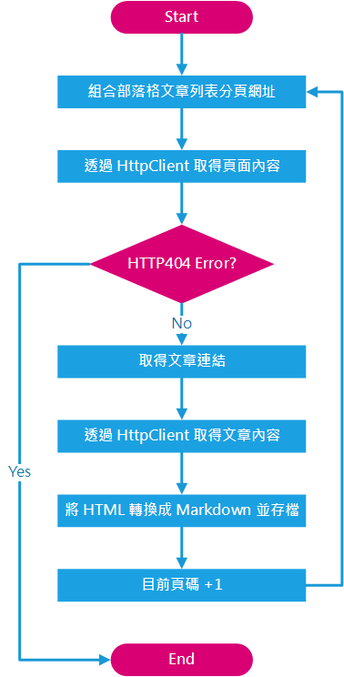
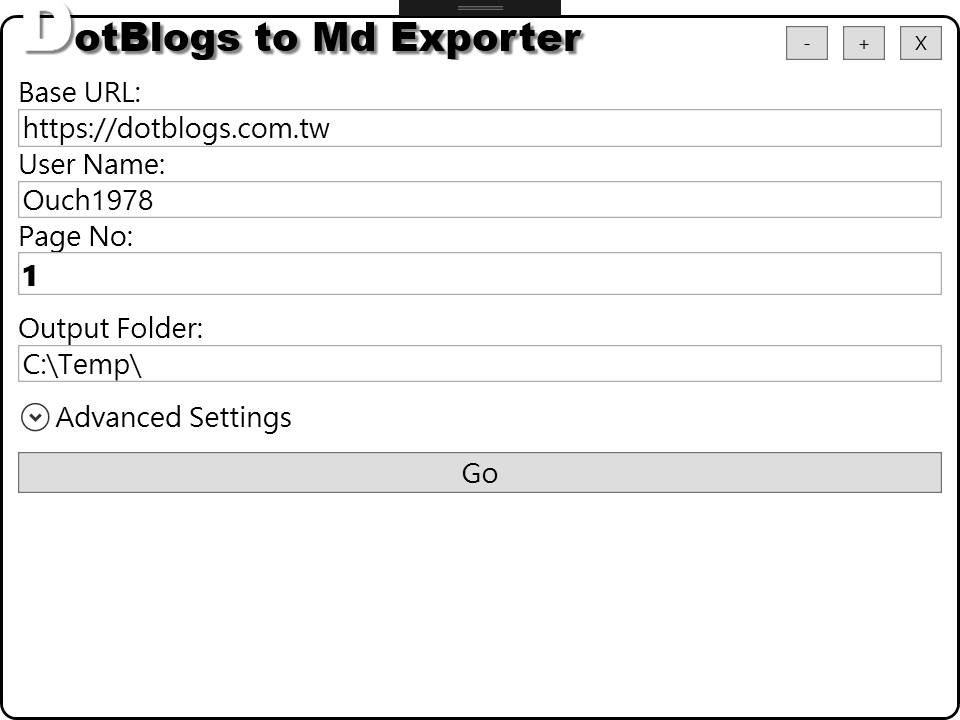

## 前言

[blackie1019]: https://github.com/blackie1019 "Blackie - 強者我同事"

忘記是去年的哪個時候，看到了強者我同事 [小黑][blackie1019] 用著 Markdown 語法寫他的部落格文章，然後透過一連串幾近自動化的流程上傳到 GitHub 上...
當時的我，默默的看著我許久沒打開的 Windows Live Writer，再默默的看了一下我許久沒新文章的部落格...

<!--truncate-->

「嗯，絕對不能再這樣下去!!」當時的我心裡默默的想著。「該是動手學點新東西的時候了!!」
「嗯!! 我也要用 Markdown 寫文章，然後把我的文章也搬到 GitHub.io 上去!!」

但是，現實是很殘酷的，我之前習慣使用的 Windows Live Writer 大改版，改版過後的點部落也不再支援 Windows Live Writer ，再加上我之前本來就沒有備份文章的習慣，現在更沒辦法透過 Windows Live Writer 把文章同步回來...

「那就自己寫吧!!」當我問強者小黑可以怎麼辦的時候，他這樣回答。

「對啊~那就自己寫吧!!」

(以上廢文)

---

## 正文

因為我原來使用的部落格平台是點部落，所以這個小工具目前使用的參數都是針對點部落而設計的，但是理論上只要稍作修改，也可以支援其他平台才對。

這個小工具基本上運作的流程如下：

[htmlagilitypack]: https://www.nuget.org/packages/HtmlAgilityPack/ "HtmlAgilityPack"
[html2markdown]: https://www.nuget.org/packages/Html2Markdown/ "Html2Markdown"

解析 HTML 的部份使用的是 [HtmlAgilityPack][htmlagilitypack] ，將 HTML 轉換成 Markdown 語法的部份則是使用 [Html2Markdown][html2markdown] 。

基於 Markdown 語法本身支援的限制，有部份的 HTML 標籤 (例如文字顏色、 iFrame 、 表格等等) 將不會被轉換，不過在顯示上應該還是沒問題的。

程式的主畫面如下圖：

基本上，如果你也是要從點部落把文章轉出來的話，只需要填入帳號應該就可以按下 Go 按鈕進行轉換了。如果你使用的是其他的平台，則可能需要自行替換掉畫面上顯示欄位的 XPath 值。

附上程式的原始碼連結，歡迎有興趣的朋友們自行取用。

](https://github.com/Ouch1978/HtmlToMdExporter)

## 後記

要從已經用了五年以上的平台轉移到另一個全新的平台，的確是讓人很掙扎的一件事。

歷經了不同時期的各種阻礙(點部落的 WebService 被封鎖、Windows Live Writer 改版、我的硬碟掛掉、點部落改版...)，我想，會讓我決定轉換平台的三大原因，主要是下面三項：

1. 我個人習慣使用離線工具撰寫文章。

2. 我想要使用有自我風格的主題和樣版，以及更多能自訂功能的部份。

3. 我喜歡 Markdown 語法的簡潔，也想藉這個機會接觸 GitHub 和 GitHub.io。

經過一番比較之後，使用 Atom 作為我的寫作工具、搭配 Jekyll 和 GitHub.io 剛好能滿足我的需求，研究了幾天之後，也順利的成功上架第一篇文章。

不過，在這邊，還是得特別感謝一直以來默默提供免費平台的點部落，以及背後辛苦付出的歷代管理者群們，特別是開國元老的大鈞和 Jon 哥，還有現在接手的 Demo 大大。

因為有你們的付出，讓台灣的開發者們得以有一個空間可以記錄、分享自己的知識，也造就了今天的我。

如果，你也在尋找一個以開發者為主要客群的部落格平台，而且你已經習慣使用 Web 上的編輯工具作為你主要的寫作工具的話，依據我個人的經驗，點部落絕對是你的首選。
