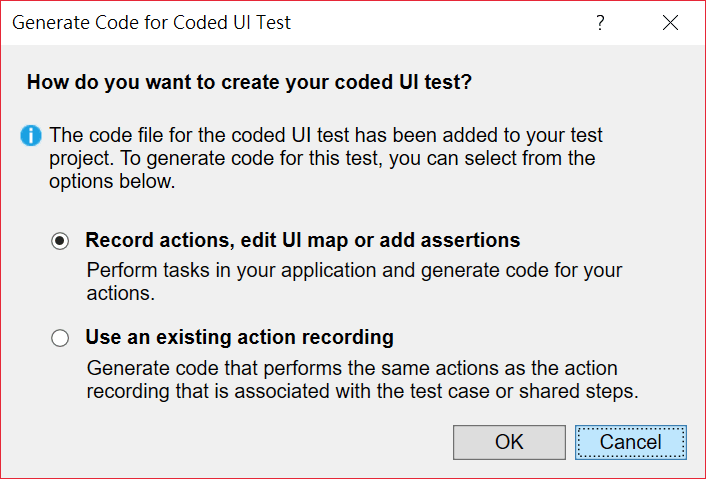

## 前言

在導入 CI/CD 的時候，能將測試自動化是很重要的一個環節。 然而，除了「`工程師生出來就應該要會`」的 Unit Test 之外， UI 的自動化測試也很重要。

基於大部份的工具都難以辨識以 Flash / Flex 編寫的 UI 裡面的元件的關係，因此大多數有需要針對 Flash UI 進行測試的需求時，最常使用的方式就是直接錄製滑鼠和鍵盤的動作。 這個方式固然可行，但是一來程式碼相對的複雜(可能得引用到 Windows API)、入門的門檻相對提高；二來，一旦 Flash 或是視窗的位置不小心跑掉，整個測試就會失敗了。

[sikuli4net]: https://www.nuget.org/packages/Sikuli4Net "Sikuli4Net - Call Sikuli from your .NET project"

針對上述的兩個問題，讓我好奇是不是還有更好的方式可以讓我們以更簡單、有效率，而且更準確的方式來針對 Flash UI 進行自動化測試，而且最好能和 Selenium 混搭。 最後，總算讓我找到另一條出路啦，也就是今天要介紹的主角 -- [Sikuli4Net][sikuli4net]。

<!--truncate-->

[vgod]: http://blog.vgod.tw/2010/01/30/sikuli/ "vgod"
[sikuli-wiki]: https://en.wikipedia.org/wiki/Sikuli "Sikuli - Wiki"

其實 Sikuli 本來是一個以 Java 為基礎而開發出來的工具，從 2009 年開始了這個專案，在 2012 年正式完成。 主要的開發者 [vgod][vgod] 也是台灣人喔!!(台灣之光!! 灑花~~~~ 關於 Sikuli 的詳細發展史，請參閱[維基百科][sikuli-wiki])

Sikuli 主要的功能和特色是：讓我們以擷圖的方式，取代我們的眼睛，再透過 Sikuli 幫我們進行比對，找到目標控制項，並且和它進行互動。

不過，前面已經提到了， Sikuli 是以 Java 為基礎開發的，所以沒辦法直接透過 .Net / C# 呼叫，得要透過 Wrapper 多包一層才能給 .Net 使用。 而這個包好可以給 .Net 使用的版本， 在 Nuget 上也有兩三種，不過最後我還是選擇了 Sikuli4Net。

## 使用方式

介紹了那麼多，光說不練是不夠的，接下來我們就來透過一個實例，見證透過 Sikuli4Nnet 為我們帶來的奇蹟吧!!

在我們開始之前，得先確認你的電腦裡面得有安裝 Java Runtime Environment 6 以上的版本(這個應該每個人都有吧?)，否則會出現系統找不到檔案的錯誤。

第一步當然就開啟地表最強的開發工具 - Visual Studio 建立我們的測試專案囉。


接著， Visual Studio 會貼心的問我們要用什麼方式建立程式碼，這邊我直接按下 Cancel 鈕。



再來，透過 Nuget 安裝以下的元件庫吧。

- Selenium.WebDriver

- Selenium.Support

- Selenium.WebDriver.ChromeDriver

- Sikuli4Net

安裝完需要使用的元件庫之後，就可以找一個 Flash 小遊戲來試刀了。

[flash 算命小遊戲]: https://en.wikipedia.org/wiki/Sikuli "Flash 算命小遊戲"

為了完成這個範例，我在網路上隨便找了一個 [Flash 算命小遊戲][flash 算命小遊戲]來作為我測試的目標。

為了證明 Sikuli4Net 可以和 Selenium 混搭使用，所以這裡就簡單的透過 Selenium 的 ChromeDriver 來幫我們用 Chrome 開啟目標網頁。

準備工作完成之後，就可以開始準備使用擷圖工具來把目標控制項的部份擷取下來並且加入到專案裡了。

以這次的範例來說，我會先在專案中建立一個名為 Images 的資料夾，再分別把 Flash 中需要點擊或是輸入文字的控制項分別擷圖存檔，並且放進 Images 資料夾中。

這邊有很重要的一點 -- `圖檔的 Copy to Output Directory 屬性記得要設為 Copy always` ，不然在執行的時候會出錯喔。


這些動作都完成了之後，再來就是透過 Sikuli4Net 提供的 API 來撰寫我們的測試啦!!

完整的程式碼如下：

```csharp title="CodedUITest1.cs"
using System;
using Microsoft.VisualStudio.TestTools.UITesting;
using Microsoft.VisualStudio.TestTools.UnitTesting;
using OpenQA.Selenium;
using OpenQA.Selenium.Chrome;
using Sikuli4Net.sikuli_REST;
using Sikuli4Net.sikuli_UTIL;
using System.IO;
using System.Threading;

namespace SikuliCodedUITestProject
{
[CodedUITest]
public class CodedUITest1
{
static IWebDriver _driver;

        APILauncher _launcher = new APILauncher( true );

        public CodedUITest1()
        {
        }

        #region Additional test attributes

        // You can use the following additional attributes as you write your tests:

        //Use TestInitialize to run code before running each test
        [TestInitialize()]
        public void MyTestInitialize()
        {
            _launcher.Start();
            _driver = new ChromeDriver();
            _driver.Manage().Window.Maximize();
            _driver.Navigate().GoToUrl( "http://www.xingzuo360.cn/uploads/media/121030/1-1210300F426.swf" );
        }

        //Use TestCleanup to run code after each test has run
        [TestCleanup()]
        public void MyTestCleanup()
        {
            _driver.Quit();
            _launcher.Stop();
        }

        #endregion


        [TestMethod]
        [DeploymentItem( "Images\\" ,"Images\\" )]
        public void CodedUITestMethod1()
        {
            Thread.Sleep(5000);

            //定義目前的畫面為偵測區
            Screen mainPage = new Screen();

            //透過 Pattern 類別宣告並定義要比對的控制項擷圖
            Pattern goButton = new Pattern( Path.Combine( AppDomain.CurrentDomain.BaseDirectory + @"\Images\Go.png" ) );
            Pattern nameField = new Pattern( Path.Combine( AppDomain.CurrentDomain.BaseDirectory + @"\Images\Name.png" ) );
            Pattern birthdayField = new Pattern( Path.Combine( AppDomain.CurrentDomain.BaseDirectory + @"\Images\Birthday.png" ) );
            Pattern gender = new Pattern( Path.Combine( AppDomain.CurrentDomain.BaseDirectory + @"\Images\Gender.png" ) );
            Pattern bloodType = new Pattern( Path.Combine( AppDomain.CurrentDomain.BaseDirectory + @"\Images\BloodType.png" ) );
            Pattern placeField = new Pattern( Path.Combine( AppDomain.CurrentDomain.BaseDirectory + @"\Images\PlaceGrownUp.png" ) );
            Pattern okButton = new Pattern( Path.Combine( AppDomain.CurrentDomain.BaseDirectory + @"\Images\OkButton.png" ) );
            Pattern result = new Pattern( Path.Combine( AppDomain.CurrentDomain.BaseDirectory + @"\Images\Result.png" ) );

            //等待 go 按鈕出現
            mainPage.Wait( goButton );

            //對 go 按鈕按下滑鼠左鍵
            mainPage.Click(goButton);

            Thread.Sleep( 3000 );

            //在姓名欄位輸入文字
            mainPage.Type( nameField , "Ouch" );

            //在生日欄位輸入文字
            mainPage.Type( birthdayField, "19781128" );

            //點選男性
            mainPage.Click( gender );

            //點選 B 型
            mainPage.Click( bloodType );

            //在成長地點欄位輸入文字
            mainPage.Type( placeField , "Taipei" );

            //按下 Ok 按鈕
            mainPage.Click( okButton );

            Thread.Sleep( 8000 );

            //以結果是否出現作為判斷測試成功的條件
            Assert.IsTrue(mainPage.Exists(result));
       }
    }

}
```

專案原始檔連結在此，歡迎自行取用。

[](https://github.com/Ouch1978/Sikuli4NetCodedUITestSample/)

## 注意事項 / 小心得

基本上，透過 Sikuli4Net 應該可以完成我們通常會對 Flash UI 進行的大部份操作。 不過如果想要針對長相一樣的多個控制項進行重複操作的話，這個部份我就還沒摸出來了。

另外，建議擷圖的部份儘量擷取比控制項還要大一點點的範圍，以提升比對準確度，如果 Flash 裡面有動畫或是需要等待它載入的話，也可以適當的透過 Thread.Sleep() 方法延緩測式的時間。

以上，如果你手邊也有古早的 Flash UI 需要測試的話，不妨也試看看 Sikuli4Net 吧~

當然，如果你有更好用、更簡便的方法或工具，也歡迎不吝分享喔!!~
