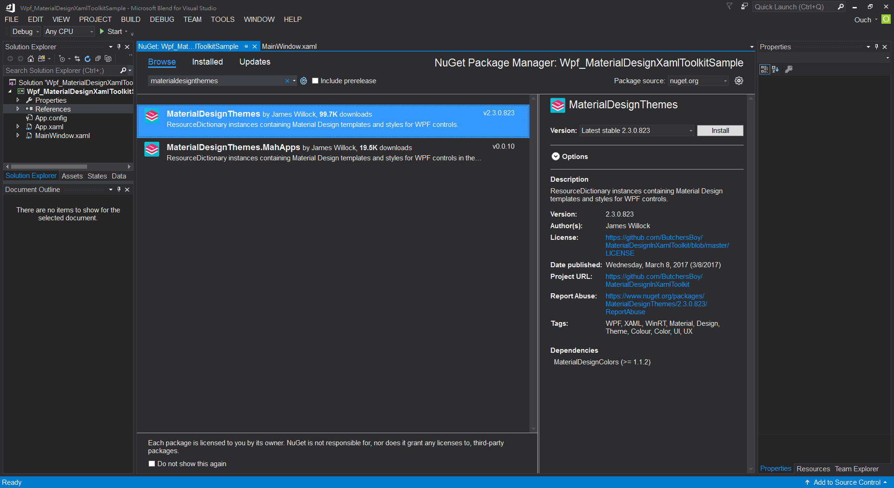
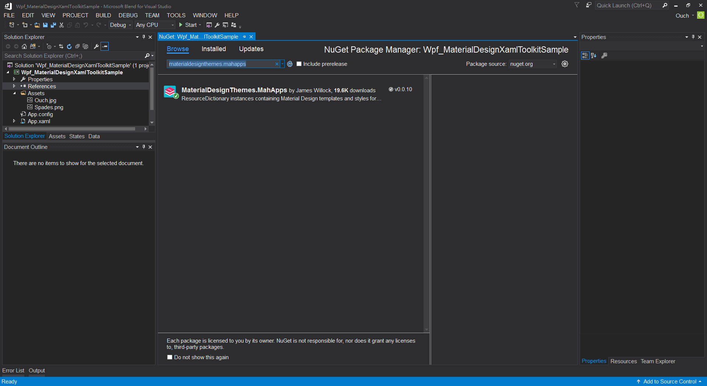
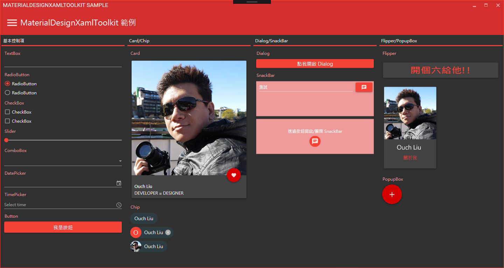

## 前言

在開發應用程式的時候， UI 和 UX 往往都是最讓工程師們最頭痛的地方。特別是以 XAML 設計應用程式外觀的時候，彈性更大，可以客製化的程度高；要設計出一個華麗又實用的系統，就得花更多時間在設計上。

雖然我們還是可以偷 Windows Presentation Framework 裡面內建的主題來使用，或是參考我古早以前的 [快速為 WPF 換裝 - 使用 WPF Themes][my-old-post] 一文裡所提到的 [WPF Themes][wpf-themes] 來快速幫 WPF 應用程式換上新衣。

不過，那些主題和目前流行的 Material Desing 風格還是有極大差異的。

現在，就有人開發出了符合 Google 的 Material Design 原則的 WPF 主題，只要輕鬆幾個步驟，就能讓 WPF 應用程式變得美美的喔!!

<!--truncate-->

[my-old-post]: https://dotblogs.com.tw/ouch1978/2011/03/10/wpf-introducing-wpf-themes
[wpf-themes]: http://wpfthemes.codeplex.com/

有圖有真相，我們先來看看套用它之後跑起來會長什麼樣子：

[image-00]: 00-material-design-xaml-toolkit-in-live.gif "套用 MaterialDesignXamlToolkit 的應用程式"

## 安裝與基本使用

廢話不多說，馬上透過 VS 好朋友 - Blend for Visual Studio 2017 來為大家示範怎麼使用。

首先我們透過 Blend 來建立一個 WPF 專案，接著透過 Manage NuGet Packages... 功能以 `MaterialDesignThemes` 為關鍵字搜尋並且安裝該套件，如下圖：



安裝完畢之後，就可以開啟專案中的 `App.xaml` 檔來進行初步主題的套用囉。

```xml title="App.xaml"
<Application x:Class="Wpf_MaterialDesignXamlToolkitSample.App"
             xmlns="http://schemas.microsoft.com/winfx/2006/xaml/presentation"
             xmlns:x="http://schemas.microsoft.com/winfx/2006/xaml"
             xmlns:local="clr-namespace:Wpf_MaterialDesignXamlToolkitSample"
             StartupUri="MainWindow.xaml">
<Application.Resources>
<ResourceDictionary>
<ResourceDictionary.MergedDictionaries>
<!--設定主題背景色-->
<ResourceDictionary Source="pack://application:,,,/MaterialDesignThemes.Wpf;component/Themes/MaterialDesignTheme.Dark.xaml" />
<!--套用基本控制項樣式-->
<ResourceDictionary Source="pack://application:,,,/MaterialDesignThemes.Wpf;component/Themes/MaterialDesignTheme.Defaults.xaml" />
<!--設定主色-->
<ResourceDictionary Source="pack://application:,,,/MaterialDesignColors;component/Themes/Recommended/Primary/MaterialDesignColor.Red.xaml" />
<!--設定輔色-->
<ResourceDictionary Source="pack://application:,,,/MaterialDesignColors;component/Themes/Recommended/Accent/MaterialDesignColor.Red.xaml" />
</ResourceDictionary.MergedDictionaries>
</ResourceDictionary>
</Application.Resources>
</Application>
```

> 關於主色和輔色選用的部份，請參考 [Material Design 官網的介紹文][color-palette]

[color-palette]: https://material.io/guidelines/style/color.html#color-color-palette "Color palette"

接下來，在我們編輯 `MainPage.xaml` 的內容之前，我們得先透過 `TextElement.Foreground` 和 `Background` 屬性來設定視窗的文字顏色以及背景色。

```xml title="MainPage.xaml"

<Window x:Class="Wpf_MaterialDesignXamlToolkitSample.MainWindow"
        xmlns="http://schemas.microsoft.com/winfx/2006/xaml/presentation"
        xmlns:x="http://schemas.microsoft.com/winfx/2006/xaml"
        xmlns:d="http://schemas.microsoft.com/expression/blend/2008"
        xmlns:mc="http://schemas.openxmlformats.org/markup-compatibility/2006"
        xmlns:local="clr-namespace:Wpf_MaterialDesignXamlToolkitSample"
        TextElement.Foreground="{DynamicResource MaterialDesignBody}"
        Background="{DynamicResource MaterialDesignPaper}"
        mc:Ignorable="d" Title="MainWindow" Height="350" Width="525">
<Grid>
</Grid>
</Window>
```

完成之後，就可以在裡面擺放控制項啦!!~

## 使用內建圖示

Material Design 的精神之一，就是使用圖示來替代文字，透過簡單明瞭的圖示來傳達訊息給使用者。
關於這點，作者也替我們"傳便便"。 MaterialDesignXamlToolkit 裡內建了數百個圖示給我們使用，使用方法也很簡單，只要在頁面上參考 `http://materialdesigninxaml.net/winfx/xaml/themes` 這個命名空間，使用裡面的 PackIcon 控制項，再透過 Kind 屬性來選取要使用的圖示即可。(是不是超級方便的啊!!!?)

> 關於可使用的圖示資訊，請參考 [Material Design Icons][material-design-icons]

[material-design-icons]: https://materialdesignicons.com/ "Material Design Icons"

## 特殊控制項與特效

能改變原來控制項的樣貌已經夠威猛了對吧?! 不過這還不夠， MaterialDesignXamlToolkit 裡面還要給你滿滿的原創控制項和特效!!

- Card - 類似小卡片的容器控制項。
- Chip - 楕圓型外框的控制項，可以另外在前面加上圖示或是文字。(嗯...其實我不知道該怎麼更精確的形容它...)
- ColourZone - 顏色區塊，適合放在頁面的上方搭配不同的控制項(例如漢堡選單)作為選單或是查詢功能使用。
- Dialog - 看名字就知道了，是對話視窗。
- Drawer - 抽屜，就是可以放置於視窗上、下、左、右的可收合面板。
- Flipper - 類似於 Card 控制項，但是可以讓我們分別針對正面及反面設置不同的呈現內容。
- PopupBox - 彈出式的容器，適合用來實作簡易型選單的功能。
- SnackBar - 會自動收合的訊息列。

## 套用視窗外觀

除了視窗裡面的控制項符合 Material Desing 的風格之外，視窗本身會不會也想換個顏色來個裡應外合呢?
沒問題，作者都幫我們準備好了!!

要連視窗都一起套用顏色的話，只需要透過 Nuget 安裝 `MaterialDesignThemes.MahApps` 套件。



接著進一步的修改 App.xaml 檔的內容：

```xml title="App.xaml"
<Application x:Class="Wpf_MaterialDesignXamlToolkitSample.App"
             xmlns="http://schemas.microsoft.com/winfx/2006/xaml/presentation"
             xmlns:x="http://schemas.microsoft.com/winfx/2006/xaml"
             xmlns:local="clr-namespace:Wpf_MaterialDesignXamlToolkitSample"
             StartupUri="MainWindow.xaml">
<Application.Resources>
<ResourceDictionary>
<ResourceDictionary.MergedDictionaries>
<!-- 加入 MahApps 相關資源 -->
<ResourceDictionary
                        Source="pack://application:,,,/MahApps.Metro;component/Styles/Controls.xaml" />
<ResourceDictionary
                        Source="pack://application:,,,/MahApps.Metro;component/Styles/Fonts.xaml" />
<ResourceDictionary
                        Source="pack://application:,,,/MahApps.Metro;component/Styles/Colors.xaml" />
<ResourceDictionary
                        Source="pack://application:,,,/MahApps.Metro;component/Styles/Accents/BaseDark.xaml" />

                <!--設定主題背景色-->
                <ResourceDictionary
                        Source="pack://application:,,,/MaterialDesignThemes.Wpf;component/Themes/MaterialDesignTheme.Dark.xaml" />
                <!--套用基本控制項樣式-->
                <ResourceDictionary
                        Source="pack://application:,,,/MaterialDesignThemes.Wpf;component/Themes/MaterialDesignTheme.Defaults.xaml" />
                <!--設定主色-->
                <ResourceDictionary
                        Source="pack://application:,,,/MaterialDesignColors;component/Themes/Recommended/Primary/MaterialDesignColor.Red.xaml" />
                <!--設定輔色-->
                <ResourceDictionary
                        Source="pack://application:,,,/MaterialDesignColors;component/Themes/Recommended/Accent/MaterialDesignColor.Red.xaml" />

                <!-- 加入與 MahApps 相容的相關資源 -->
                <ResourceDictionary
                        Source="pack://application:,,,/MaterialDesignThemes.MahApps;component/Themes/MaterialDesignTheme.MahApps.Fonts.xaml" />
                <ResourceDictionary
                        Source="pack://application:,,,/MaterialDesignThemes.MahApps;component/Themes/MaterialDesignTheme.MahApps.Flyout.xaml" />
            </ResourceDictionary.MergedDictionaries>

            <!-- 加入筆刷資源 -->
            <SolidColorBrush x:Key="HighlightBrush"
                    Color="{DynamicResource Primary700}" />
            <SolidColorBrush x:Key="AccentColorBrush"
                    Color="{DynamicResource Primary500}" />
            <SolidColorBrush x:Key="AccentColorBrush2"
                    Color="{DynamicResource Primary400}" />
            <SolidColorBrush x:Key="AccentColorBrush3"
                    Color="{DynamicResource Primary300}" />
            <SolidColorBrush x:Key="AccentColorBrush4"
                    Color="{DynamicResource Primary200}" />
            <SolidColorBrush x:Key="WindowTitleColorBrush"
                    Color="{DynamicResource Primary700}" />
            <SolidColorBrush x:Key="AccentSelectedColorBrush"
                    Color="{DynamicResource Primary500Foreground}" />
            <LinearGradientBrush x:Key="ProgressBrush" EndPoint="0.001,0.5"
                    StartPoint="1.002,0.5">
                <GradientStop Color="{DynamicResource Primary700}" Offset="0" />
                <GradientStop Color="{DynamicResource Primary300}" Offset="1" />
            </LinearGradientBrush>
            <SolidColorBrush x:Key="CheckmarkFill"
                    Color="{DynamicResource Primary500}" />
            <SolidColorBrush x:Key="RightArrowFill"
                    Color="{DynamicResource Primary500}" />
            <SolidColorBrush x:Key="IdealForegroundColorBrush"
                    Color="{DynamicResource Primary500Foreground}" />
            <SolidColorBrush x:Key="IdealForegroundDisabledBrush"
                    Color="{DynamicResource Primary500}" Opacity="0.4" />
        </ResourceDictionary>
    </Application.Resources>

</Application>

```

再來只需要把原來視窗的 Window 型別改成 `http://metro.mahapps.com/winfx/xaml/controls` 命名空間中的 `MetroWindow` 型別就搞定啦!!

執行起來就會像下圖這樣喔!! 是不是很酷炫啊!?



## 總結

MaterialDesignXamlToolkit 真的是非常強大，我只能介紹部份的功能給大家。
官方 GitHub 上的範例遠比我介紹的部份來得詳盡許多，而且也和它的 Wiki 作了不錯的整合。
雖然作者也有意推出 UWP 版，不過目前還在開發當中，有興趣的朋友們不妨也一起參與開發，或是直接打賞作者，讓他有繼續開發的動力喔!!

最後，我在這篇文章裡所撰寫的範例程式碼連結如下，歡迎任意取用：

[](https://github.com/Ouch1978/Wpf_MaterialDesignXamlToolkitSample/)
