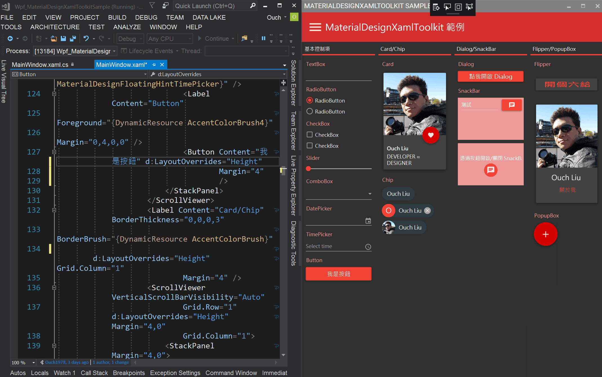
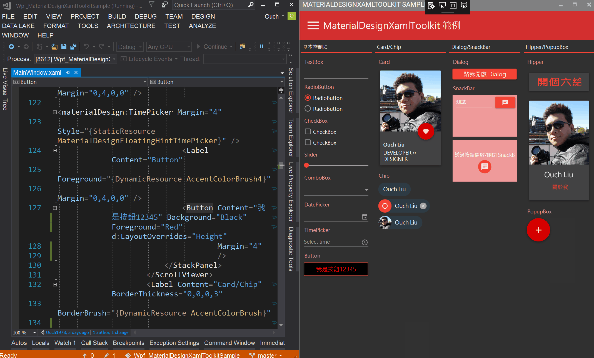
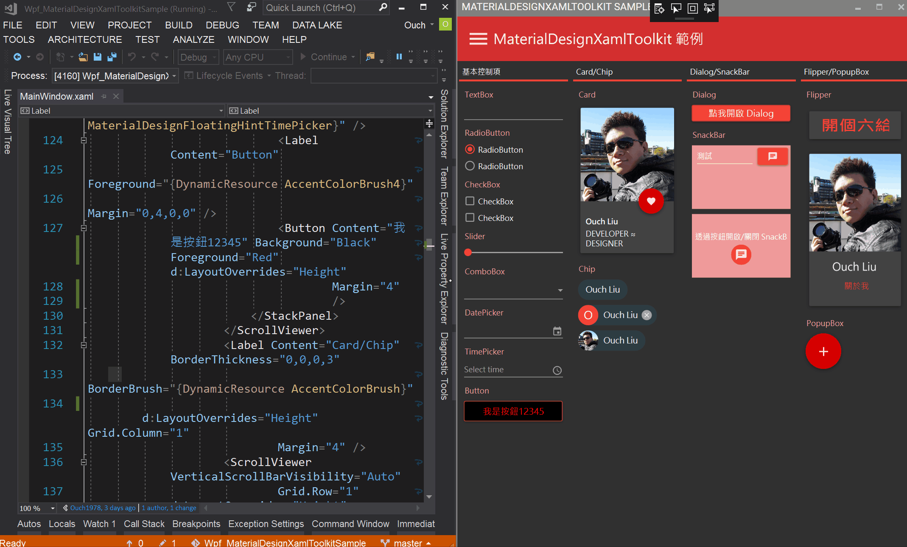

## 前言

自從 WPF 在 .Net Framework 3.0 中首度現身以來， XAML 就扮演了它的 UI 設計語言的角色。 時至今日，微軟在更多 UI/UX 的領域相繼投入了更多的關注在它身上。 透過這篇文章，我想用簡單快速的方式讓大家了解 XAML 的發展，也藉此跟大家介紹一個在 Visual Studio 2017 裡很方便，但不是新功能的功能。(好饒舌??)

<!--truncate-->

## XAML 的過去

XAML 的全名為 E`x`tensible `A`pplication `M`arkup `L`anguage ，我們可以把它看作是結合了 XML 與 HTML 特性的使用者介面描述語言。 有了它的存在，讓 Windows 平台上的桌面應用程式有了全新的風貌和想像。
以往，由於平台本身限制的關係，藉由 Windows Form 撰寫的應用程式介面大多比較死板，相對的難以作到控制項隨著視窗縮放，也相對的難去實作出動畫和轉場效果。
甚至，如果沒有一定的底子和功力，想要在下拉式選單裡面塞圖片或是按鈕，就可以讓工程師為了這樣的需求刻上一整天的 UI。
而隨著 WPF 和 XAML 的出現，工程師們不用再攪盡腦汁去突破平台本身的限制，就可以輕鬆的透過 XAML 實作出上述的客製化控制項與動畫。

在 WPF 之後， 微軟也推出了 Silverlight ，一個微軟想用來和 Adobe 的 Flash 抗衡的框架，其使用者介面描述語言也是 XAML。
之後， XAML 也相繼在 Windows Phone 7 、 Windows Phone 8 、 Windows 8/8.1 以及現在的 Windows 10、 Windows Mobile 10 、 XBox One 、 Hololens 這幾個平台中出現，作為 App 和作業系統中佔有重要地位的使用者介面描述語言。

> 關於 XAML 的發展史，有人使用 TimelineJS 刻出了一個網頁： [An history of 11 years of XAML stacks][an history of 11 years of xaml stacks]

[an history of 11 years of xaml stacks]: http://japf.github.io/xaml-history/ "An history of 11 years of XAML stacks"

儘管 Silverlight 已經成為歷史的一部份了，但是 XAML 在 UWP 的生態環境裡仍然佔有舉足輕重的地位。

## XAML 的現在與 Visual Studio 2017

有持續在關心 Windows 10 發展的朋友們應該知道， Windows 10 的開始功能表就是透過 XAML 實作出來的。
微軟也在不同的會議及活動中承諾會持續針對 XAML 投入更多的心力，例如提供了開發 UWP 時可以使用的 [UWP Community Toolkit][uwp community toolkit] ，內建更多的控制項和特效以及其它方便的功能。

[uwp community toolkit]: https://github.com/Microsoft/UWPCommunityToolkit "UWP Community Toolkit"

除此之外，微軟在 Visual Studio 上也為 XAML 開發者們提供了實用的 `XAML Edit & Continue` 功能。

平常有在以 C# 撰寫程式的朋友們應該對 Edit & Continue 的功能不陌生，也應該因為它的存在，在進行除錯的的時候得到了不少的幫助。
而自從 Visual Studio 2015 Update 2 推出之後， XAML 開發者們也能享受到相同的好處，透過 XAML Edit & Continue 的功能在進行除錯的同時，也可以透過所視即所得的方式同時以 XAML 語法編輯你的 UI。

我們也可以透過 Live Visual Tree 面板來觀查我們所設計出來的 UI 的視覺樹是什麼樣的構造，這個在我們想自已刻控制項或是效能校調的時候是非常有幫助的一個功能。

同時，也可以透過 Live Property Explorer 來即時的對視覺樹中的控制項進行屬性的編輯並且即時看到效果，而不影響 XAML Code。

是不是很方便啊!?

當然，這些方便的功能也都一併被內建在 Visual Studio 2017 裡面囉!!

## XAML 的未來以及相關資源

有陸續在關心 Windows 10 發展的朋友們應該也都跟我一樣很期待 Creator Update 正式版的發佈日期。

除了 Creator Update 之外，微軟也宣佈了 Neon 專案，據說會重新定義 Microsoft Design Language 及部份控制項，並且在 Windows Vista 和 Windows 7 時代的毛玻璃效果也會隨之回歸。

如果你也對 XAML 及 UI/UX 設計有興趣，這裡還有一些不錯的資源可以參考：

- [The Future of XAML][the-future-of-xaml]

  [the-future-of-xaml]: https://channel9.msdn.com/Events/Build/2016/The-Future-of-XAML "The Future of XAML"

- [Windows UI Samples][windows-ui-samples]

  [windows-ui-samples]: https://aka.ms/winuidevlabs "Windows UI Samples"

- [Other UWP Samples][other-uwp-samples]

  [other-uwp-samples]: https://aka.ms/windowsuwpsamples "Other UWP Samples"
