## 前言

自從 Windows 10 更新到 Creator Update 之後，原來在開始按鈕右鍵選單裡面的控制台選項不見了，取而代之的是新的設定選單。但是對於已經習慣使用控制台的我來說，這個改變真的是讓我很不習慣啊~~

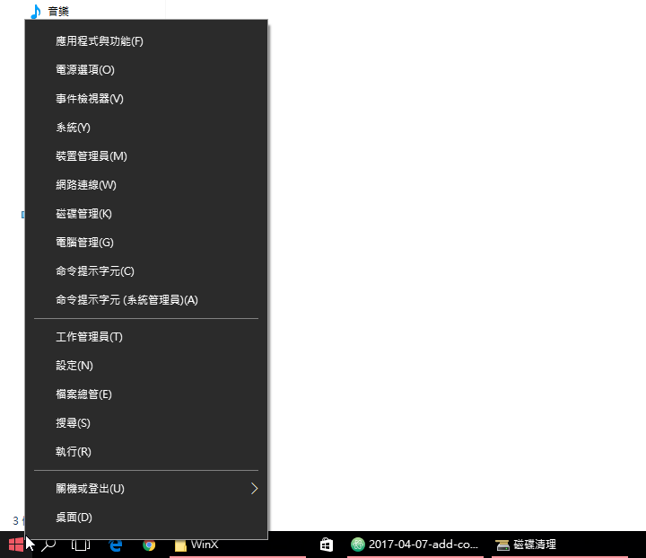

為了讓這個習慣得以延續下去，路不轉，人轉囉!! 以下就簡單的分享一下怎麼把控制台這個選項加回來的方法：

<!--truncate-->

## 方法一：透過手動的方式加回來

基本上，Windows 10 開始按鈕右鍵選單的內容會存放在 `%USERPROFILE%\AppData\Local\Microsoft\Windows\WinX` 資料夾裡。所以我們可以這樣作：

首先，透過檔案總管瀏覽 `%USERPROFILE%\AppData\Local\Microsoft\Windows\WinX` 資料夾，應該會看到裡面應該有三個分別名為 Group1 ~ 3 的資料夾。

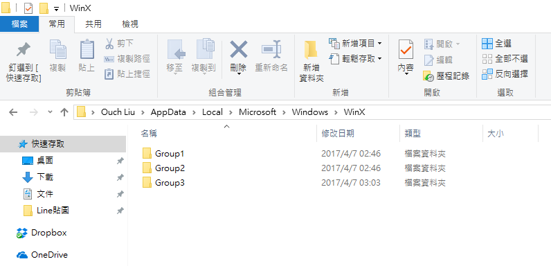

而屬於控制台的群組應該會位於 Group2 裡(我們會看到一個叫作控制台的連結，但是它其實是設定的捷徑)。

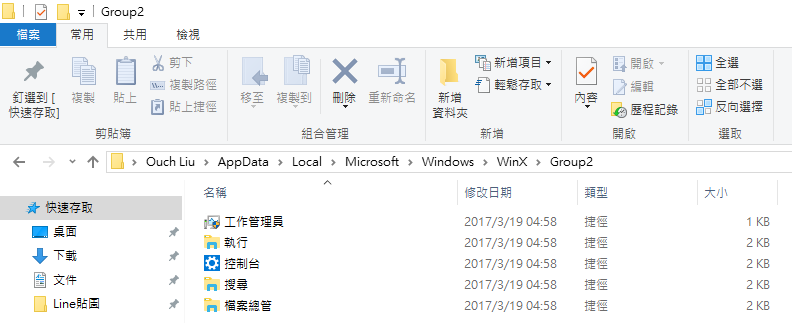

接著我們就可以手動來為控制台建立一個捷徑囉。(若是使用 64 位元的 Windows 10 的話，路徑為 `C:\Windows\System32\control.exe`)

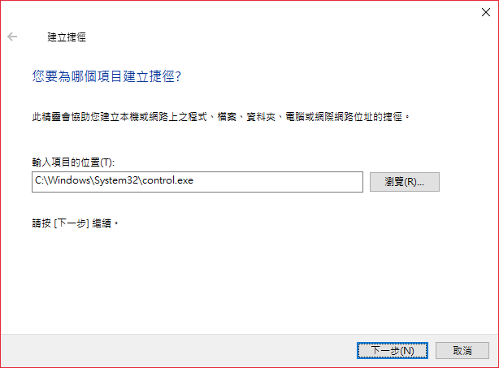

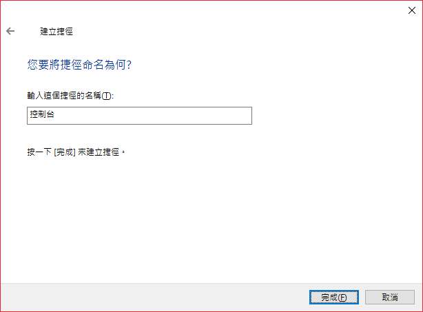

建立完捷徑之後得透過 `hashlnk.exe`，來為我們的捷徑加上雜湊編碼，這樣 Windows 10 才會認得它。
加上雜湊編碼的方式很簡單，只要透過檔案總管將我們建立好的控制台連結拖拉進 hashlnk.exe 圖示上即可。

> hashlnk.exe 的下載連結在此： [下載 hashlnk.exe 檔][下載 hashlnk.exe 檔]

[下載 hashlnk.exe 檔]: https://github.com/riverar/hashlnk/raw/master/bin/hashlnk_0.2.0.0.zip "下載 hashlnk.exe 檔"

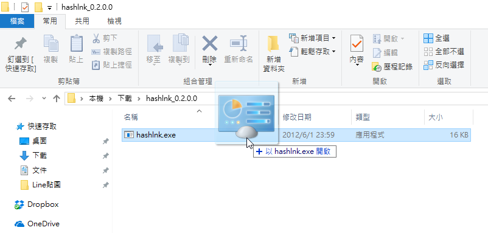

接下來這個步驟非常的重要 - `開啟工作管理員，將檔案總管重新啟動`。

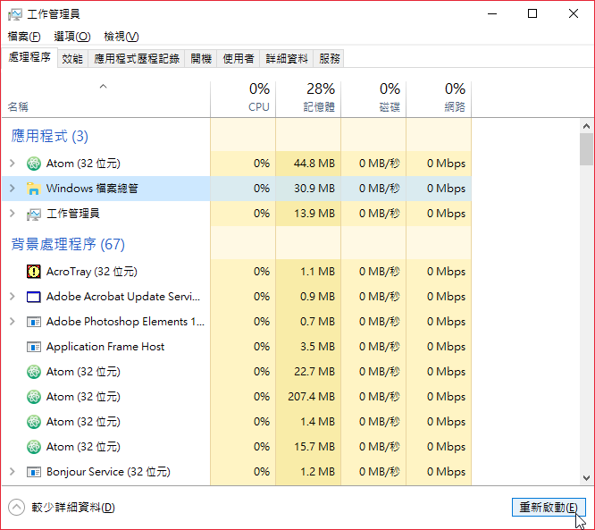

完成上述動作就大功告成啦!!要驗證是否成功，只需要按下鍵盤的 Windows + X 鈕 (或是直接在開始按鈕上按下滑鼠右鍵)，噠噠!! ~~大師兄~~ 控制台回來了!!!

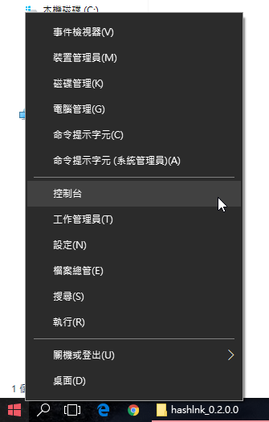

## 方法二：透過 WinXMenuEditor 加回來

覺得上述方式太麻煩的朋友們也不用擔心，因為有現成的工具可以使用。

只要透過 WinXMenuEditor ，就可以輕鬆的以視覺化的方式把控制台的選項加回來囉!!

> WinXMenuEditor 的下載連結在此： [下載 WinXMenuEditor 檔][下載 winxmenueditor 檔]

[下載 winxmenueditor 檔]: http://winaero.com/request.php?21 "下載 WinXMenuEditor 檔"

方法如下：

在您想編輯的群組名稱上按下滑鼠右鍵，選取 `Add` -> `Add a Control Panel item...`

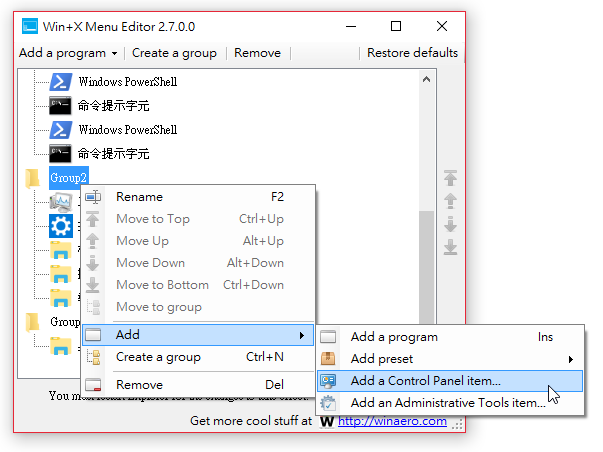

接著在出現的對話視窗中選取控制台，並且按下 Select 按鈕。

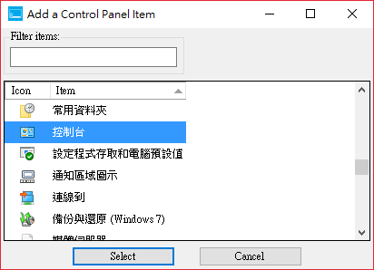

最後按下 Restart Explorer 按鈕以重新啟動檔案總管。

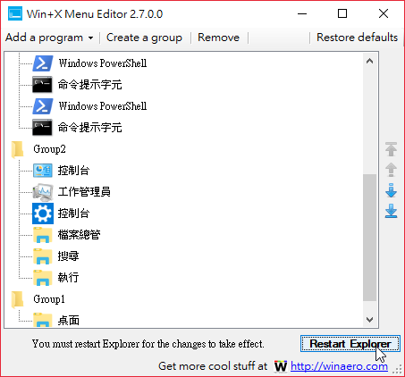

搞定!!~ 是不是也很方便呢?

以上，希望對跟我一樣習慣能從開始按鈕開啟控制台的你有幫助喔!!~
