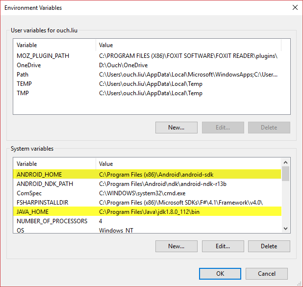
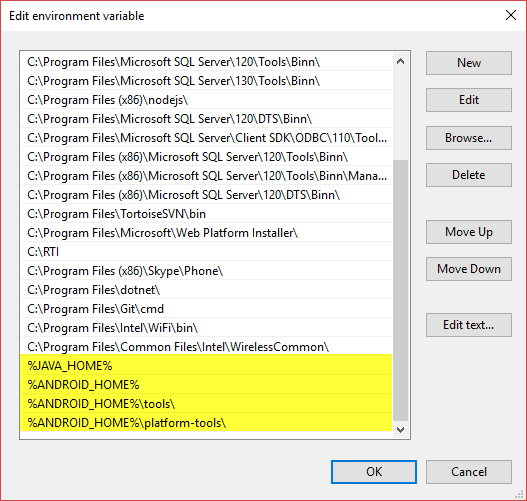
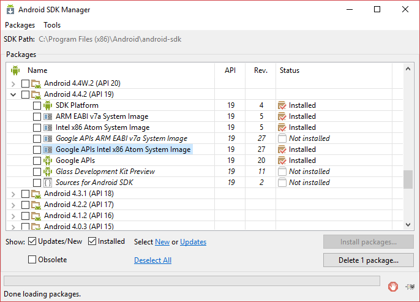
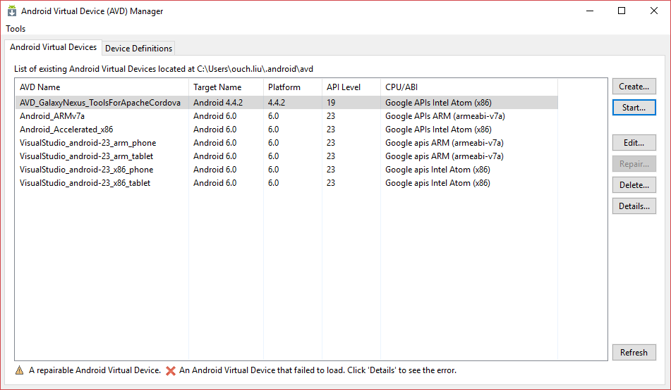
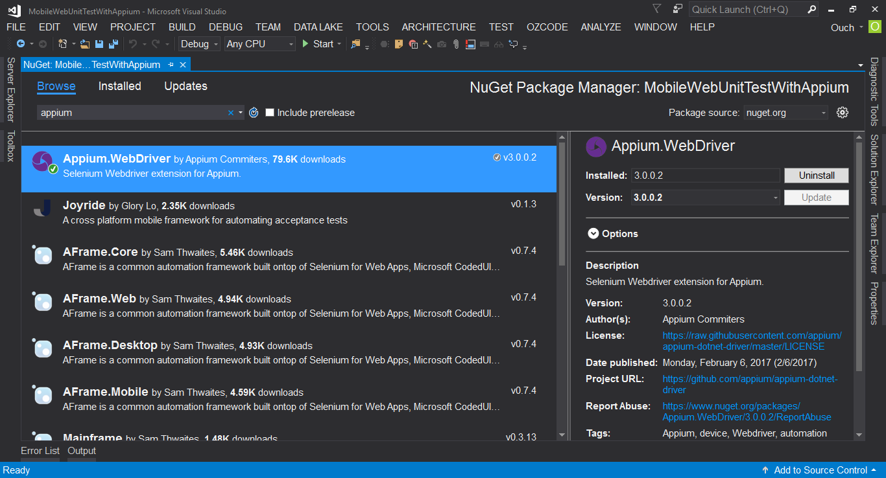
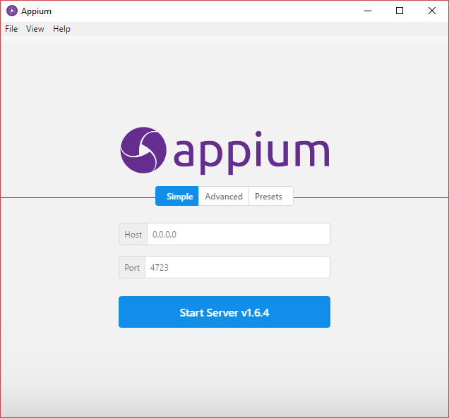
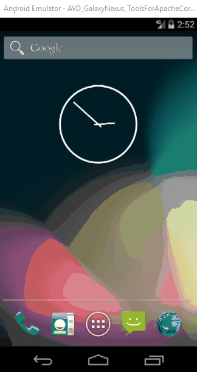
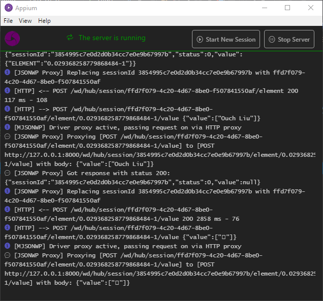

## 前言

在開發行動版網站的過程中，測試仍然是很重要的一環，但是基於需要測試的裝置種類繁多，所以往往讓人又愛又怕受傷害。

雖然說，可以透過 Selemium 搭配 Chrome 進行對不同裝置的自動化測試，但是，支援的裝置種類仍然有限，而且直接透過 Chrome 進行模擬，真實度也和真的在手機上進行測試有不小的差距。

另外，以企業的解決方案這個角度來看，如果能透過一個標準化的框架，使用大部份開發者原本就熟悉的工具及程式語言，就可以同時滿足行動裝置網站與原生 App 的測試，那就更有價值了。

<!--truncate-->

在和[強者我同事 - 小黑][強者我同事 - 小黑]討論行動裝置上的網站和原生 App 測試相關的解決方案的時候，他提到了 Appium 這個測試框架。

[強者我同事 - 小黑]: http://blackie1019.github.io/ "強者我同事 - 小黑"

> 簡單來說，Appium 就是給行動裝置使用的 Selenium。

基於上述幾個原因，我想試看看 Appium 是不是真的和 Selenium 之間的學習曲線是不是真的如其它人所說的那麼平緩。

附帶一提，Appium 的運作架構如下：


## 環境準備

在我們動手開始寫程式之前，得要先確認下列項目都已經安裝/設定好：

- 安裝 Visual Studio 2017 的行動裝置相關開發功能(這樣才能使用 VS2017 附的安卓模擬器)

- 安裝 [Appium][appium]

  [appium]: https://github.com/appium/appium-desktop/releases/latest "下載 Appium"

- 安裝 [Java SDK][java sdk]

  [java sdk]: https://github.com/appium/appium-desktop/releases/latest "下載 Java SDK"

- 在 Windows 的系統變數中加入 `ANDROID_HOME`，並且將它指到 Android SDK 的安裝路徑(預設為 C:\Program Files (x86)\Android\android-sdk)

- 在 Windows 的系統變數中加入 `JAVA_HOME` ，並且並將它指定到 Java SDK 的 bin 資料夾

  

- 在 Windows 系統變數中的 Path 項目中加上以下幾個路徑：

  - %JAVA_HOME%
  - %ANDROID_HOME%
  - %ANDROID_HOME%\tools\
  - %ANDROID_HOME%\platform-tools\

    

## Android 模擬器設定

透過 VS 開發最大的好處就是可以在 VS 裡面管理所有相關的功能，包含 Android SDK 和模擬器。
安裝好 VS 之後，不妨先透過 Android SDK Manager (Tools -> Android -> Android SDK Manager...)來更新 Android SDK 到最新的版本。

另外，如果你使用 Intel 的 CPU 的話，也建議針對 Android 4.4.2 安裝 `Google APIs Intel x86 Atom System Image`，並且安裝 [`Intel® Hardware Accelerated Execution Manager`][haxm] 以獲得更好的效能。

[haxm]: https://software.intel.com/en-us/android/articles/intel-hardware-accelerated-execution-manager "Intel® Hardware Accelerated Execution Manager"



> 若有啟用 Hyper-V 的話，HAXM 可能會和它相衝，這時候可以透過在命令提示字元輸入 `bcdedit /set hypervisorlaunchtype off` 之後重新開機以關閉 Hyper-V 。

SDK 更新完之後，就可以透過 Tools -> Android -> Android Emulator Manager... 來管理虛擬機囉。在這邊，我選擇修改原來內建的 AVD_GalaxyNexus_ToolsForApacheCordova，並且調整 CPU/ABI 為 `Google APIs Intel Atom (x86)`、Skin 為 `Skin with dynamic hardware controls`、勾選 `Use Host GPU`。


設定完成之後，就可以按下 Android Virtual Device (AVD) Manager 裡面的啟動按鈕來開啟模擬器啦~



如果看到模擬器正常執行，就可以開始動手寫測試程式囉。

## 撰寫自動化測試程式碼

透過 Visual Studio 2017 建立出 Unit Test 專案之後，首先要作的是透過 NuGet Package Manager 在專案中加入 Appium.WebDriver 的參考。



再來就可以開心的寫程式啦!!~

我的範例程式如下：

```csharp title="UnitTest1.cs"
using System;
using Microsoft.VisualStudio.TestTools.UnitTesting;
using OpenQA.Selenium.Appium;
using OpenQA.Selenium.Appium.Android;
using OpenQA.Selenium.Remote;
using OpenQA.Selenium.Appium.Enums;
using OpenQA.Selenium;

namespace MobileWebUnitTestWithAppium
{
[TestClass]
public class UnitTest1
{
//宣告 Appium Driver，並指定使用 Android Element
AppiumDriver<AndroidElement> \_driver;

        [TestMethod]
        public void TestSearchOuchMvpProfile()
        {
            //定義相容性
            DesiredCapabilities desiredCapabilities = new DesiredCapabilities();

            //指定平台為安卓
            desiredCapabilities.SetCapability( MobileCapabilityType.PlatformName , MobilePlatform.Android );

            //指定使用的平台版本為 4.4.2
            desiredCapabilities.SetCapability( MobileCapabilityType.PlatformVersion , "4.4.2" );

            //指定裝置名稱，裝置名稱可以透過在 Tools -> Android Adb Command Prompt... 中輸入 adb devices -l 取得
            desiredCapabilities.SetCapability( MobileCapabilityType.DeviceName , "generic_x86" );

            //指定瀏覽器名稱為 Browser(也可以使用 Chrome，指定為 Browser 則會使用預設的瀏覽器)
            desiredCapabilities.SetCapability( MobileCapabilityType.BrowserName , "Browser" );

            //指定不開啟任何 App(有的範例並沒有這行，但是我如果把這行拿掉的話會出錯)
            desiredCapabilities.SetCapability( MobileCapabilityType.App , null );

            //建立 AppiumDriver 的 Instance ，並指定 Appium Server 的路徑
            _driver = new AndroidDriver<AndroidElement>( new Uri( "http://127.0.0.1:4723/wd/hub" ) , desiredCapabilities );

            //指定瀏覽器開啟網址
            _driver.Navigate().GoToUrl( "https://mvp.microsoft.com/zh-tw/" );

            //找出關鍵字搜尋框
            AndroidElement searchBox = _driver.FindElementByName( "kw" );

            //在搜尋框中輸入文字
            searchBox.SendKeys( "Ouch Liu" );

            //按下 Enter
            searchBox.SendKeys( Keys.Enter );

            //找出內文為指定文字的超連結
            AndroidElement profileLink = _driver.FindElementByLinkText( "Ouch Liu" );

            //按下超連結
            profileLink.Click();

            //取出 class 為 title 物件中的文字
            string titleText = _driver.FindElementByClassName( "title" ).Text;

            //定義預期值
            string expectedTitle = "Ouch Liu (劉耀群)";

            //比對實際值與預期值是否相同
            Assert.AreEqual( expectedTitle , titleText );
        }
    }

}
```

> DeviceName 可以透過 Visual Studio 主選單的 Tools -> Android Adb Command Prompt... 中輸入 `adb devices -l` 取得。

## 執行測試

在進行測試之前，請先打開桌上面的 Appium 圖示來啟動 Appium Server。
基本上，完全不需要更改任何設定，只需要按下 Start Server 1.6.4 按鈕就行了。



Appium Server 啟動之後的畫面如下：


在開始執行測試之前，請務必先確認 Appium Server 已經正常啟動，而且 Android 模擬器也能正常運作。

接著就可以透過 Test Explorer 來執行我們的測試程式，驗證看看 Appium 是不是真的有那麼厲害囉。



因為我最後驗證的條件只有檢查文字，只要瀏覽器中的 Dom 物件找得到該文字就算測試成功了，所以並不需要將畫面往下捲，也是可以通過測試的。

另外，在執行的過程中，我們也可以看到 Appium Server 視窗中處理測試程式中各個動作的 Log。



## 結語

上面的測試程式碼應該對於平常就有在使用 Selenium 的朋友們充滿了親切感吧，就我個人的感覺，真的是很容易上手的一個框架。

加上 Appium Server Desktop 最近也更新到了新版，免除了舊版許多繁冗的設定，現在幾乎是打開之後只要按下 Start Server 就可以使用了，真的是超級方便的啊!!~~

有相關需求的朋友們不妨也一起玩看看喔!!

最後，附上專案的原始碼，請自行取用：

[](https://github.com/Ouch1978/MobileWebUnitTestWithAppium/)
