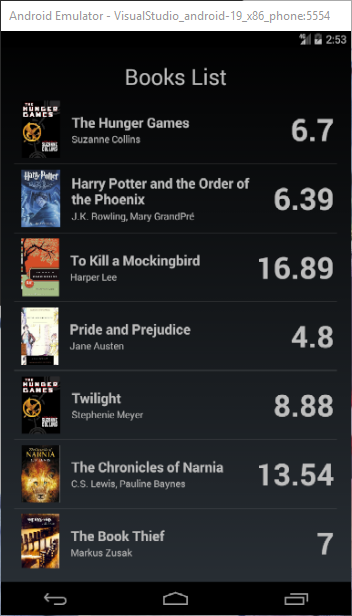

## 前言

在使用 Visual Studio 中的 Xamarin 開發 App 的時候，雖然可以透過 Xamarin.Forms Previewer 來預覽 XAML 刻出來的畫面，不過如果能讓你直接在實機或是模擬器上直接看到畫面，是不是會更有感覺呢?

另外，雖然透過 Xamarin 目前也支援設計時期的範例資料，但是我們還是得要透過 ViewModelLocater 搭配手動刻出的 ViewModel 才能得到我們想要的結果。

最後， Xamarin.Forms Previewer 的穩定性也是很讓人垢病的一大致命傷。

基於以上幾點(其實最痛的是穩定性啦)，讓我不得不尋找一個 Xamarin.Forms Previewer 的替代方案，後來，我找到了 Gorilla 。

它可以讓我上面的三個願望(在虛擬與實機即時預覽/支援設計時期的資料繫結與範例資料/穩定)，一次滿足。

<!--truncate-->

## 下載與安裝

Gorilla Player 目前還在 Beta 階段，要使用之前，得先到 [Gorilla Player 官網][gorilla player official website] 註冊一個帳號，之後才有辦法啟動 Gorilla Player。

[gorilla player official website]: http://gorillaplayer.com/ "Gorilla Player 官網"

而下載頁面 [在此][gorilla player download page] ，目前 Windows 與 Mac 兩個平台的版本都有提供。

[gorilla player download page]: http://gorillaplayer.com/download.html "Gorilla Player 下載頁面"

安裝的過程中，也可以選擇是否要安裝其他的功能，例如 Visual Studio 2015 或是 Xamarin Studio 的 Addin，以及 Player 應用程式的原始檔和範例。

> 個人強烈建議至少要裝 Player 原始檔和範例。

看到這邊，應該有人會問，啊怎麼只有 Visual Studio 2015 的 Addin? 我用的是 Visual Studio 2017 耶!!

免驚~ 免驚~ Visual Studio 2017 的使用者並沒有被放生，我們可以在 [Visual Studio Marketplace][gorilla player visual studio addin] 裡面找到可供 Visual Studio 2017 使用的 Addin 。

[gorilla player visual studio addin]: https://marketplace.visualstudio.com/items?itemName=UXDivers.GorillaPlayerVisualStudioAddin "Gorilla Player Visual Studio Addin"

## 基本使用

Gorilla Player 執行的架構如下圖：

要透過 Gorilla Player 來預覽 Xamarin.Fomrs 的畫面，首先當然是得先開啟電腦上的 Gorilla Player 應用程式，沒意外的話，Server 應該都會正常啟動。

如果要確認 Server 的相關資訊，可以透過在系統列的 Gorilla Player 圖示上按下滑鼠右鍵，選擇 `About Gorilla Player 0.9.1.2`，就會看到如下圖的相關資訊。

Server 預設會使用的 Port 也會顯示在這邊，若有開啟防火牆的話，記得要先把這 `9014` 和 `14578` 兩個 Port 解除封鎖喔!!

> 也可以透過電腦上的瀏覽器直接瀏覽 <http://localhost:9014> 確認 Server 是否有正常啟動。

確認 Server 正常啟動之後，再來是 Visual Studio 的部份，我們可以先任意開啟一個 Xamrain Form 專案來進行測試。

如果已經安裝好了 Visual Studio 的 Addin 的話，可以在 Visual Studio 功能表中的 `Tools` -> `Gorilla Player` 項目下看到如下圖的幾個選項。

> 也可以透過選單中出的是不是 Disconnect from Gorilla 來判斷是否已經正確的和 Server 接通。
> 另外，也可以透過選單中的 Follow Me 選項讓 Gorilla Player 自動跟隨正在編輯中的 XAML 檔。

接著就是模擬器/手機的部份，我們得在目標裝置上先安裝好 Gorilla Player App，並且確認它可以連接到電腦上的 Gorilla Player Server，這樣才有辦法正常的預覽。

要在模擬器或是手機上安裝 Gorilla Player App 的話，可以透過在系統列的 Gorilla Player 圖示上按下滑鼠右鍵，並且選取 `Show Player and Sample Location` (前提是要在安裝的過程中有先安裝好範例。)，接著開啟資料夾中的 Player 專案，建置之後佈署到要用來預覽的裝置上。

> 如果要使用實機預覽的話，您可能得先自行進行開發者解鎖的動作。

將 Gorilla Player App 佈署到裝置上之後，首先我們得要來測看看它是否能正確的和 Server 進行連線。

打開 Gorilla Player App ，應該會看到有自動探索以及手動設定兩種方式可以選擇。

如果使用自動探索的方式無法正確的連線到 Server 的話，就可以透過手動的方式設定，只需要輸入 Server 端的 IP 與 Port 即可。

![image-07] (07-manual-setup.png "手動設置 Gorilla Player")

成功連線之後，就可以直接針對編輯中的 XAML 檔進行預覽啦!!~

> Gorilla Player 預覽的機制和 Edit and Continue 不同，得要`存檔`之後才能看到改變。

## 進階使用 - 設計時期的資料繫結

已經熟悉 WPF、 SilverLight 、 UWP 開發的朋友們應該對 Blend 強大的設計時期資料支援功能愛不釋手吧。 在 Xamarin 裡面也雖然可以繞一小段路來達到類似的效果，但畢竟還是得要寫一點點程式。

那透過 Gorilla Player 呢? 沒錯!! 完全無碼!! 只需要一個 JSON 檔，就可以讓我們作到設計時期的資料繫結喔!!

基本上，只需要在我們的 PCL 專案根目錄中加入一個名為 SampleData.json 的 JSON 檔，並且用它來描述我們設計時期的資料，就可以輕鬆的餵給 Gorilla Player 使用囉。

例如說，我在我的 PCL 專案中加入了一個描述書本資料的 SampleData.json 檔，如下圖：

接著我只要在我的 MainPage.xaml 檔中的 ListView 設定它的 `ItemsSource` 為 `{Binding .}`，就可以讓它吃到 SampleData.json 中的資料囉!!很簡單吧!?

透過模擬器中的 Gorilla Player App 預覽的畫面如下圖：

> SampleData.json 中設計時期資料會以 XAML 檔的檔名來進行對應。

> 若同檔名但位於不同資料夾下的 XAML 檔想要使用不同的設計時期資料，則可以在定義的時候加上資料夾名稱。

除了 SampleData.json 之外，我們也可以透過 NuGet 在 PCL 專案中加入 `UXDivers.GorillaPlayer.Common` 的參考，使用它的 JsonData 類別直接在 XAML 檔裡面定義設計時期資料，如下圖：

透過模擬器預覽的畫面如下圖：

> 關於更進一步設計時期的資料繫結相關資訊，也可以參考 Gorilla Player 範例中的 `Samples\HowTo\SampleData` 專案。
> 除此之外，[Gorilly Player 官方的 GitHub][working with sample data] 上也有相關的介紹。

[working with sample data]: https://github.com/UXDivers/Gorilla-Player-Support/wiki/Working-with-sample-data "Working with sample data"

## 結語

雖然得要多安裝另一個程式，而且無法享受原生的 Edit and Continue 功能，但是 Gorilla Player 在 Xamarin.Forms Previewer 穩定下來之前，應該都還是很方便的一套工具。

而且能直接在實機上預覽，真的是很有 Fu 啊!!

有興趣的朋友們不妨也安裝試用看看喔!!~

最後，附上本文的範例程式原始碼，請自行取用：

