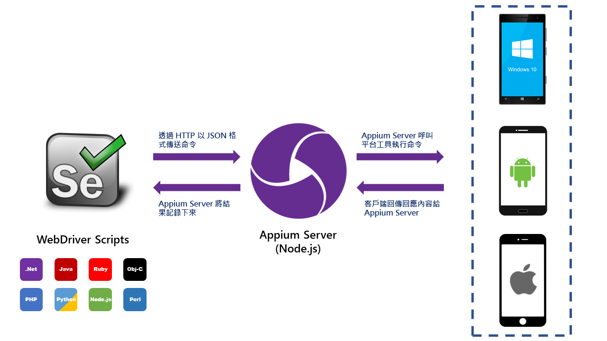
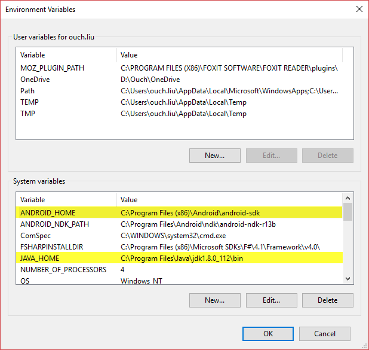
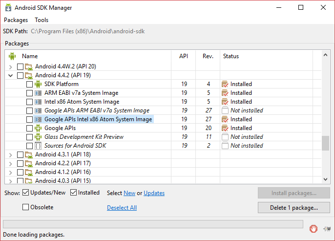
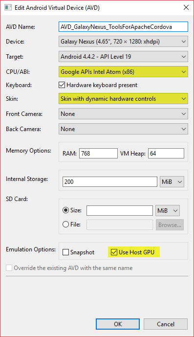
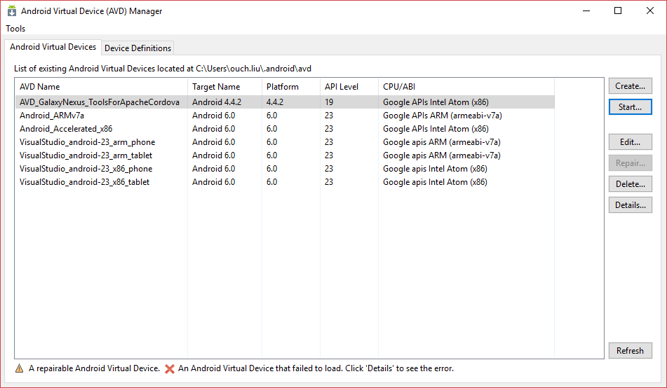
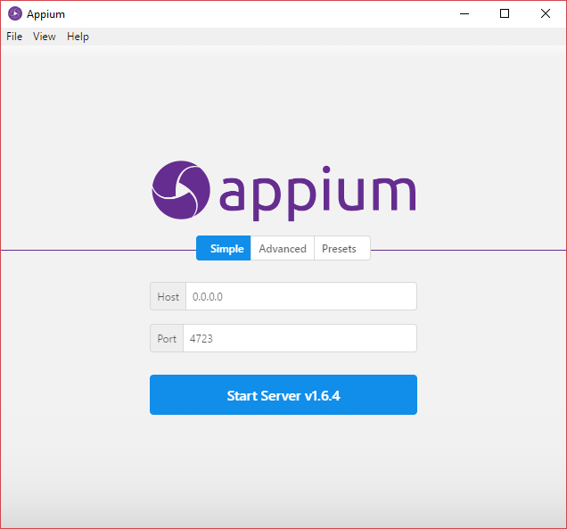
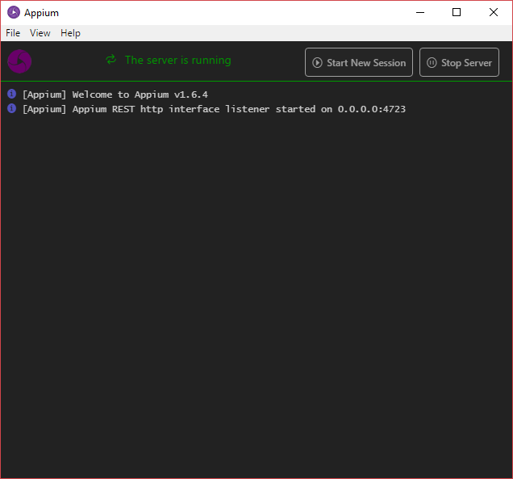
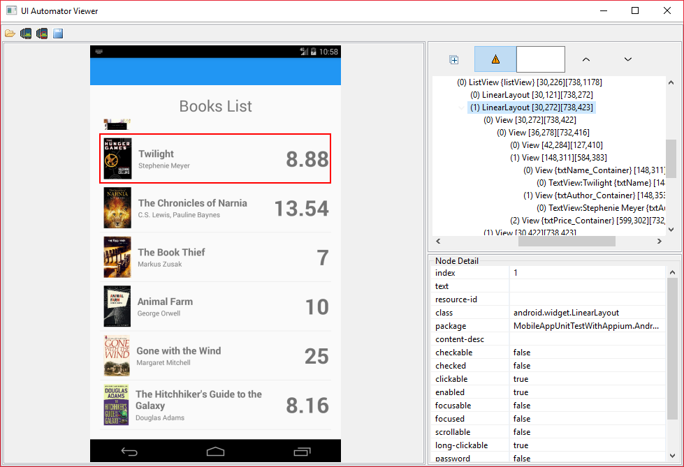

## 前言

在先前的 [透過 Visual Studio 2017 與 Appium 測試安卓手機上的行動版網頁](/blog/2017/04/17/mobile-web-automation-testing-with-vs2017-and-appium) 一文中跟大家介紹了使用 Appium 來達到 Mobile Web 測試的自動化。

不過，在 Mobile 的世界裡， App 才是大家更想關心的事。所以，這次就來跟大家分享使用 Appium 來作到 Moble App 的測試自動化囉!!

<!--truncate-->

在接下去之前，讓我們再來看一次 Appium 的運作架構。



## 環境準備

在我們動手開始寫程式之前，得要先確認下列項目都已經安裝/設定好：

- 安裝 Visual Studio 2017 的行動裝置相關開發功能(這樣才能使用 VS2017 附的安卓模擬器)

- 安裝 [Appium][appium]

  [appium]: https://github.com/appium/appium-desktop/releases/latest "下載 Appium"

- 安裝 [Java SDK][java sdk]

  [java sdk]: https://github.com/appium/appium-desktop/releases/latest "下載 Java SDK"

- 在 Windows 的系統變數中加入 `ANDROID_HOME`，並且將它指到 Android SDK 的安裝路徑(預設為 C:\Program Files (x86)\Android\android-sdk)

- 在 Windows 的系統變數中加入 `JAVA_HOME` ，並且並將它指定到 Java SDK 的 bin 資料夾

  

- 在 Windows 系統變數中的 Path 項目中加上以下幾個路徑：

  - %JAVA_HOME%
  - %ANDROID_HOME%
  - %ANDROID_HOME%\tools\
  - %ANDROID_HOME%\platform-tools\

    ![image-02] (02-add-paths.png "設定 Path 中的路徑")

## Android 模擬器設定

透過 VS 開發最大的好處就是可以在 VS 裡面管理所有相關的功能，包含 Android SDK 和模擬器。
安裝好 VS 之後，不妨先透過 Android SDK Manager (Tools -> Android -> Android SDK Manager...)來更新 Android SDK 到最新的版本。

另外，如果你使用 Intel 的 CPU 的話，也建議針對 Android 4.4.2 安裝 `Google APIs Intel x86 Atom System Image`，並且安裝 [`Intel® Hardware Accelerated Execution Manager`][haxm] 以獲得更好的效能。

[haxm]: https://software.intel.com/en-us/android/articles/intel-hardware-accelerated-execution-manager "Intel® Hardware Accelerated Execution Manager"



> 若有啟用 Hyper-V 的話，HAXM 可能會和它相衝，這時候可以透過在命令提示字元輸入 `bcdedit /set hypervisorlaunchtype off` 之後重新開機以關閉 Hyper-V 。

SDK 更新完之後，就可以透過 Tools -> Android -> Android Emulator Manager... 來管理虛擬機囉。在這邊，我選擇修改原來內建的 AVD_GalaxyNexus_ToolsForApacheCordova，並且調整 CPU/ABI 為 `Google APIs Intel Atom (x86)`、Skin 為 `Skin with dynamic hardware controls`、勾選 `Use Host GPU`。



設定完成之後，就可以按下 Android Virtual Device (AVD) Manager 裡面的啟動按鈕來開啟模擬器啦~



如果看到模擬器正常執行，就可以開始動手寫測試程式囉。

> 若要在實機上進行測試的話，可能得先自行進行開發者解鎖。

## 撰寫自動化測試程式碼

在撰寫自動化測試的程式碼之前，首先我們得要找一個 App 來測試(廢話)。

基於自己的程式自己寫的原則，我這邊就直接拿 [透過 Gorilla Player 在裝置上即時預覽 Xamarin Forms 介面] 一文中的範例稍作修改來供測試使用。

這個範例程式的內容很簡單，基本上就是用一個 ListView 去呈現書籍的資料，點擊之後會切到詳細資料頁面這樣而已。

而我希望能透過 Appium 來幫我儘可能的點選 ListView 中的每個項目，並且確認每個項目的資料值都如我預期，以及詳細資料頁裡面的資料也符合預期這樣。(不過我的測試並沒有針對圖片去作任何的驗證。)

所以我寫出來的程式碼如下：

```csharp title="UnitTest1.cs"
using System;
using System.Collections.Generic;
using System.Drawing;
using System.IO;
using System.Linq;
using MobileAppUnitTestWithAppium.Models;
using Newtonsoft.Json;
using NUnit.Framework;
using OpenQA.Selenium.Appium;
using OpenQA.Selenium.Appium.Android;
using OpenQA.Selenium.Appium.Enums;
using OpenQA.Selenium.Remote;

namespace UnitTestProject
{
[TestFixture]
public class UnitTest1
{
//宣告 Appium Driver，並指定使用 Android Element
AppiumDriver<AndroidElement> \_driver;

        [Test]
        public void TestMobileApp()
        {
            DesiredCapabilities desiredCapabilities = new DesiredCapabilities();

            //指定平台為安卓
            desiredCapabilities.SetCapability( MobileCapabilityType.PlatformName , MobilePlatform.Android );

            //指定裝置名稱，裝置名稱可以透過在 Tools -> Android Adb Command Prompt... 中輸入 adb devices -l 取得
            desiredCapabilities.SetCapability( MobileCapabilityType.DeviceName , "kate" );

            //指定要測試的 App，基本上就是 Android 專案的名稱
            desiredCapabilities.SetCapability( "appPackage" , "MobileAppUnitTestWithAppium.Android" );

            //指定 App 的 MainActivity，這個值可以在 Android 專案下的 obj\Debug\android\AndroidManifest.xml 檔裡面找到
            desiredCapabilities.SetCapability( "appActivity" , "md566d58bce9157a88432d9c294e8892f90.MainActivity" );

            //建立 AppiumDriver 的 Instance ，並指定 Appium Server 的路徑
            _driver = new AndroidDriver<AndroidElement>( new Uri( "http://127.0.0.1:4723/wd/hub" ) , desiredCapabilities );

            AndroidElement listView = _driver.FindElementById( "listView" );

            var listViewItems = listView.FindElementsByClassName( "android.widget.LinearLayout" );

            IEnumerable<Book> expectedBooks = null;

            var directory = Path.GetDirectoryName( System.Reflection.Assembly.GetExecutingAssembly().Location );

            using( StreamReader file = File.OpenText( $"{directory}\\Books.json" ) )
            {
                string jsonString = file.ReadToEnd();
                expectedBooks = JsonConvert.DeserializeObject<IEnumerable<Book>>( jsonString );
            }

            Size size = _driver.Manage().Window.Size;

            //抓取螢幕高度的中心點
            int screenHeightStart = (int) (size.Height * 0.5);

            foreach(var listViewItem in listViewItems )
            {
                //取得目前抓到的項目
                Book actualBook = new Book
                {
                    Name = listViewItem.FindElementById( "txtName" ).Text ,
                    Author = listViewItem.FindElementById( "txtAuthor" ).Text ,
                    Price = Double.Parse( listViewItem.FindElementById( "txtPrice" ).Text )
                };

                Book expectedBook = expectedBooks.First( b => b.Name == actualBook.Name );

                Assert.AreEqual( expectedBook.Name , actualBook.Name );

                Assert.AreEqual( expectedBook.Author , actualBook.Author );

                Assert.AreEqual( expectedBook.Price , actualBook.Price );

                listViewItem.Click();

                actualBook = new Book
                {
                    Name = _driver.FindElementById( "txtName" ).Text ,
                    Author = _driver.FindElementById( "txtAuthor" ).Text ,
                    Isbn = _driver.FindElementById( "txtIsbn" ).Text ,
                    Price = Double.Parse( _driver.FindElementById( "txtPrice" ).Text ) ,
                    ReleaseDate = DateTime.Parse( _driver.FindElementById( "txtReleaseDate" ).Text ) ,
                };

                Assert.AreEqual( expectedBook.Name , actualBook.Name );

                Assert.AreEqual( expectedBook.Author , actualBook.Author );

                Assert.AreEqual( expectedBook.Isbn , actualBook.Isbn );

                Assert.AreEqual( expectedBook.ReleaseDate , actualBook.ReleaseDate );

                Assert.AreEqual( expectedBook.Price , actualBook.Price );

                //找到返回上一頁的按鈕
                AndroidElement backButton = _driver.FindElementByClassName( "android.widget.ImageButton" );

                //點選返回上一頁的按鈕
                backButton.Click();

                //每次都把 ListView 往上滑一點點
                _driver.Swipe( 0 , screenHeightStart , 0 , screenHeightStart - listViewItem.Size.Height / 2 , 1000 );
            }
        }

        [TearDown]
        public void TearDown()
        {
            _driver?.CloseApp();
        }

    }

}
```

在進行測試之前，請先將 App 佈署到要測試的裝置上，並且打開桌上面的 Appium 圖示來啟動 Appium Server。
基本上，完全不需要更改任何設定，只需要按下 Start Server 1.6.4 按鈕就行了。



Appium Server 啟動之後的畫面如下：



> 在開始執行測試之前，請務必先確認 Appium Server 已經正常啟動，而且 Android 模擬器也能正常運作。

眼尖的朋友應該會發現，我在描述測試案例的句子裡面有語病，我說`儘可能的點選 ListView 中的每個項目`，這是因為 Appium 目前並沒有內建 ScrollToEnd 之類的 API，之前本來還有 ScrollTo 和 ScrollToExact 兩個 API 可以用，但是後來都被拔掉了，所以我只能儘可能的做到測好測滿。

以安卓為例，透過 Appium 來抓取 ListView 中的子控制項的時候，並不像網頁的 DOM 物件那樣只要元件樹載入完畢，就能抓到所有項目；反之，我們能抓取到的項目個數會受限於螢幕大小(也就是可視範圍能顯示的數目)，並沒有辦法一次抓到所有的項目。

如果你有一個超級長的 ListView ，而且要針對裡面的每個元素進行測試的話，可能就得自己想辦法搭配捲動畫面的功能，先把 ListView 的所有項目都先爬出來，再逐一進行測試。

另外，如果要透過控制項的 ID 來抓取控制項的話，在不同的平台上會有不同的屬性需要特別設定，例如以 Xamarin.Forms 來說，就得透過 `AutomationId` 來作為測試時期控制項唯一的識別 Id。甚至有些平台/框架的控制項 Id 會是平台/框架主動賦予的，在使用上就得格外注意。

在撰寫測試程式的時候，也可以透過 Android SDK 中的 UI Automator Viewer 來了解 App 中控制項的名稱和位置等等關係。



> 可以透過 C:\Program Files (x86)\Android\android-sdk\tools\uiautomatorviewer.bat 來啟動 UI Automator Viewer。

以上，希望能幫到有相關需求的朋友們。

最後，附上專案的原始碼，請自行取用：

[](https://github.com/Ouch1978/MobileAppUnitTestWithAppium/)
