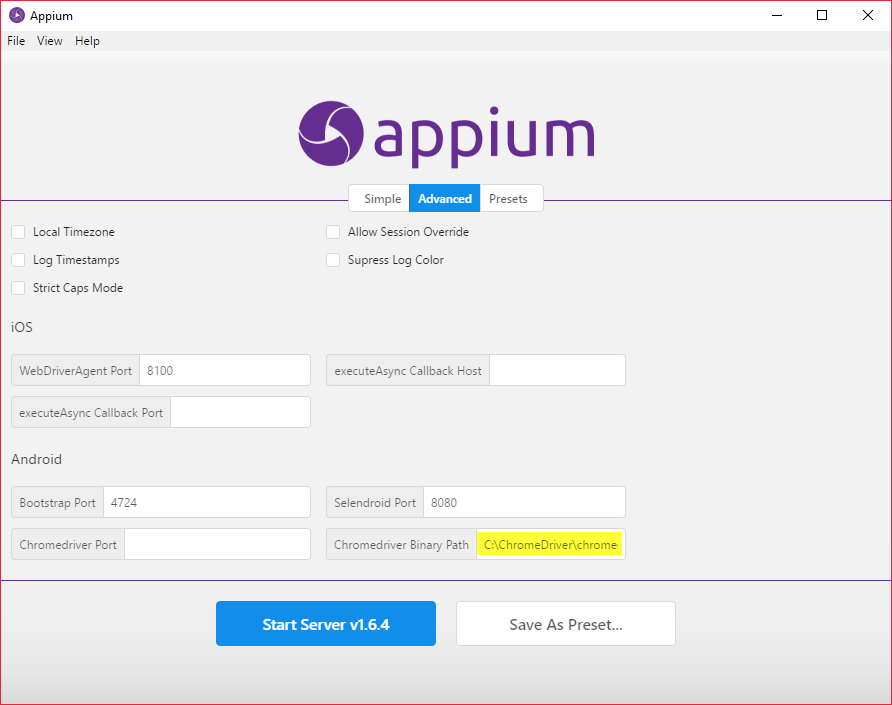
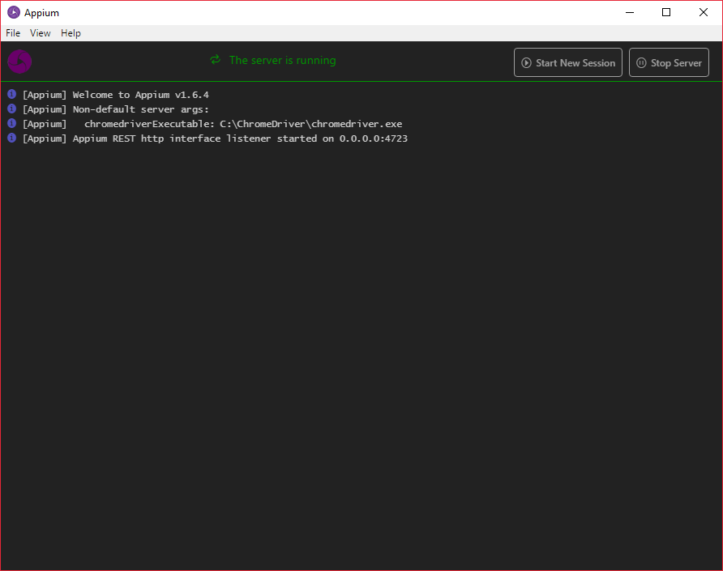

之前在使用 Appium 測試安卓裝置上的行動網站的時候，一切都很開心愉快。

但是，安卓裝置的版本眾多，總不可能只測單一版本；為了確保網站在不同的裝置上都能正常運作，使用不同版本的安卓作業系統來進行測試也是免不了得要作的。

原本以為，只要把相同的測試放到不同版本的模擬器裡面跑，應該什麼都不用多作，就可以一一通過測試才對。

但是「`代誌嘸親像憨人所想的架擬簡單`」，我光是把模擬器的作業系統從 4.4.2 換到 6.0 而已，然後他就死掉了...

<!--truncate-->

基本上會看到的現象就是瀏覽器無法被正常啟動，而從 Appium 的 Console 裡則會看到如下圖的錯誤訊息：

![image-01] (01-chrome-version-must-be-greator-than-error.png "Chrome version must be => xxx")

> Encountered internal error running command: Error: unknown error: Chrome version must be >= 55.0.2883.0
> (Driver info: chromedriver=2.28.455520 (cc17746adff54984afff480136733114c6b3704b),platform=Windows NT 10.0.15063 x86_64)

蝦毀!? 難道我只是想測試不同的安卓版本，也得要一一為每台模擬器更新 Chrome 嗎!? (要更新 Chrome 還得要綁帳號什麼的，超麻煩的啊!!~)

好吧，山不轉路轉。我不更新 Chrome ，我改 ChromeDriver 的版本總可以了吧!?

不過，話說回來，Appium 的 ChromeDriver 怎麼改? 在執行檔後面加參數嗎? 好像行不通...

經過一番亂試之後，總算讓我找到了!!(明明就很容易找到啊~~)

原來就在 Appium Desktop 的 `Advanced` 頁籤下的 `Chromedriver Binary Path` 。

遇到類似問題的話，只要到 [ChromeDriver 官方下載網站][link-01]下載舊版的 ChromeDriver ，並且把完整的路徑(包含檔名)填入 Chromedriver Binary Path 欄位裡就行啦!!

[link-01]: https://chromedriver.storage.googleapis.com/index.html "Chromedriver官方下載網站"

設定完畢之後，按下 Start Server v1.6.4，應該會看到 Appium Console 裡面出現我們自訂的 ChromeDriver 路徑。

只要使用有支援作業系統中內建瀏覽器版本的 ChromeDriver ，測試應該就又可以順利的跑完囉!!~

舉例來說，我在使用 Android 6.0 進行測試的時候，只要搭配 ChromeDriver 2.1.6 就沒問題了。

> 根據我的測試，ChromeDriver 2.1.6 搭配 Android 4.4.2 、6.0 和 7.1.1 這三個版本都不會有問題。

以上，希望可以幫助到有需要的朋友們。
