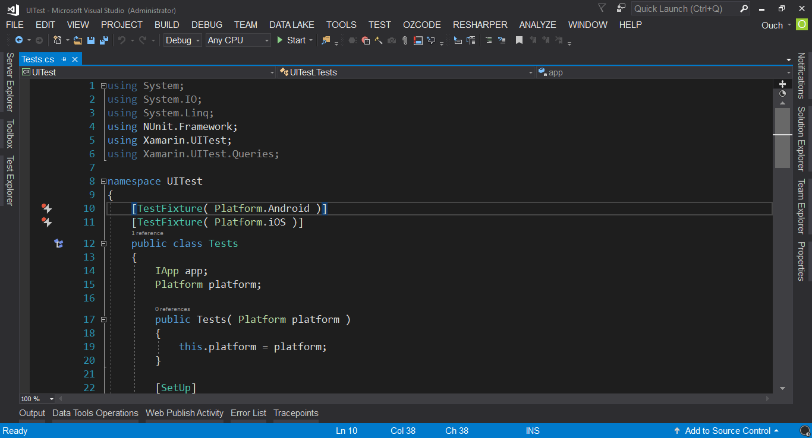
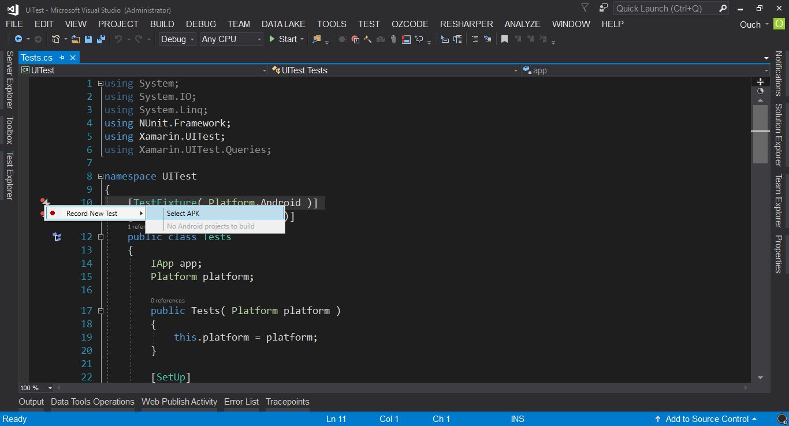
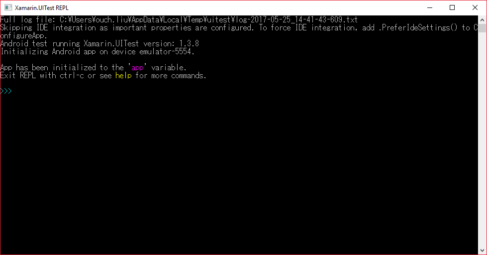
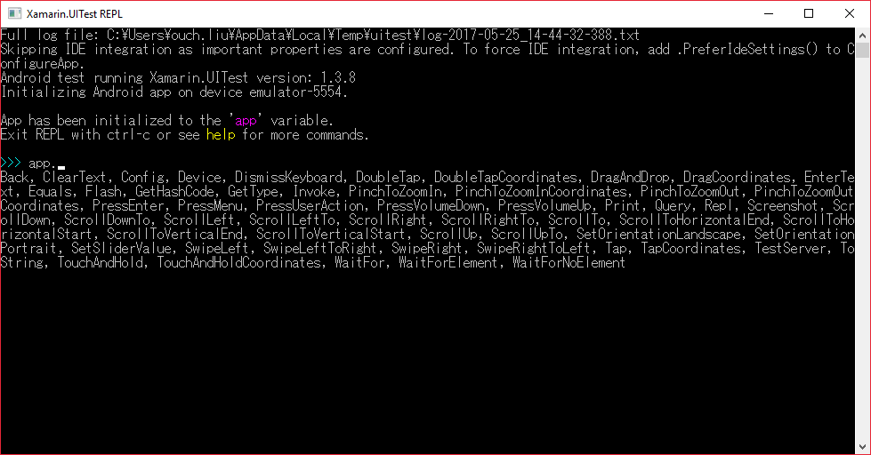
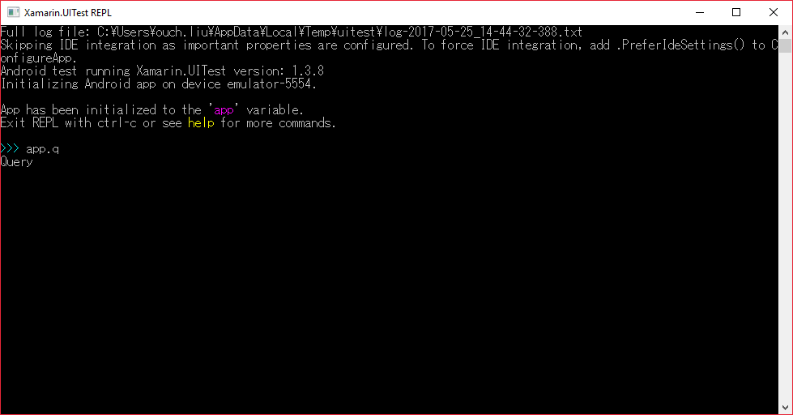
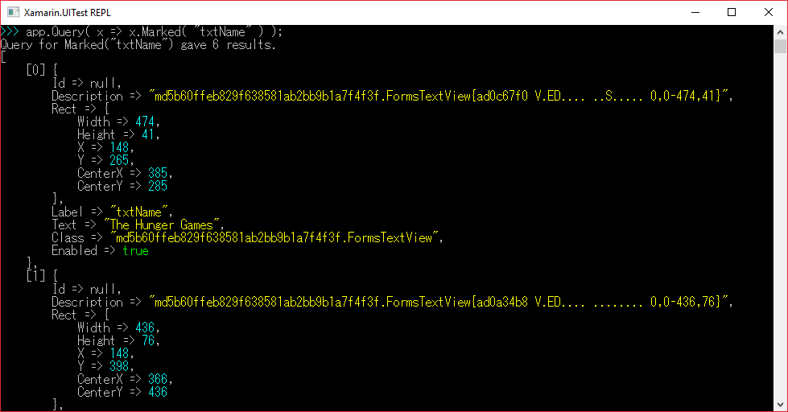
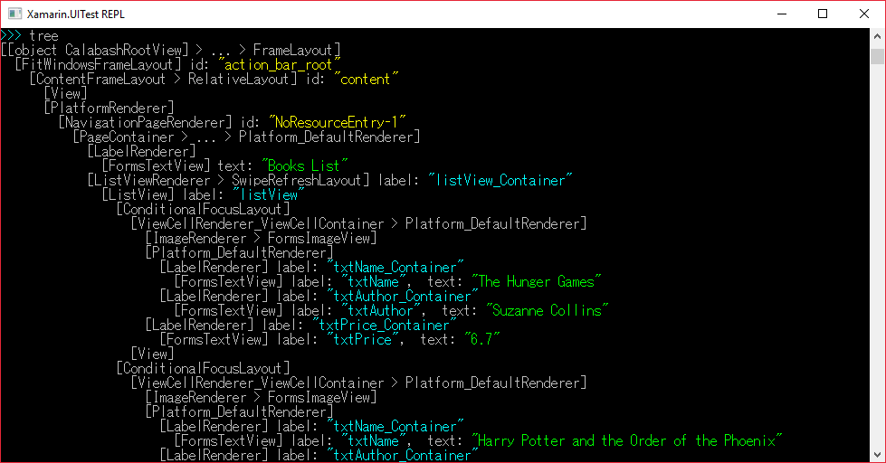

## 前言

介紹完了使用 Appium 來針對安卓應用程式進行自動化測試的方式之後。這回要跟大家分享的是更輕鬆愉快的方式--只要透過錄製的方式就能自動產生程式碼的 Xamarin.UITest。

如果要簡單的介紹一下 Xamarin.UITest ，它其實就是一個以 Calabash 為基礎，可以讓我們透過 NUnit 和 C# 來撰寫針對安卓和 iOS 原生 App 自動化測試的一個框架。

雖然它的名字前面掛了個 Xamarin ，但是它可不只能測 Xamarin 開發出來的 App 而已喔!! 原生的安卓和 iOS 應用程式也都是可以透過它來作到自動化測試的喔!!

而 Xamarin.UITest 原生支援 NUnit 2，所以建立出來的專案預設就會加入 NUnit 的參考，整個測試框架也是基於 NUnit 2 所建構的。

> 需要特別注意的是，目前 UITest 尚未支援 NUnit 3 喔!!

好了，有了簡單的介紹之後，再來我們就直接進入重點啦~

<!--truncate-->

## 懶人/麻瓜福音 - 透過錄製的方式產生程式碼

Xamarin.UITest 最吸引人的地方就是可以直接透過 Visual Studio 來錄製測試的步驟，並且自動轉化為測試程式碼。

廢話不多說，馬上開啟 Visual Studio 2017 來建立一個 Xamarin.UITest 測試專案。
專案類型使用 `Cross-Platform` -> `UI Test App (Xamarin.UITest|Cross-Platform)`。

![image-01] (01-create-uitest-project.png "建立 Xamarin.UITest 測試專案")

專案建立完成之後，透過方案總管打開內建的 Tests.cs 檔，應該可以看到如下圖的畫面：



在開始錄製測試的步驟之前，建議先將電腦中的安卓模擬器開起來準備；如果要使用實機進行錄製的話，也請先把機器接上電腦。

只要點選那個錄製符號加閃電的圖示，並且選取 `Record New Test` -> `Select APK`，接著選取要進行測試的 APK 之後，接下來，Visual Studio 就會幫我們把 APK 安裝到模擬器上，並且自動打開它，錄製我們接下來的所有行為。



這邊我就一樣使用之前用來示範 Appium 自動化測試的同一個 APK 檔來進行測試。

如果光是用文字加圖片來描述錄製的過程的話可能會有點複雜，所以我直接錄給大家看囉~

請看 VCR !!

<iframe src="https://www.youtube.com/embed/-F111OKB2bg?rel=0&showinfo=0?ecver=2" width="640" height="360" frameborder="0"/>

影片中有幾個重點，在這邊再透過文字來提醒大家：

- 錄製的過程中，如果有需要驗證物件是否出現或是值是否正確的時候，可以按下左邊的板手小圖示，選取 `Start Assertion Mode`，再點選要驗證的控制項，就能自動產生驗證相關的程式碼。

- 若要結束錄製，則需要按下左邊的板手小圖示，選取 `Stop Recording` 即可。

> 錄製完畢之後，千萬要記得要在 AppInitializer.cs 的 StartApp 方法中為 Android 手動加上 APK 檔的路徑，這樣才能順利執行測試喔!!

## 錄好了，然後呢?

大家可以看到，錄製出來的程式碼就是很標準的 C# 語法，只要有基本的 C# 功力，應該都有能力去編輯它的內容才對。

然而，畢竟不是我們自己手動刻出來的，透過錄製產生出來的程式碼，也可能會有部份不如我們的預期。

舉例來說，像是驗證的部份，自動產生的程式碼就不會幫我們加上 NUnit 的 Assert 方法來進行驗證。

另外，針對某些控制項的搜尋方式，有些會使用控制項 Id ，有些則是使用值來查找。

雖然這些並不會影響到自動化測試的結果，不過對於講究紀率的開發團隊來說，可能還是得手動進行一些調整，來讓這組程式碼可以符合團隊開發的規範。

所以，舉例來說，我們可以將錄製好的程式碼改成這樣：

```csharp title="Test.cs"
[Test]
public void NewTest()
{
app.Tap( x => x.Marked("The Hunger Games"));
app.Back();
app.Tap(x => x.Text("Harry Potter and the Order of the Phoenix"));
app.Back();
app.Tap(x => x.Text("To Kill a Mockingbird"));
app.Back();
app.Tap(x => x.Text("Pride and Prejudice"));

    var name = app.Query( x => x.Marked( "txtName" ) );

    Assert.IsTrue( name.Any());

    Assert.AreEqual( "Pride and Prejudice" ,  name.FirstOrDefault().Text  );

    var price = app.Query( x => x.Marked( "txtPrice" ) );

    Assert.IsTrue( price.Any() );

    Assert.AreEqual( "4.8" , price.FirstOrDefault().Text );

    app.Back();

}
```

這樣一來應該比原來產生的程式碼來得一致多了吧?

除了用錄製的方式產生程式碼之外，當然您也可以選擇使用完全手寫的方式來寫出自動化測試的所有流程喔!!

## 小密技 - 使用 REPL (Read-Eval-Print-Loop) 工具輔助開發測試程式

如果想要使用純手動的方式自己刻出測試程式的話，那麼，要怎麼準確的抓取到要測試的目標控制項應該就是最重要的一件事了。

Xamarin.UITest 裡面提供了一個名為 REPL 的工具，可以讓我們在命令提示字元模式下與 UI 進行互動。

使用方式很簡單，只要在測試方法中加上一行：

```csharp title="Test.cs"
    app.Repl();
```

當測試程式執行到這一行的時候，就會把 REPL 叫出來，同時將測試暫停在這一行。



REPL 裡面也提供了類似 IntelliSense 的功能，只要輸入 app. ，下面就會出現可供使用的方法。



例如說，我想輸入 app.Query ，我只需要先輸入 app.q , REPL 就會幫我們過濾能使用的方法，再來只要透過 Tab 鍵，就能幫我們完成指令的輸入。



所以我們就可以透過 REPL 來拆解 App 的結構，或是先行一步驗證指令的結果。



也可以在 REPL 裡面直接輸入 tree 指令，列出整個 App UI 的樹狀結構。



有了 REPL 的協助，開發的過程應該就會輕鬆很多囉!!~

## 結語

雖然 Xamarin.UITest API 的使用邏輯和 Selenium/Appium 不太相同，但是基於有強大的錄製能力以及簡潔的語法以及支援雲端測試這三大優勢的加持下，也是很值得參考的行動裝置自動化測試解決方案喔!!

當然，不只是安卓的應用程式可以這樣測，iOS 上的應用程式也可以比照辦理喔!! (不過前提是得要先有一個 iOS 開發環境....)

因為我手邊還沒有的 iOS 開發環境的關係，iOS 的部份就等哪天我在門口踢到一個裝著 MacBook 的箱子之後再來跟各位分享了。

以上，希望哪天我也可以在門口踢到一個裝著 MacBook 的箱子。

最後的最後，Xamarin.UITest 的強大之處並不只是這樣而已，另一個強大的點就是可以透過 Xamarin Test Cloud 上的裝置來進行測試。

這個部份就待之後再另開文章來分享給大家囉!!~
