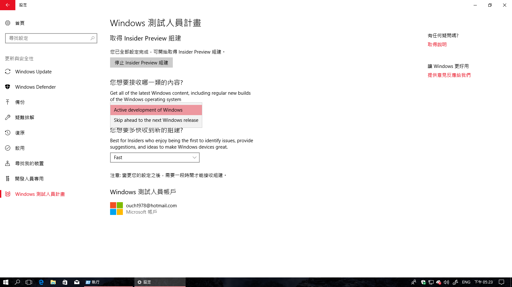
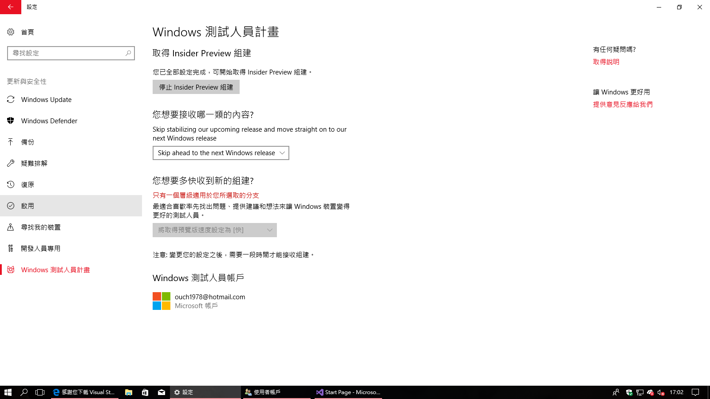

## 前言

這幾天在試玩 Windows Insider Preview 版 Windows 的時候，赫然發現在 Windows Indider Program 裡面的更新選項變得跟之前不太一樣了 -- 除了之前可以選取從 Fast Ring 和 Slow Ring 進行更新之外，現在在 Fast Ring 中的使用者們還會得到另一個 "`您想要接收哪一類的內容?`" 選項，而裡面的項目則包含了 "`Active development of Windows`" 和 "`Skip ahead to the next Windows release`" 這兩種。

而且手機版和桌機版都有這個選項。(但是我的手機還來不及截圖，很開心的升級到 15237 版之後，那個選項就不見了)

<!--truncate-->

## Skip ahead to the next Windows release 是幹嘛用的?

根據[微軟在七月二十六號發佈的消息][link01]，他們想讓在 Fast Ring 裡面的測試者們可以提前體驗到還在開發中的 Redstone 4 的功能。

[link01]: https://blogs.windows.com/windowsexperience/2017/07/26/announcing-windows-10-insider-preview-build-16251-pc-build-15235-mobile/ "Announcing Windows 10 Insider Preview Build 16251 for PC & Build 15235 for Mobile"

簡單的說，目前的 Windows 10 原始碼可以分成幾個分支，分別是開發中版本、Windows 測試人員預覽分支和當前版本分支(雖然還有企業版分支和長期支援分支，不過我們就先略過不看...)

目前的當前版本分支當然就是一般使用者正在使用中的 RS2 正式版的內容啦。

開發中版本分支經過微軟內部測試之後，則會被推送到 Windows 測試人員預覽分支，供選擇 Slow Ring 或 Fast Ring 的 Windows 測試人員們進行預覽，一直到正式版產出之前，參與 Windows 開發人員計畫的朋友們都可以搶先一般使用者早一步進行體驗。

隨著秋季創意者更新(開發代號為 Redstone 3 ，簡稱 RS3) 開發版越來越穩定的同時，微軟也早已開始了下一個 Windows 版本(Redstone 4)的開發，並且想藉由 Windows 測試人員，早一步的讓有興趣的朋友們進行測試。所以才加入了這兩個新的選項。

之後，選擇 `Active development of Windows` 的朋友們將會可以提早測試到 RS3 發行版的功能，但是因為是穩定版的關係，所以並不會接收到開發中內建應用程式的更新。

而選擇 `Skip ahead to the next Windows release` 的使用者們則是可以跳過 RS3 的穩定版，更提早一步的直接體驗到 RS4 以及開發中的內建應用者式。(但是選了這個選項之後除了重灌之外，是沒辦法反悔倒回去測試 RS3 的喔!! 服用前請三思~)

## 後記

正當我很開心的想說可以早一步體驗到 RS4 並且選擇了 Skip ahead to the next Windows release 之後沒多久， Windows 就跳出一個訊息跟我說目前不支援這個選項組合了，貌似微軟已經把這個選項關掉了。(不知道是參與測試的人數已經足夠了還是其它原因?)

希望在不久的將來可以看到這個選項再次被打開，讓我看得到也吃得到啊~~

## 2017/08/15 更新

很神奇的，這幾天重新下載了 Insider Preview 16251 版重新安裝之後，Skip ahead to the next Windows release 這個選項又被打開了，而且還可以直接透過 Windwos Update 更新到 Build 16257.re_prerelease.170728-1630 版。(雖然說這個應該和 Skip ahead to the next Windows release 應該沒有什麼直接的關係啦...)

"

但是至少 Skip ahead to the next Windows release 現在是可以選的囉!!

至於之後什麼時候才能得到 RS4 相關功能的更新呢?? 讓我們繼續看下去~~
