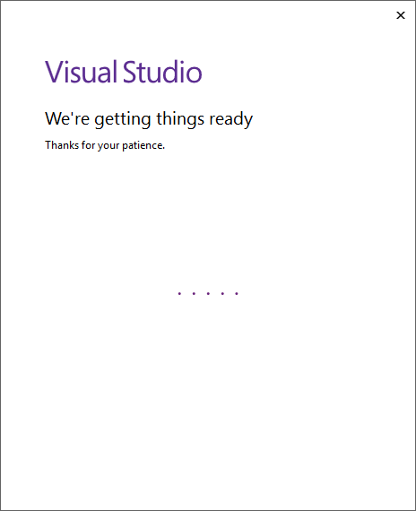
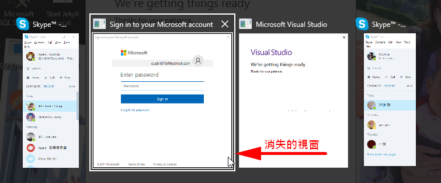

## 前言

上星期筆電不知道是什麼原因，突然就沒辦法正常開機了，而且試過使用修復功能也沒救，只好整個重灌了。

就當安裝完 Visual Studio 2017 之後，準備首次啟動的時候，輸入完帳號按下下一步按鈕之後，畫面上就出現了 `We are getting things ready` 的訊息，不過因為當時已屆下班時間，我就索性放著讓它跑。

沒想到... 隔天回到公司，一看電腦，它居然還是停留在一樣的畫面!!...

<!--truncate-->

## 解法

根據經驗，首次啟動 Visual Studio 2017 的時候，應該會跑出一個登入的畫面讓我們進行登入的才對。

而這個登入的步驟呢，如果使用的是 Microsoft Account 的話，在輸入完帳號之後，會另外跳轉到另一個視窗讓我們輸入密碼。

神奇的是，這個應該要出現讓我輸入密碼的視窗並沒有出現...

當時也不知道是哪來的靈感，想說會不會是視窗被擋住了或是被藏起來了，所以就索性的按了 `Alt + Tab` 鈕...

沒想到，還真的是被藏起來了!! 只要手動切換到那個視窗，就可以繼續完成登入的動作了。

## 後記

後來上網一查才[發現][link01]，原來這個已經不是新問題了，理應早在四月底之前的某個版本更新就應該已經被修好了。

[link01]: https://developercommunity.visualstudio.com/content/problem/44750/were-getting-things-ready-stays-forever-1.html "We're getting things ready stays forever"

無論如何，我就還是遇到了。

而且神奇的是，剛剛試著在另一台 VM 安裝 VS2017，就完全沒遇到這個問題...

這篇文章就當做個紀念，順便看看能不能幫到和我遇到同樣問題的朋友囉~
