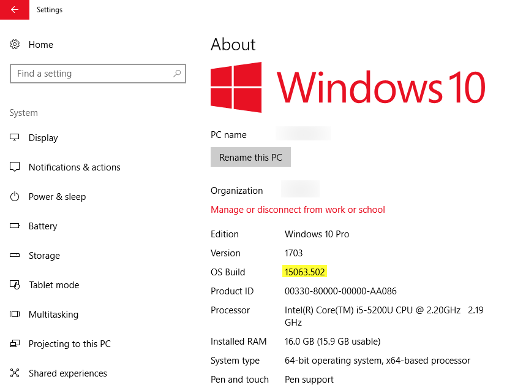

## 前言

這次重灌完電腦，並且安裝好了 Visual Studio 2017 之後，一直沒什麼時間把它打開來動手寫程式。

昨天索性打開來更新到最新的版本之後，隨便開了一個之前寫好玩的專案想說來跑看看，結果一開沒多久，Visual Studio 馬上沒有回應，再過沒多久，就直接崩潰重開了。

![image-01] (01-visual-studio-2017-is-restarting.png "Visual Studio 2017 重複自動重啟")

<!--truncate-->

到 Windows 事件檢視器一看，發現錯誤原因如下：

![image-02] (02-error-log-in-event-viewer.png "Windows 事件檢視器中顯示的錯誤訊息")

使用關鍵字 `PenIMC_v0400.dll` 一查，看起來好像跟手寫筆有關係，而且[看起來有不少人][link01]跟我一樣中招...

[link01]: https://developercommunity.visualstudio.com/content/problem/55303/visual-studio-may-terminate-unexpectedly-when-runn.html "Visual Studio may freeze or crash when running on a pen-enabled machine"

## 解法

簡單的說，解法有兩種，一種是透過 Windows Update 安裝 KB4022716 (15063.447)這個更新包；但是很神奇的，我的電腦跑的明明就是 15063.502 版，卻還是一樣中招啊...



所以只能試看看另一種方式，也就是自己手動修改 Visual Studio 2017 的設定檔，把 Visual Studio 2017 對觸控和手寫筆的支援相關功能關掉(這個比較像是 Workaround，而且等微軟之後釋出相關修正檔之後，得要記得把它改回來)。

具體的作法如下：

1. 找到 Visual Studio 2017 的執行檔路徑，如 C:\Program Files (x86)\Microsoft Visual Studio\2017\Enterprise\Common7\IDE。

2. 使用文字編輯工具開啟 `devenv.exe.config` 檔(記得使用 Administrator 權限開，否則可能會無法存檔喔)。

3. 找到 `AppContextSwitchOverrides` 相關設定，並且加入 "`Switch.System.Windows.Input.Stylus.DisableStylusAndTouchSupport=true`"。

依照我自己的例子，改完之後 AppContextSwitchOverrides 這一段會變成下面這樣

```xml title="devenv.exe.config"

    <AppContextSwitchOverrides value="Switch.System.Threading.ThrowExceptionIfDisposedCancellationTokenSource=false;Switch.System.Windows.Forms.DoNotSupportSelectAllShortcutInMultilineTextBox=false;Switch.UseLegacyAccessibilityFeatures=false;Switch.System.Windows.Input.Stylus.DisableStylusAndTouchSupport=true" />

```

手動把觸控和手寫支援關掉之後，目前觀查了半天，還沒有出現自動重啟的問題。

以上，希望可以幫助到跟我遇到相同狀況的苦主。
