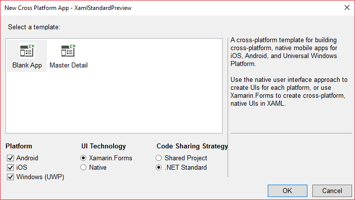
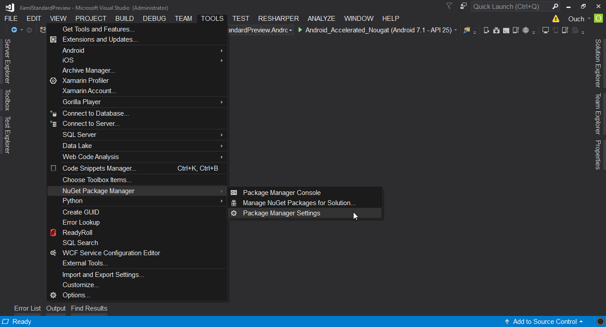
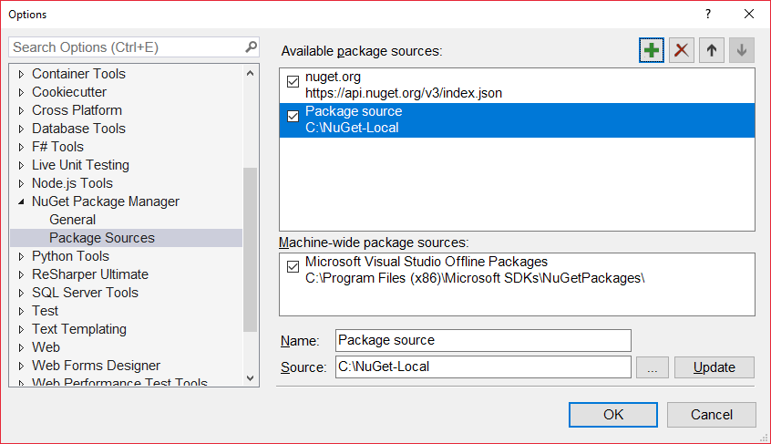
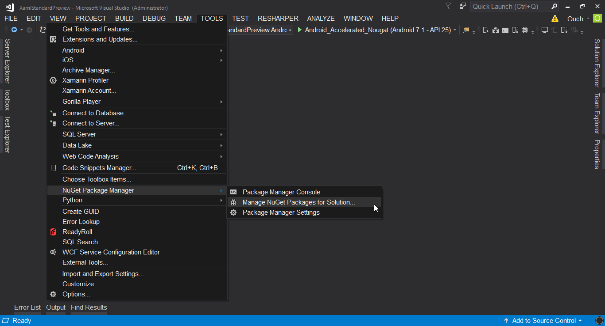
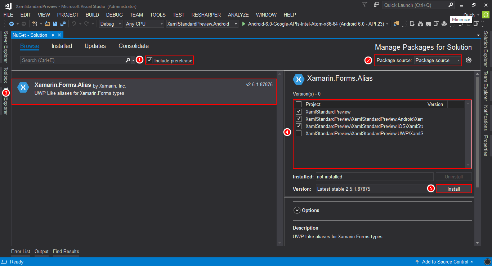
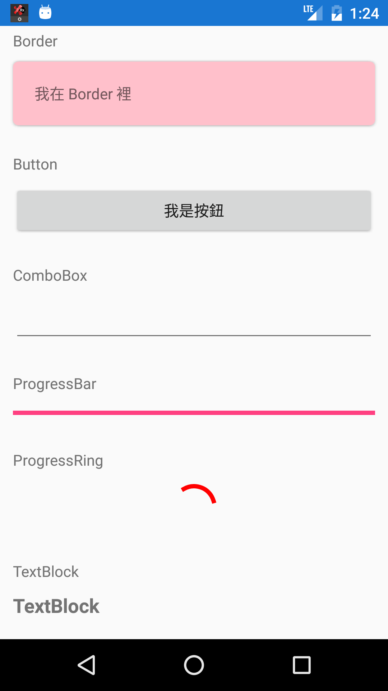

## 前言

除了 .NET Standard 2.0 之外，2017 年還有另一個讓我很期待的東西，據說可以讓 UWP 和 Xamarin.Forms 的 XAML 寫起來更直覺，而且可以無縫接軌，那就是我們今天要介紹的主角，XAML Standard!!

<!-- truncate-->

## XAML Standard 簡介

如果對 XAML 發展的歷史有一定瞭解的朋友應該都知道，目前的 XAML 在不同的平台上(WPF、Silverlight、UWP、Xamarin Forms)支援的控制項和功能都不盡相同。

舉例來說，同樣是文字控制項，在 UWP 裡面叫做 TextBlock ，但是在 Xamarin 裡面卻叫做 Label；而文字輸入控制項在 UWP 裡面叫作 TextBox ，但是在 Xamarin 裡面卻叫做 Entry。

更進一步來看，連控制項的名稱都不一樣了，屬性就有更大的差別了。例如：在 UWP 裡面，ProgressBar 的數值叫做 Value，在 Xamarin 裡面則是叫作 Progress。

基於以上種種不一致的因素，所以即便我們使用的都是 XAML 語法，但是卻往往得要為了不同的平台去作不同的調整。

為了消弭這種的不便因子，所以 XAML Standard 的概念就這樣誕生了，初步的目標是讓 WPF、Windows 10 XAML 以及 Xamarin.Forms 的 XAML 可以使用一致的標準。

> XAML Standard 是在 Build 2017 提出來的概念，目前 XAML Standard 的 1.0 版還在 Preview 階段，詳細的內容可以參考官方 GitHub。

## 牛刀小試

好啦，說完了故事，就到了動手實作的時間了。

首先透過 Visual Studio 2017 建立一個 Cross Platform 的專案，並且在專案樣版設定的步驟選取使用 .Net Standard 作為程式碼共享的策略。



在專案建立完成之後，可以先下載 [Xamarin.Forms.Alias.2.5.1.87875.nupkg][link-01]，並且將它放到一個好記的資料夾裡面。

[link-01]: https://aka.ms/xf-xamlstandard-nuget "Xamarin.Forms.Alias.2.5.1.87875.nupkg 下載連結"

接著在 Visual Studio 2017 中點選 Tools -> NuGet Package Manager -> Package Manager Settings，如下圖：



然後在 Package Sources 中加入一個自定的 Package Source，並且將 Source 的路徑指到存放 nupkg 檔的資料夾。



完成之後，就依序在我們想要使用 XAML Standrd 的專案中各自加入 Xamarin.Forms.Alias 的參考。

比較快的作法是：點選 Tools -> NuGet Package Manager -> Manage NuGet Package for Solution...



然後勾選 'Include prerelease'，在 Package source 下拉選單中選取我們在上一個步驟手動加入的 source，再勾選要安裝的專案後按下 Install 鈕，即可一次針對多個專案進行安裝。



接下來，我們得先在兩個 .cs 檔裡面透過 Alias.Init() 方法針對 XAML Standrd 作初始化 - 分別是安卓專案中的 MainActivity.cs 檔，以及 iOS 專案中的 AppDelegate.cs 檔，修改如下：

```csharp title="安卓專案裡的 MainActivity.cs"
using System;

using Android.App;
using Android.Content.PM;
using Android.Runtime;
using Android.Views;
using Android.Widget;
using Android.OS;
//加入 Xamarin.Forms.Alias 的參考
using Xamarin.Forms.Alias;

namespace XamlStandardPreview.Droid
{
[Activity( Label = "XamlStandardPreview" , Icon = "@drawable/icon" ,
Theme = "@style/MainTheme" , MainLauncher = true ,
ConfigurationChanges = ConfigChanges.ScreenSize | ConfigChanges.Orientation )]
public class MainActivity : global::Xamarin.Forms.Platform.Android.FormsAppCompatActivity
{
protected override void OnCreate( Bundle bundle )
{
TabLayoutResource = Resource.Layout.Tabbar;
ToolbarResource = Resource.Layout.Toolbar;

            base.OnCreate( bundle );

            global::Xamarin.Forms.Forms.Init( this , bundle );

            //加入這行
            Alias.Init();

            LoadApplication( new App() );
        }
    }

}
```

```csharp title="安卓專案裡的 AppDelegate.cs"

using System;
using System.Collections.Generic;
using System.Linq;

using Foundation;
using UIKit;
//加入 Xamarin.Forms.Alias 的參考
using Xamarin.Forms.Alias;

namespace XamlStandardPreview.iOS
{
// The UIApplicationDelegate for the application. This class is responsible for launching the
// User Interface of the application, as well as listening (and optionally responding) to
// application events from iOS.
[Register("AppDelegate")]
public partial class AppDelegate :
global::Xamarin.Forms.Platform.iOS.FormsApplicationDelegate
{
//
// This method is invoked when the application has loaded and is ready to run. In this
// method you should instantiate the window, load the UI into it and then make the window
// visible.
//
// You have 17 seconds to return from this method, or iOS will terminate your application.
//
public override bool FinishedLaunching(UIApplication app, NSDictionary options)
{
global::Xamarin.Forms.Forms.Init();

            //加入這行
            Alias.Init();

            LoadApplication( new App());

            return base.FinishedLaunching(app, options);
        }
    }

}
```

還有要在我們想使用 XAML Standard 的 XAML 檔中加入對 Xamarin.Forms.Alias 的參考。

```xml title=".Net Standard 專案裡的 MainPage.xaml"

<?xml version="1.0" encoding="utf-8" ?>

<ContentPage xmlns="http://xamarin.com/schemas/2014/forms"
             xmlns:x="http://schemas.microsoft.com/winfx/2009/xaml"
             xmlns:alias="clr-namespace:Xamarin.Forms.Alias;assembly=Xamarin.Forms.Alias"
             x:Class="XamlStandardPreview.MainPage">
<ContentPage.Content>
</ContentPage.Content>
</ContentPage>
```

作完以上的準備工作之後，就可以開始使用 XAML Standard 來設計我們的使用者介面啦!!~

以目前 XAML Standard Preview 已經支援的控制項作出來的小範例如下：

```xml title=".Net Standard 專案裡的 MainPage.xaml"

<?xml version="1.0" encoding="utf-8" ?>

<ContentPage x:Class="XamlStandardPreview.MainPage" xmlns="http://xamarin.com/schemas/2014/forms"
             xmlns:x="http://schemas.microsoft.com/winfx/2009/xaml"
             xmlns:alias="clr-namespace:Xamarin.Forms.Alias;assembly=Xamarin.Forms.Alias">
<ContentPage.Content>
<ScrollView>
<alias:StackPanel>

                <alias:TextBlock Margin="12,4" Text="Border" />
                <alias:Border Margin="12,0,12,16" BackgroundColor="Pink" BorderBrush="Red"
                              CornerRadius="5">
                    <alias:TextBlock>我在 Border 裡</alias:TextBlock>
                </alias:Border>

                <alias:TextBlock Margin="12,4" Text="Button" />
                <alias:Button Margin="12,0,12,16" Text="我是按鈕" />

                <alias:TextBlock Margin="12,4" Text="ComboBox" />
                <alias:ComboBox Margin="12,0,12,16">
                    <alias:ComboBox.Items>
                        <x:String>ComboBox Item1</x:String>
                        <x:String>ComboBox Item2</x:String>
                        <x:String>ComboBox Item3</x:String>
                    </alias:ComboBox.Items>
                </alias:ComboBox>

                <alias:TextBlock Margin="12,4" Text="ProgressBar" />
                <alias:ProgressBar Margin="12,0,12,16" Value="20" />

                <alias:TextBlock Margin="12,4" Text="ProgressRing" />
                <alias:ProgressRing Margin="12,0,12,16" IsRunning="True" Color="Red" />

                <alias:TextBlock Margin="12,4" Text="TextBlock" />
                <alias:TextBlock Margin="12,0,12,16" FontAttributes="Bold" FontSize="18">
                    TextBlock
                </alias:TextBlock>

                <alias:TextBlock Margin="12,4" Text="TextBox" />
                <alias:TextBox Margin="12,0,12,16">TextBox</alias:TextBox>

                <alias:TextBlock Margin="12,4" Text="ToggleSwitch" />
                <alias:ToggleSwitch Margin="12,0,12,16" IsOn="True">Test</alias:ToggleSwitch>

                <alias:TextBlock Margin="12,4" Text="UserControl" />
                <alias:UserControl Margin="12,0,12,16">
                    <alias:Border BackgroundColor="LightGreen">
                        <alias:StackPanel>
                            <alias:TextBlock>Name</alias:TextBlock>
                            <alias:TextBox>Ouch Liu</alias:TextBox>
                        </alias:StackPanel>
                    </alias:Border>
                </alias:UserControl>

            </alias:StackPanel>
        </ScrollView>
    </ContentPage.Content>

</ContentPage>
```

上面的程式碼在安卓執行的結果如下圖：



本文的範例原始碼連結如下，請自行取用：

[](https://github.com/Ouch1978/XamlStandardPreview)

## 試用心得

光是想到能使用同一組 XAML 語言跨 WPF 、 UWP 和 Xamarin.Forms 平台進行開發，就是一件讓我非常期待的事。

但是可以想像的是，要完成這樣的願景所需要花費的時間和心力也一定不小。

目前的 XAML Standard Preview 在使用上雖然不是那麼的直覺；還是得要手動初始化，還有在 XAML 檔中加入參考...

撰寫出來的 XAML 和其他平台上執行的結果和長相也還是有著不小的差異，目前我有發現的一些差別如下：

- Border 的外框並不會顯示出來。
- ProgressBar 的 Value 好像不會反映在 UI 上
- 透過 XAML 指定 ComboBox 的 SelectedIndex 不會有效果

除此之外，目前的版本跟我想像中可以直接從 Silverlight 或是 UWP 的 XAML 複製貼上就直接抄到 Xamarin.Forms 中使用的美夢還是有著不小的差距。

而且目前 XAML Standard 的進展似乎不如 .Net Standard 2.0 和 .Net Core 2.0 的進展一樣快速。

不過，至少這是一個得期待的開始，希望之後可以完全無痛共用的時刻可以早一點到來~~
