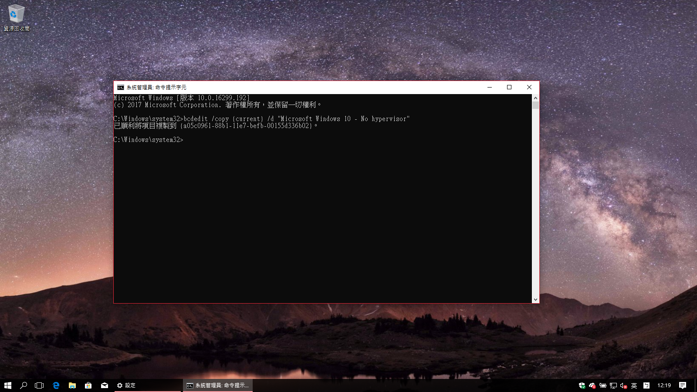
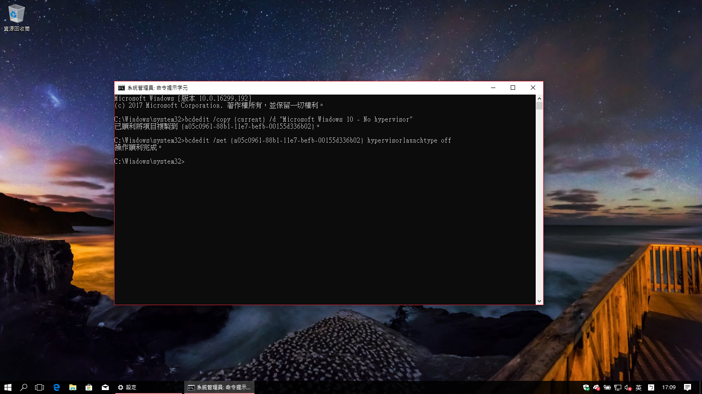
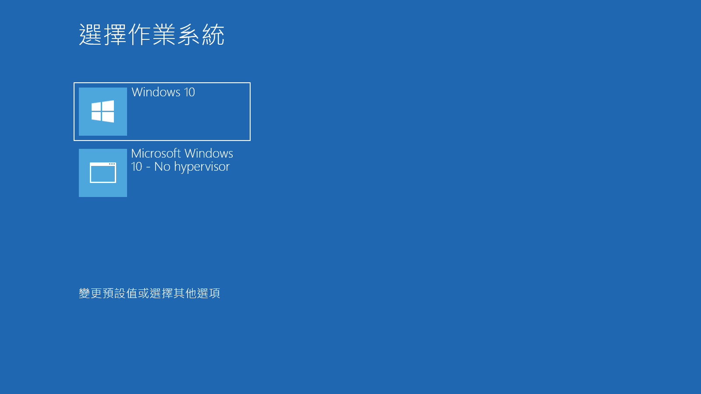
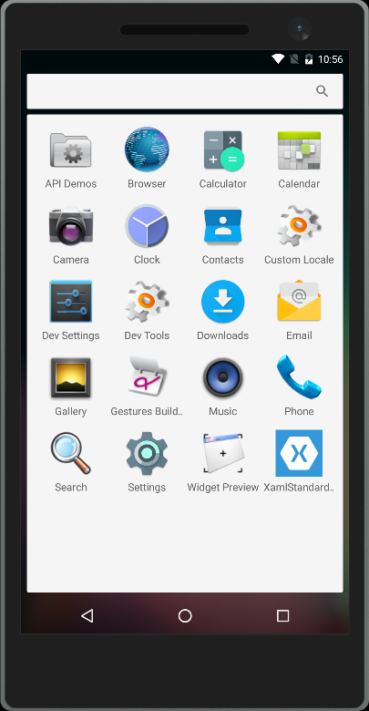
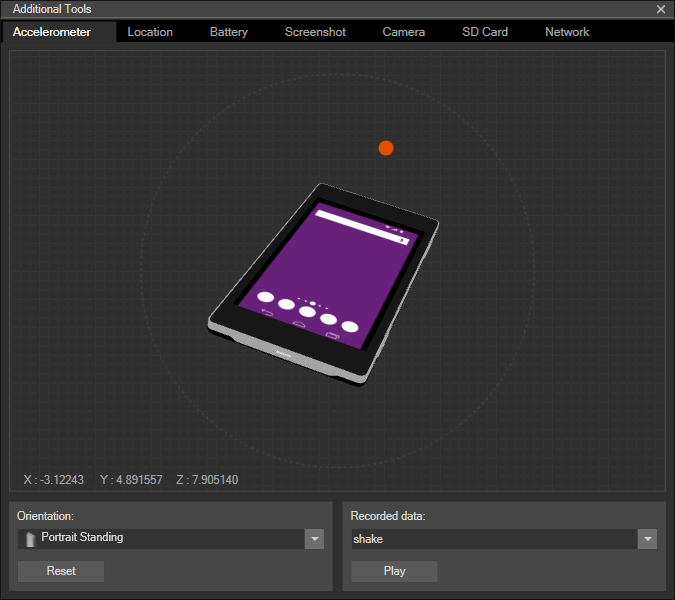

## 前言

有在使用 Visual Studio 2017 和 Xamarin 進行開發的朋友們可能會跟我一樣遇過同樣的問題：如果使用 Visual Studio 2017 裡面內建的安卓模擬器，就得把 Hyper-V 給關掉，不然就無法啟用 Intel® Hardware Accelerated Execution Manager 來替安卓模擬器加速。

畢竟，要支援 Intel® Hardware Accelerated Execution Manager ，才能啟用 Visual Studio 2017 中內建模擬器工具裡的 Atom x86 架構安卓虛擬機，以達到媲美真機的效能(官方說法是效能會差上十倍，不信邪的朋友也可以試著開啟 ARM 架構的模擬器來比較看看，效能真的會讓人很想哭)。

但是身為一個工程師，透過 VM 來架設實驗環境應該是家常便飯的事。從微軟在 Windows 8 內建了 Hyper-V 之後，它就一直是我架設 VM 的首選工具。

所以當看到 Hyper-V 和 Intel® Hardware Accelerated Execution Manager 無法共存的訊息出現，我就一直在想：「到底有什麼其它的方式能讓我不用每次都得要為了開啟安卓模擬器就得先手動關閉 Hypervisor 功能；而在要使用虛擬機器的時候又得先手動開啟 Hypervisor?」。

在網路上爬了一些文章之後，歸納出了下面兩種解法。

<!--truncate-->

## 解法一：建立多重開機選單

我們可以透過建立多重開機的方式，建立出一個預設把 Hypervisor 關閉的設定，專門用來執行安卓模擬器。

方法如下：

1. 以系統管理員的身份開啟命令提示字元，並且輸入下列指令：

```bat title="從現有的開機設定複製出一組新的設定"
bcdedit /copy {current} /d "Microsoft Windows 10 – No Hypervisor"

```

執行成功之後會得到一串機碼值，如下圖。



1. 複製步驟一產生的機碼，並且接著輸入：

```bat title="將新的開機設定檔中的 Hypervisor 功能關閉"
bcdedit /set {步驟一產生的機碼} hypervisorlaunchtype off
```

如果出現操作順利完成的訊息，就代表完成啦!!~



之後只要重新開機，就會出現像下圖的選單，這時候我們就可以在要使用安卓模擬器的時候用關閉 Hypervisor 的設定來開機囉!!~



## 解法二：安裝 Visual Studio Emulator for Android

對於使用 AMD CPU 的朋友們來說，天生就無法透過安裝 Intel® Hardware Accelerated Execution Manager 來啟用 x86 架構的安卓模擬器。

不過幸好我們還是可以手動下載之前在 Visual Studio 2015 裡內建的 Visual Studio Emulator for Android。



更讓人開心的是，它原生就支援 x86 架構的安卓模擬器，有了它，就不用再忍受 ARM 架構模擬器的龜速囉!!

生就支援 x86 架構"

尤於 Visual Studio Emulator for Android 也是基於 Hyper-V 技術打造出來的，所以它和 Hyper-V 完全不會互相衝突。

而且它也內建了加速器、GPS、電量、相機等等相關的模擬功能，用起來並不輸給 Google 原生的模擬器喔!!



Visual Studio Emulator for Android 的下載點[在此][link-01]。

[link-01]: https://aka.ms/vscomemudownload "Visual Studio Emulator for Android 下載連結"

## 總結

上面兩種方法「基本上」都可以解決 Hyper-V 和安卓模擬器無法並存的問題。

但是至於哪個方式比較好用，或是哪個方式比較適合你，就得要看你的環境條件和使用習慣了。

如果是使用 Intel CPU 的朋友，可能建立多重開機選單會比較能壓榨出電腦的效能，而且可以享受到 Intel® Hardware Accelerated Execution Manager 帶來的快感。

而對於使用 AMD CPU 的朋友們，可能 Visual Studio Emulator for Android 會是一個更好的選擇，因為它原生就支援 x86 的模擬器，而且 Intel® Hardware Accelerated Execution Manager 對你來說是看得到但是卻吃不到的東西。

以上，希望對有跟我遇到相同煩惱的朋友們有幫助喔~
