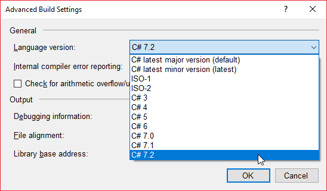

## 前言

微軟在 2017 年 12 月發佈了 Visual Studio 2017 的 15.5 版，裡面有一項很重要的功能就是 C# 編譯器加入了對 C# 7.2 的支援。

所以，就讓我們來快速的了解一下 C# 7.2 為我們帶來了哪些實用的新功能吧!!~

> P.S. 後面的廢話很多，如果想要在五分鐘裡面看完所有新功能的話，不妨直接看程式碼範例的部份就好。

<!--truncate-->

## 準備工作

首先，如果要在 Visual Studio 2017 裡面使用 C# 7.2 進行開發的話，得要先在專案中指定使用的語言版本。

方法是：點選 `Project`(專案) -> `Properties`(屬性) -> `Build`(建置) -> `Advanced...`(進階...)

接著在彈出來的 Advanced Build Settings(進階建置設定) 視窗中的 Language version(語言版本) 下拉選單中挑選 C# 7.2 後按下 OK 按鈕。



之後就可以在專案中使用 C# 7.2 進行開發囉!!

## C# 7.2 新功能介紹

### Readonly Ref (in 參數)

通常在傳遞某個變數到某個方法的時候，我們可以透過在變數前面加上 ref 關鍵字，直接將該變數傳到方法中操作(Passing an argument by reference)而不是另外複製一份(Pass by value)，進而能從該方法中對變數的值進行修改。

但是在某些狀況下，我們可能會希望將變數直接傳遞給方法，但是又不希望它的值在該方法中被修改。

這時候，聰明的工程師可能會聯想到可以把 readonly 這個關鍵字拿出來用，組成 readonly ref；這樣一來，就既可以將變數直接傳遞到方法中使用，而且又可以防止它的值在方法中被修改。

沒錯，就是這個概念!! 所以在 C# 未來發展的討論中就有人提出這樣的想法。

然後經過了一番討論之後，最終得到的結果是新增了 `in` 這個關鍵字，取代原來 readonly ref 的構想。

所以，我們可以藉由下面這段程式碼來快速了解一下 in 這個關鍵字帶來的新特性。

```csharp title="Readonly Ref (in 參數) 範例"
static Point AddPoints( in Point v1 , in Point v2 )
{
//非法，會出現編譯錯誤!!
v1 = default( Point );

    //非法，會出現編譯錯誤!!
    v1.X = 0;

    //非法，會出現編譯錯誤!!
    Foo( ref v1.X );

    //合法
    return new Point( v1.X + v2.X , v1.Y + v2.Y );

}

```

### Non-Trailing Named Arguments

自從 C# 4.0 之後，我們開始可以使用具名與非具名參數來呼叫方法。

但是使用上有一個限制，就是具名的參數一定得要放在後面，如果沒照作的話，進行編譯時就會出現 `CS1738 - Named argument specifications must appear after all fixed arguments have been specified` 錯誤。

但是到了 C# 7.2，這個限制就不再存在了，之後我們就可以在呼叫方法的時候，在任意位置使用具名參數囉!!

詳細的狀況可以參考下面的範例：

```csharp title="Non-Trailing Named Arguments 範例"
public void DoSomething( bool isEmployed , string personName , int personAge )
{
//do something
}

void Test()
{
DoSomething( false , "Ouch Liu" , 38 ); //合法
 DoSomething( true , personAge: 38 , personName: "Ouch Liu" ); //合法
DoSomething( personAge: 38 , personName: "Ouch Liu" , isEmployed: false ); //合法
//DoSomething( isEmployed: false , "Ouch Liu" , 38 ); //C# 7.2 之前會出現 CS1738 錯誤，C# 7.2 之後會變合法
//DoSomething( true , personName: "Ouch Liu" , 38 ); //C# 7.2 之前會出現 CS1738 錯誤，C# 7.2 之後會變合法
//DoSomething( "Ouch Liu" , isEmployed: true , 38 ); //依然不合法
//DoSomething( "Ouch Liu" , 38 , isEmployed: true ); //依然不合法
}
```

### Leading Separator

在 C# 7.0 的時候，有一個新增的小功能，讓我們可以在使用位元或是二進制值的時候用底線來區隔，以方便閱讀，如下例：

```csharp title="C# 7.0 Leading Separator 範例"
//Binary Literal
private int[] \_binaryNumbers = { 0b1 , 0b10 , 0b100 , 0b1000 , 0b100000 , 0b1000000 };

//Digit Separators
private int[] \_binaryWithSeparaters = { 0b0000_0001 , 0b0000_0010 , 0b0000_0100 , 0b0000_1000 , 0b0010_0000 , 0b1000_0000 };

```

但是眼尖的朋友或是比較謹慎的朋友們可能會發現，在 prefix(如 0b) 的後面就直接接著數值還是有一點難讀。

所以在 C# 7.2 就針對 Leading Separator 又再作了多一次的優化，讓我們可以直接在 prefix 之後就直接加入一個底線。如下例：

```csharp title="C# 7.2 Leading Separator 範例"
//Binary Literal
private int[] \_binaryNumbers = { 0b_1 , 0b_10 , 0b_100 , 0b_1000 , 0b_100000 , 0b_1000000 };

//Digit Separators
private int[] \_binaryWithSeparaters = { 0b_0000_0001 , 0b_0000_0010 , 0b_0000_0100 , 0b_0000_1000 , 0b_0010_0000 , 0b_1000_0000 };
```

和 C# 7.0 的寫法比起來，這樣是不是更好讀了不少呢?

### Private Protected

最後一個要介紹在 C# 7.2 中新增的功能則是從 C++ 抄來的概念 - private protected。

原本在 C# 中就有 protected 或是 internal 這兩個修飾詞可以使用。

然而，internal 修飾詞可以讓我們限制該類別只能被同一個組件中的類別繼承；而 protected 修飾詞則可以讓我們限制該類別只能在同類別或衍生類別中被存取。

如果想要同時達到兩個需求呢，就可以使用新增的 private protected 修飾詞了。

所以目前 C# 7.2 所支援的各種修飾詞和提供的組合及效果如下：


## 後記

小弟有幸在 2018 年的 1 月 8 號在 Study4 所舉辦的與大師對談活動後的 Light Talk 階段分享這個主題。
在此也將當天的[投影片][link-01]和[活動投影片連結][link-02]分享出來，有興趣的朋友不妨也下載來看看。

[link-01]: https://github.com/Study4/study4love-2018/blob/master/light%20talk/%E4%BA%94%E5%88%86%E9%90%98%E7%9C%8B%E5%AE%8C%20C%23%207.2.pptx "五分鐘看完 C# 7.2 投影片"

[link-02]: https://github.com/Study4/study4love-2018 "Study4.TW Study4Love - 與大師對談 投影片"
