## 前言

對於靠電腦吃飯的工程師來說，重灌電腦應該是一件避免不了的小事(?)。

除了平常好好燒香拜拜和勤作備份之外，儘可能汲取和 Windows 環境相關設定的知識在重灌的時候也是很有幫助的。

所以，常常動不動就會踩到莫名地雷而得重灌電腦的我就把在重灌的時候會用到的小技巧拿出來和大家分享啦!!

<!--truncate-->

## 將程式設定為自動啟動

在 Windows 裡面有一個資料夾，只要我們把應用程式的捷徑放進去，在開機的時候就可以讓它自動啟動。

這個資料夾的路徑是 `%UserProfile%\AppData\Roaming\Microsoft\Windows\Start Menu\Programs\Startup`。

不過我們也可以透過按下 Windows 按鈕 + R 鍵，並且輸入 `shell:startup` 來叫出。

只要把想要在一開始就自動執行的程式捷徑丟進去就行囉。

## 在網域下啟用 PIN 密碼與 Windows Hello 指紋解鎖功能

自從 Windows 10 1607 (年度更新版)之後， Windows 10 就把加入網域的使用者使用 PIN 登入 Windows 的功能關掉了。

(新增 PIN 按鈕會被反灰，旁邊可能還會出現因為群組原則，該功能已被關閕，請洽系統管理員之類的訊息。不過我來不及擷圖了...)

因為 PIN 被禁止使用，所以連帶的使得指紋解鎖的功能也沒辦法被啟用。

要把 PIN 重新打開的話，有兩個可以選擇的方式。

第一個方式是透過群組原則裡面的設定來進行修改，方法如下：

按下 Windows 按鈕 + R 鍵，輸入 `gpedit.msc` 來開啟 Windows 10 的本機群組原則編輯器。

再來找到`電腦設定` -> `系統管理範本` -> `系統` -> `登入` -> `開啟方便的 PIN 登入` 項目，把狀態改為`已啟用`。

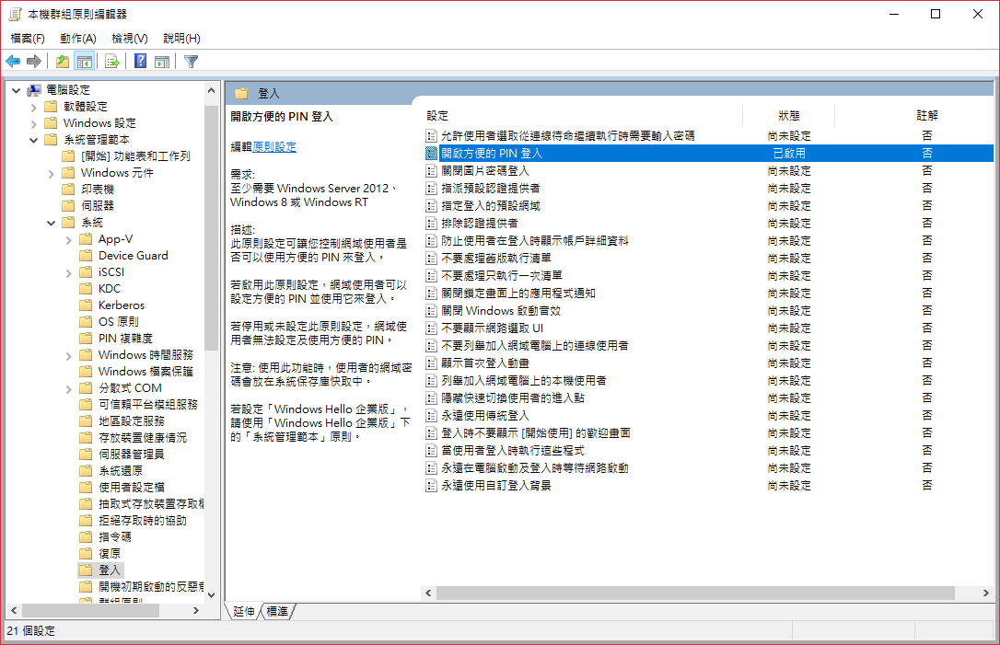

第二個方式是直接修改登錄機碼，方法如下：

按下 Windows 按鈕 + R 鍵，輸入 `regedit` 來 開啟登錄編輯程式。

找到 `HKEY_LOCAL_MACHINE\SOFTWARE\Policies\Microsoft\Windows\System` 機碼，並且將 `AllowDomainPINLogon` 的值改成 `1` 即可。

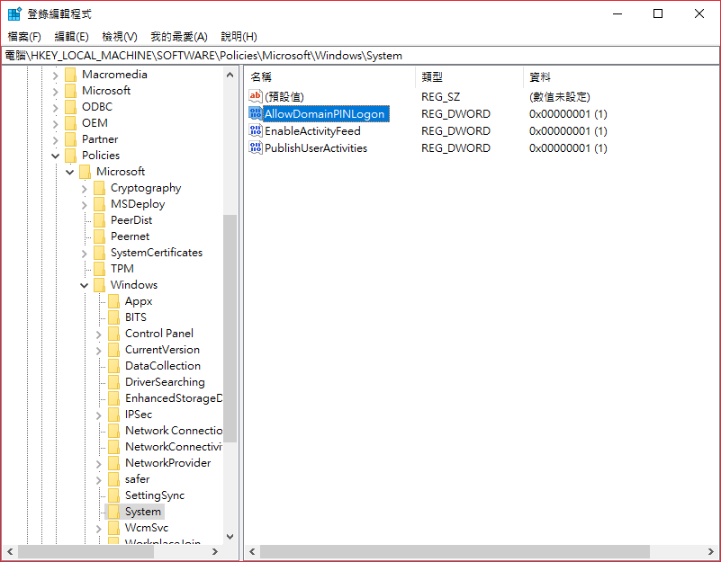

沒有意外的話，原本被禁用的 PIN 應該就可以使用囉!!

## 為多螢幕設定不同的桌布

之前的 Windows 在桌布設定的功能裡，只要針對圖片按下滑鼠右鍵，就可以選擇對特定的螢幕套用。

而在 Windows 10 裡面，雖然自訂桌布的功能已經和設定一起被重新設計為更符合 Fluent Design Language 的使用者界面，不過這個功能還是完整的被保存了下來喔!!

我們一樣可以在圖片上按下滑鼠右鍵，從彈出的選單中選擇要將桌布套用到哪一顆螢幕上。

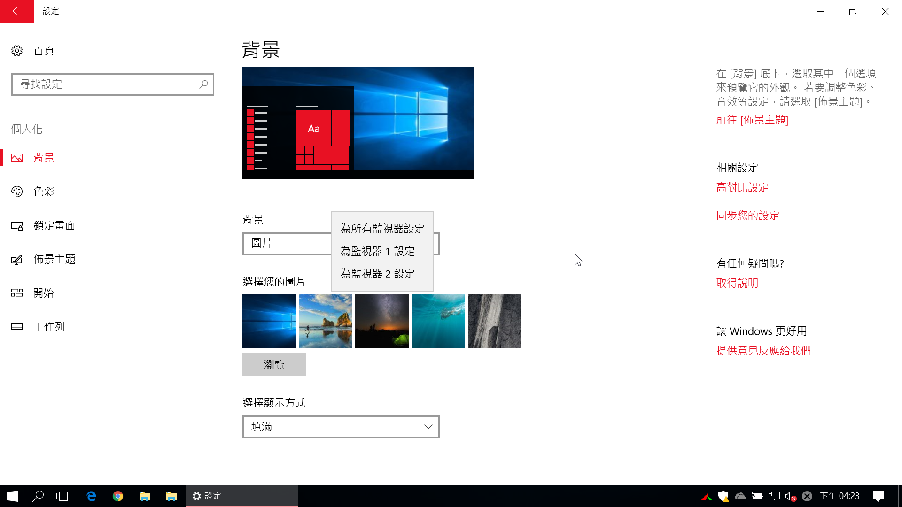

那如果想要一顆螢幕用圖片當桌布，另一個螢幕用純色背景呢?

很簡單，作一張純色的圖片就行啦!!

## 檔案總管相關

以下的部份可以讓我們自訂一些和檔案總管相關的設定，像我自己是很不喜歡左邊的瀏覽窗格裡面出現一大堆東西，所以特別把這個部份也分享出來。

### 修改預設的下載(Downloads)和桌面(Desktop)資料夾路徑

有勤作備份的同學們應該都不會忘記`下載`和`桌面`這兩個資料夾吧?

像我自己的習慣是把這兩個資料夾都存放在系統碟之外的地方，如 `D:\Downloads` 和 `D:\Desktop`。

這樣的好處是，在重灌完 Windows 10 之後，不需要透過複製貼上來搬移檔案，只需要把系統預設的路徑改過去就行了。

修改 Windows 10 內建的下載資料夾路徑的方法如下：

首先開啟檔案總管，在下載資料夾上按下滑鼠右鍵，點選`內容`。

接著點選屬性視窗中的`位置`頁籤，按下`移動(M)...`按鈕後，選取新的資料夾位置後按下`確定`按鈕。

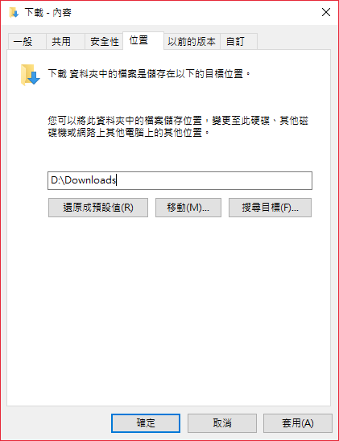

然後 Windows 10 就會很貼心的問你要不要把檔案從舊的位置移到新位置，這邊當然選要囉!!

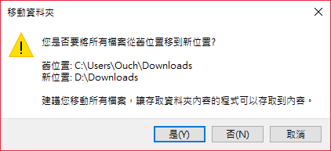

至於桌面資料夾也是依樣畫葫蘆就可以了。

### 修改檔案總管起始的位置為本機，而不是快速存取

如果沒經過任何調整的話，預設開啟檔案總管的時候會直接看到的應該是快速存取裡面的內容。

不過微軟其實提供了另一個選項，只需要在檔案總管裡面設定一下，就可以把起始的位置換成本機。

方法如下：

在檔案總管的`檢視`頁籤中點選`選項`，再透過`開啟檔案管以：`這個下拉選單選取`本機`後按下`確定`鈕就搞定啦!

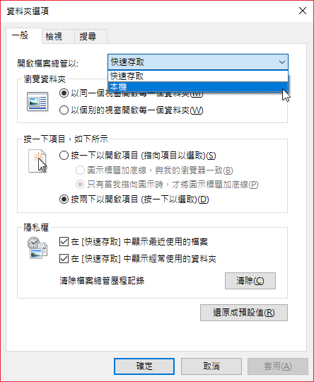

### 修改工作列的檔案總管捷徑起始的位置為某一磁碟槽或路徑

如果想要按下工作列釘選的檔案總管捷徑之後就直接瀏覽到某一個磁碟槽或是特定的路徑(例如 C:\)呢?

這個就稍微複雜一點點了，首先得要先建立該磁碟槽或是路徑的捷徑。

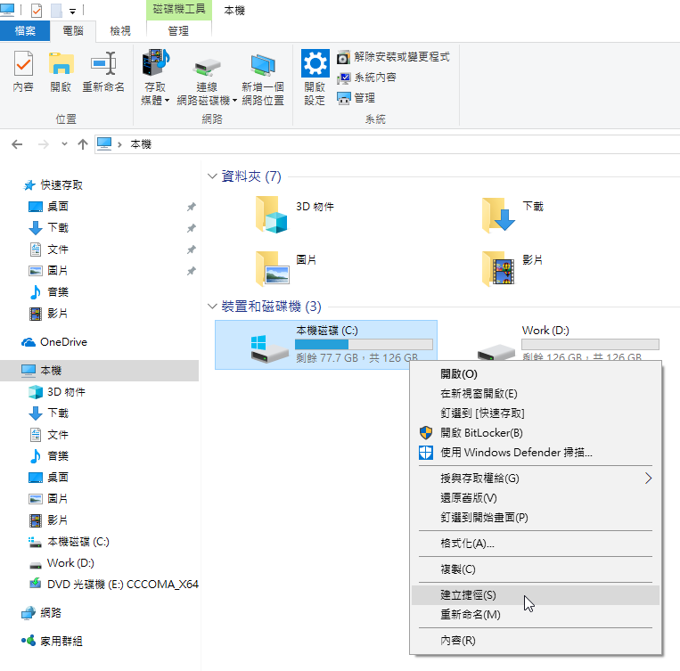

接著我們要來更改捷徑的圖示，首先在建立出來的捷徑上按下滑鼠右鍵 -> 點選 `內容` -> `變更圖示`。

接著在變更圖示對話視窗裡的文字欄位輸入`%SystemRoot%\Explorer.exe`，並且選取檔案總管的圖示後按下確定鈕，再按下檔案總管-內容視窗的確定鈕。

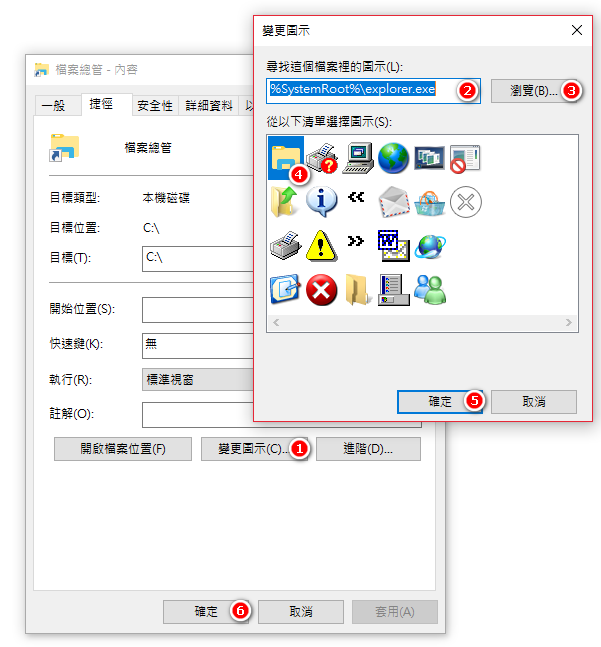

將捷徑的名稱更改為`File Explorer`(注意，一定要一模一樣喔!!)

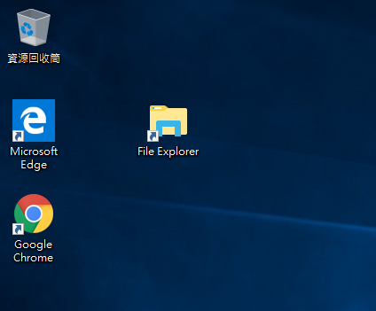

最後剪下捷徑，並且貼到 `%UserProfile%\AppData\Roaming\Microsoft\Internet Explorer\Quick Launch\User Pinned\TaskBar` 裡，出現是否取代原來檔案的時候用力按下取代就行了!!

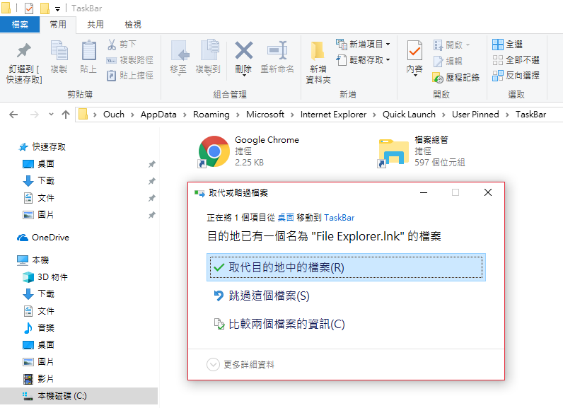

### 不在快速存取中顯示最近使用的檔案和資料夾

檔案總管預設的設定會把最近存取的檔案和資料夾都顯示在快速存取區，但是我個人並不是很喜歡這個功能，所以都會把它關了。

關閉的方式如下：

在快速存取上按下滑鼠右鍵，點選`選項`，然後把一般頁籤中隱私權區裡面的`在「快速存取」中顯示最近使用的檔案`和`在「快速存取」中顯示經常使用的資料夾`這兩個項目取消勾選再按下確定按鈕就行了。

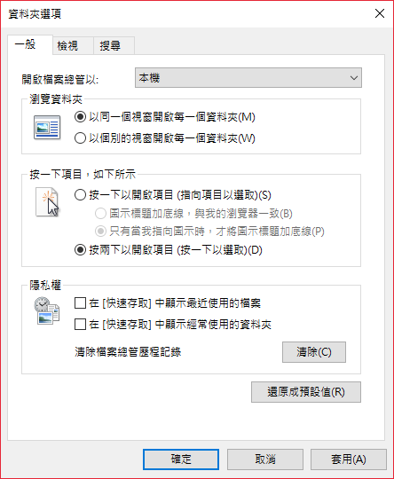

如果快速存取下面已經有一堆項目的話，也可以按下`清除`按鈕把裡面的項目清光喔!!

### 隱藏在本機底下內建的資料夾(如音樂、影片等)

隨著 Windows 10 不同版本的演進，在本機下預設會顯示的項目也跟著越來越多，除了常見的下載、文件、圖片、影片之外，最近又多了一個 3D 物件。

但是除了下載之外，像是音樂、圖片和影片這幾個資料夾我幾乎都是沒在用的，但是它就是會出現在那邊佔位置，所以我也都會選擇把它們隱藏起來。

要隱藏這些資料夾，得透過修改機碼值來達成。

不過如果不想手動去修改登錄機碼的話，也是可以透過 [Winaero Tweaker][link-01] 這個免費的小工具來幫我們作到這件事。

[link-01]: https://winaero.com/request.php?1796 "下載 Winaero Tweaker"

Winaero Tweaker 裡面的 `File Explorer` -> `Customize This PC Folders` 提供了一個直覺又方便的使用者界面來讓我們決定要顯示/隱藏哪些資料夾。

只需要選取要隱藏的資料夾(可多選)之後，按下 Remove Selected 按鈕就大功告成啦!!

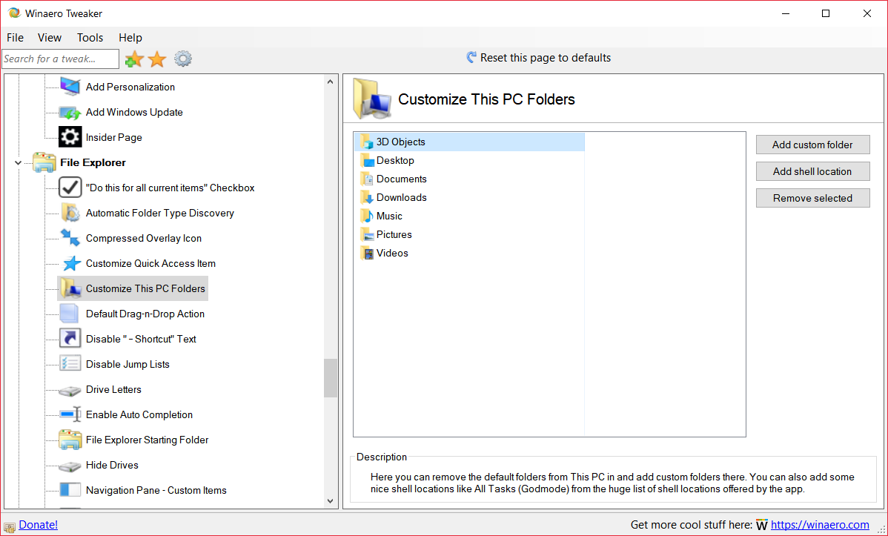
