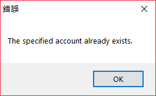
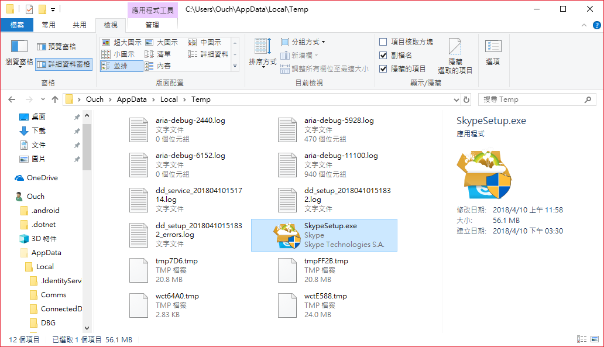
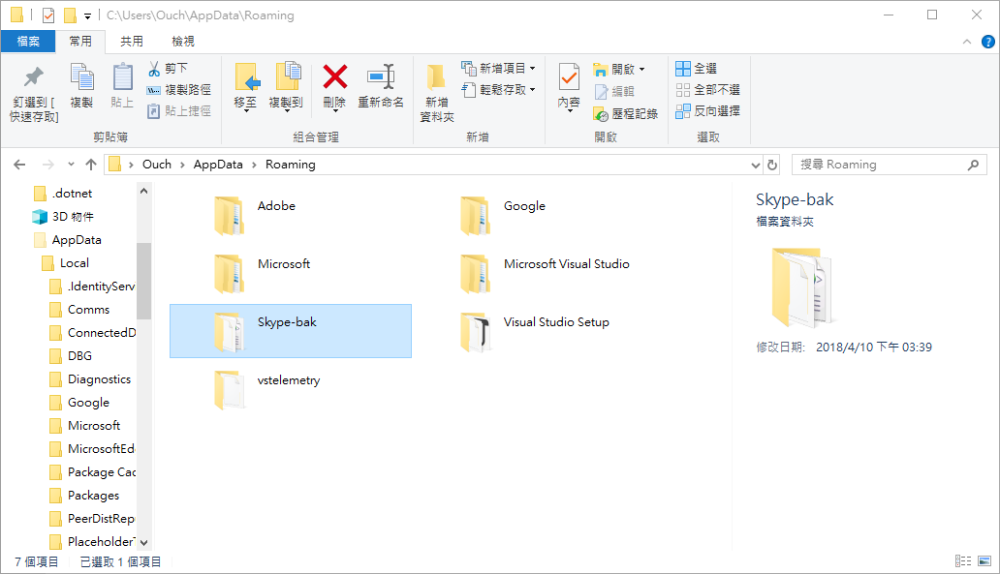
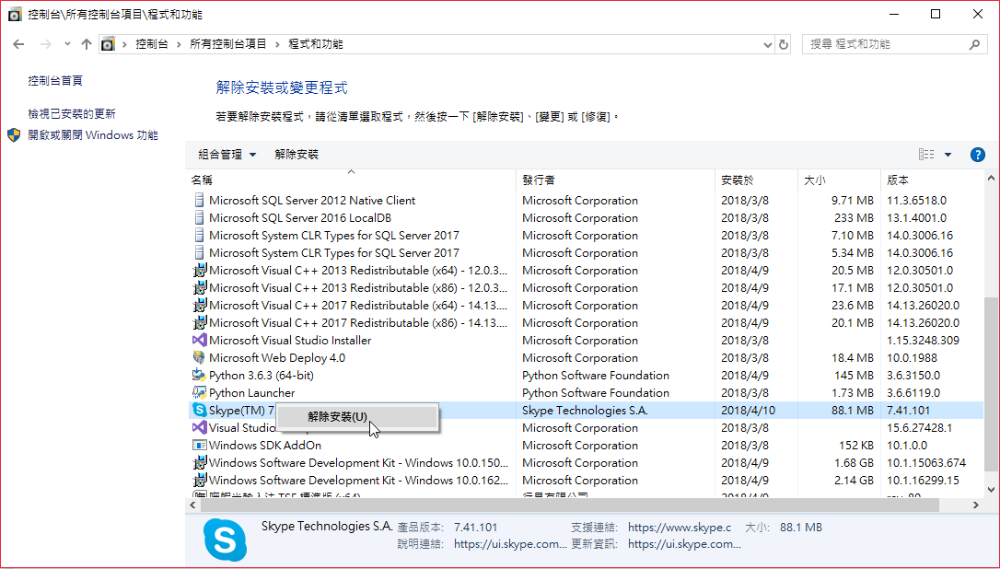
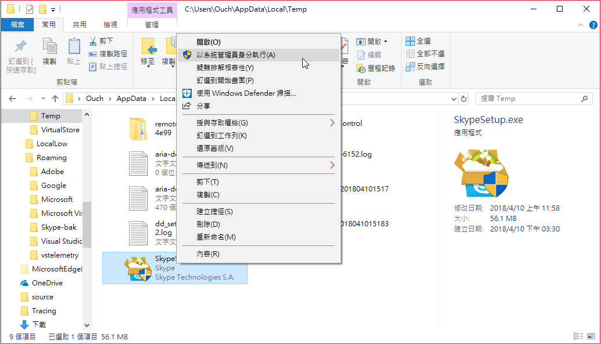

## 前言

今天心血來潮想說檢查一下傳統桌面版的 Skype 有沒有更新，結果照著平常的更新步驟按下更新按鈕之後，卻出乎意料的無法順利更新成功，取而代之的是我之前沒看過的 "The specified Account already exists" 錯誤訊息...

向 Google 大神求助之後，找到微軟的 Answers 網站上也有人遇到相同的問題，而且重試了好幾次都沒辦法解決。

經過一番反覆試驗之後，總算是安裝成功了。

以下就來分享我成功安裝成最新版本的方法。

<!--truncate-->

## 解決方法

1. 從 `%Temp%` 資料夾中找到 Skype 安裝檔。(透過正常的 Skype 更新流程更新的話，安裝檔會被存放在 Temp 資料夾裡面，我們可以先取出備用)
   

2. 關閉 Skype ，並且備份 `%UserProfile%\AppData\Roaming\Skype` 資料夾
   

3. 透過程式和功能移除 Skype。
   

4. 以`系統管理員`身份執行 `%Temp%` 資料夾裡的 Skype 安裝檔。
   

   > 很神奇的是，先前我安裝 Skype 的時候都可以一路安裝到底，但是今天卻遇到安裝程式出現無法存取 C:\Program Files (x86)\Skype\Phone 資料夾的錯誤，改以系統管理員權限執行就正常了。

5. 將備份的 `%UserProfile%\AppData\Roaming\Skype` 資夾中的內容複蓋回去。

以上，如果沒有其它意外的話， Skype 應該就可以更新到最新的版本囉!!
