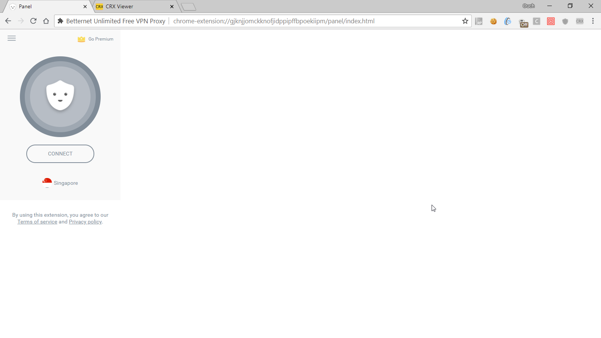

## 前言

在透過 Selenium 進行自動化測試的時候，可能會基於需求或是地域的限制，得要模擬在不同的地區進行測試，並且驗證結果是否符合預期。

然而，該怎麼在自動化的程式中切換地區(也就是俗稱的翻牆啦~)，就是第一個會面臨到的問題。

值得開心的是，Chrome Web Store 裡面有不少 VPN 和 Secured Proxy 可以幫助我們輕鬆的翻牆。

更值得開心的是，我們也可以把這些工具運用到自動化測試的流程裡。

以下就來分享透過 Selenium 的 Chrome Driver 安裝擴充功能 ，並且模擬從不同的國家連線到 Google.com 的方法。

<!--truncate-->

## 流程說明

首先，由於 Selenium 預設每次開啟的 Chrome Driver 都會是一個全新的實體，所以我們的第一步就是幫它裝上我們要用來翻牆的擴充功能。

安裝完翻牆用的擴充功能之後，有一個很重要的步驟，就要是取得擴充包的 Id 還有裡面的 html 頁面路徑，以便於之後和它互動。

完成上面兩個動作之後，就可以動手撰寫程式來讓安裝並且開啟擴充功能的動作自動化，以便於之後測試的進行。

### 下載 .CRX 檔

目前 Chrome Web Store 裡面經有有不少可以用來翻牆的擴充功能，例如 [TunnelBear VPN][link-01] 和 [Betternet Unlimited Free VPN Proxy][link-02] 。

[link-01]: https://chrome.google.com/webstore/detail/tunnelbear-vpn/omdakjcmkglenbhjadbccaookpfjihpa "TunnelBear VPN"
[link-02]: https://chrome.google.com/webstore/detail/betternet-unlimited-free/gjknjjomckknofjidppipffbpoekiipm "Betternet Unlimited Free VPN Proxy"

> 要使用 TunnelBear 的話必需要先建立帳號，免費帳號登入之後每個月會有 500 MB 的容量限制，而 Betternet 則沒有任何限制，也不需要登入就能使用。

有毅力和實驗精神的朋友們當然可以自己撰寫程式碼，透過 Chrome Web Store 進行下載和安裝；不過，我個人會比較推薦直接透過 .crx 檔進行安裝。

取得 .crx 檔的方式也有不只一種，例如透過在 Chrome 安裝 [Get CRX][link-03] 這個擴充功能直接把已經安裝在 Chrome 裡的擴充功能匯出成 .crx 檔。

[link-03]: https://chrome.google.com/webstore/detail/get-crx/dijpllakibenlejkbajahncialkbdkjc "Get CRX Chrome Extension"

也可以直接透過 [Chrome Extension Downloader][link-04] 或是 [CRX Extractor][link-05] 等等網站直接下載。

[link-04]: https://chrome-extension-downloader.com/ "Chrome Extension Downloader"
[link-05]: http://crxextractor.com/ "CRX Extractor"

為了方便之後的使用，可以把下載下來的 .crx 檔放在一個方便存取又好記的地方(例如 `C:\Chrome Extensions`)。

### 取得擴充功能的 Id 與網頁路徑

其實呢，擴充功能說穿了，不過就是一個副名被改成 .crx 的 ZIP 檔；我們可以直接把它當作一個被打包起來的網站，所以完全可以透過 Selenium 來跟裡面的 html 檔互動。

Id 我們可以很輕鬆的透過擴充功能在 Chrome Web Store 裡的連結取得。

而 html 檔的路徑呢，則可以透過前面提到的 [CRX Extractor][link-05] 或是直接透過 7-ZIP 等壓縮工具來查看裡面的內容。

除此之外，透過 [Chrome extension source viewer][link-06] 直接查看擴充功能的內容也是蠻方便的選擇。

[link-06]: https://chrome.google.com/webstore/detail/chrome-extension-source-v/jifpbeccnghkjeaalbbjmodiffmgedin "Chrome extension source viewer"

以 Betternet 為例，透過 Chrome extension source viewer 查看內容的話會看到的檔案列表如下圖：

功能的內容"

而那個 `panel/index.html` 就是我們之後要用來互動的目標。

> 我們可以透過 `chrome-extension://{擴充功能 Id}/{html 檔路徑}` 直接開啟擴充功能中的頁面

所以我們只要在 Chrome 的網址列輸入 `chrome-extension://gjknjjomckknofjidppipffbpoekiipm/panel/index.html` 網址，就可以看到該擴充功能的頁面，如下圖：



### 在自動化程式中指定 Chrome 開啟擴充功能

萬事俱備之後，就到了最開心的環節 - Coding 了!!~

廢話不多說，直接上 Code。

```csharp title="SwitchCountryTest.cs"
using System;
using FluentAssertions;
using FluentAutomation;
using FluentAutomation.Interfaces;
using Microsoft.VisualStudio.TestTools.UnitTesting;
using OpenQA.Selenium;
using OpenQA.Selenium.Chrome;

namespace AutomationWithChromeExtension
{
    [TestClass]
    public class SwitchCountryTest : FluentTest
    {

        private const string BetterNetCrxPath = "gjknjjomckknofjidppipffbpoekiipm.crx";

        private const string BetterNetExtensionUrl =
            "chrome-extension://gjknjjomckknofjidppipffbpoekiipm/panel/index.html";

        private const string TargetUrl =
            "http://www.google.com";

        [TestInitialize]
        public void TestInitialize()
        {
            SeleniumWebDriver.Bootstrap( SeleniumWebDriver.Browser.Chrome , TimeSpan.FromSeconds( 15 ) );

            LoadBetterNetExtension();
        }

        [TestMethod]
        public void TestWithoutBetterNet()
        {
            InteractWithBetterNet( isTurnOn: false , country: string.Empty );

            CheckFooterText( expectedText: "台灣" );
        }

        [TestMethod]
        public void TestSwitchToIndia()
        {
            InteractWithBetterNet( isTurnOn: true , country: "India" );

            CheckFooterText( expectedText: "India" );
        }

        [TestMethod]
        public void TestSwitchToGermany()
        {
            InteractWithBetterNet( isTurnOn: true , country: "Germany" );

            CheckFooterText( expectedText: "Deutschland" );
        }


        private void CheckFooterText( string expectedText )
        {
            I.Open( TargetUrl ).Find( "span.Q8LRLc" ).Element.Text.Should().Be( expectedText );
        }

        private void LoadBetterNetExtension()
        {
            FluentSettings.Current.ContainerRegistration = ( container ) =>
            {
                container.Register<ICommandProvider , CommandProvider>();
                container.Register<IAssertProvider , AssertProvider>();
                container.Register<IFileStoreProvider , LocalFileStoreProvider>();


                var chromeOptions = new ChromeOptions();
                chromeOptions.AddArgument( "start-maximized" );
                chromeOptions.AddExtension( BetterNetCrxPath );

                container.Register<IWebDriver>( ( c , o ) => new ChromeDriver( chromeOptions ) );
            };
        }

        private void InteractWithBetterNet( bool isTurnOn , string country )
        {
            TurnOnOffBetterNet( isTurnOn );
            SwitchToCountry( country );
        }

        private void SwitchToCountry( string country )
        {
            if( string.IsNullOrEmpty( country ) == true )
            {
                return;
            }

            I.Open( BetterNetExtensionUrl )
                .Click( "div .globe" )
                .Click( $"div .locationsContainer span:contains('{country}')" )
                .Wait( TimeSpan.FromSeconds( 3 ) );
        }

        private void TurnOnOffBetterNet( bool isTurnOn )
        {
            bool isConnected = I.Open( BetterNetExtensionUrl )
                 .Find( "div .button" ).Element.Text == "DISCONNECT";

            if( isTurnOn == isConnected )
            {
                return;
            }

            I.Click( isTurnOn ? "div.button.disconnected" : "div.button.connected" )
                .Wait( TimeSpan.FromSeconds( 5 ) );
        }

    }

}

```

## 結語

透過這個方法，可以在自動化測試的時候任意切換地區瀏覽同一個網站，判斷是否顯示的內容有依照需求中的定義呈現。

甚至，也可以突破某些網站的封鎖，順利的存取到網站中的內容喔!!

以上，希望對大家有幫助。

最後附上範例的原始碼，請自行取用：

[](https://github.com/Ouch1978/AutomationWithChromeExtension)
