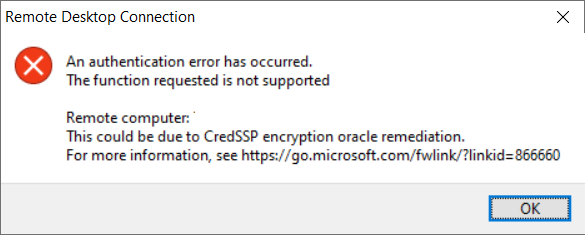
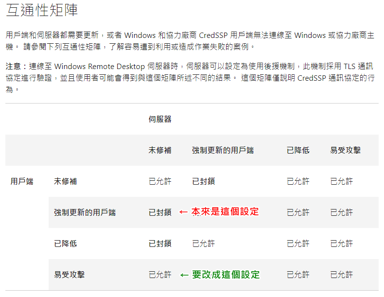

## 前言

最近要使用遠端桌面連線到某台 Windows Server 的時候，出現了以下這個錯誤：



雖然說這已經不是第一次看到了，不過只要一換電腦就又得要再撞到一次，就還是順手寫個筆記記錄一下。

<!--truncate-->

## 原因與解法

簡單的說，這個問題會發生，是因為微軟在 2018 年四月針對遠端桌面連線功能釋出了一個安全性的更新，以解決 CredSSP 在連線過程中可能產生的弱點。

但是這個安全更新得要同時存在於本地端電腦和遠端電腦，本地端才能正常的連線到遠端，只要有一邊沒安裝這個更新，那就會出現這個錯誤。

而通常都是遠端(Server)沒裝更新造成這個錯誤訊息跑出來，所以最佳解當然就是大家都乖乖的安裝該更新檔。

如果你手邊剛好有電腦還沒安裝該更新檔的話，可以透過[這個網址](https://www.catalog.update.microsoft.com/Search.aspx?q=KB4093120 "KB4093120")下載。

## 應急解法

雖然說有官方建議的最佳解，但是我們都連不上 Server 了，怎麼幫 Server 更新咧?

沒關係，山不轉路轉!! 接下來就分享兩招應急措施：

### 修改群組原則

如果很不幸的，你的電腦有加入網域，又碰巧你不是管理員、不能修改群組原則的話，請直接跳到下一個方法。

如果你可以調整群組原則的話，就可以依照[微軟官方文件](https://support.microsoft.com/zh-tw/topic/cve-2018-0886-%E7%9A%84-credssp-%E6%9B%B4%E6%96%B0-5cbf9e5f-dc6d-744f-9e97-7ba400d6d3ea "CVE-2018-0886 的 CredSSP 更新")中`互通性矩陣`一節中的內容來調整設定，讓本機可以連到遠端伺服器。



修改群組原則的流程如下：

1. 按下 <kbd>⊞ Win</kbd> + <kbd>R</kbd> 鍵，輸入 `gpedit.msc` 開啟群組原則編輯器。

2. 點選 `Computer Configuration`(電腦設定)。

3. 點選 `Administrative Templates`(系統管理範本)。

4. 點選 `System`(系統)。

5. 點選 `Credentials Delegation`(認證委派)。

6. 雙擊右邊的 `Encryption Oracle Remediation`(加密 Oracle 補救) 開啟設定畫面。

7. 點選 Encryption Oracle Remediation 視窗裡的的 `Enabled`(已啟用) 選項。

8. 在下方的 `Protection Level`(保護層級) 下拉選單中選擇 `Vulnerable`(易受攻擊)。

9. 按下右下角的 `確定`(OK) 按鈕。

完成上述步驟之後，**不用**重新開機，就可以順利連上遠端的機器囉!!

### 修改本地端的登錄機碼

這個方法相較於修改群組原則來得簡單得多，只需要開啟命令提示字元，輸入下列指令：

```powershell
reg add "HKLM\Software\Microsoft\Windows\CurrentVersion\Policies\System\CredSSP\Parameters" /f /v AllowEncryptionOracle /t REG_DWORD /d 2
```

執行完畢後，也**不用**重新開機，就可以順利連上遠端的機器囉!!

## 參考資料

[CVE-2018-0886 的 CredSSP 更新](https://support.microsoft.com/zh-tw/topic/cve-2018-0886-%E7%9A%84-credssp-%E6%9B%B4%E6%96%B0-5cbf9e5f-dc6d-744f-9e97-7ba400d6d3ea "CVE-2018-0886 的 CredSSP 更新")
