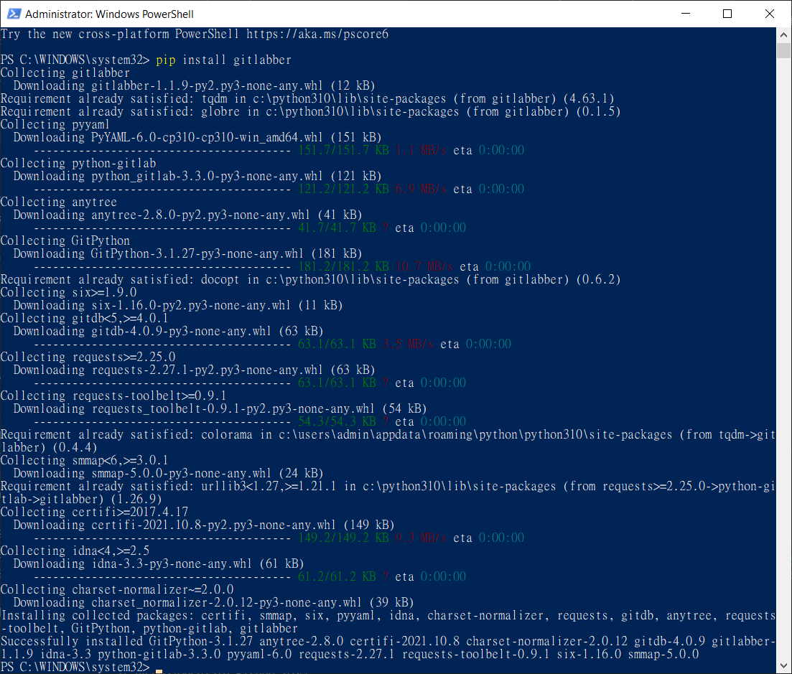
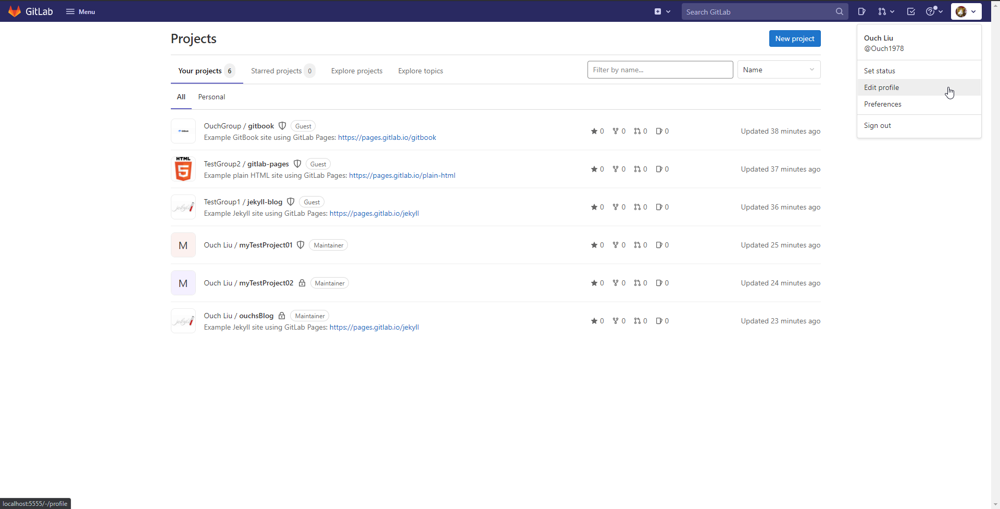
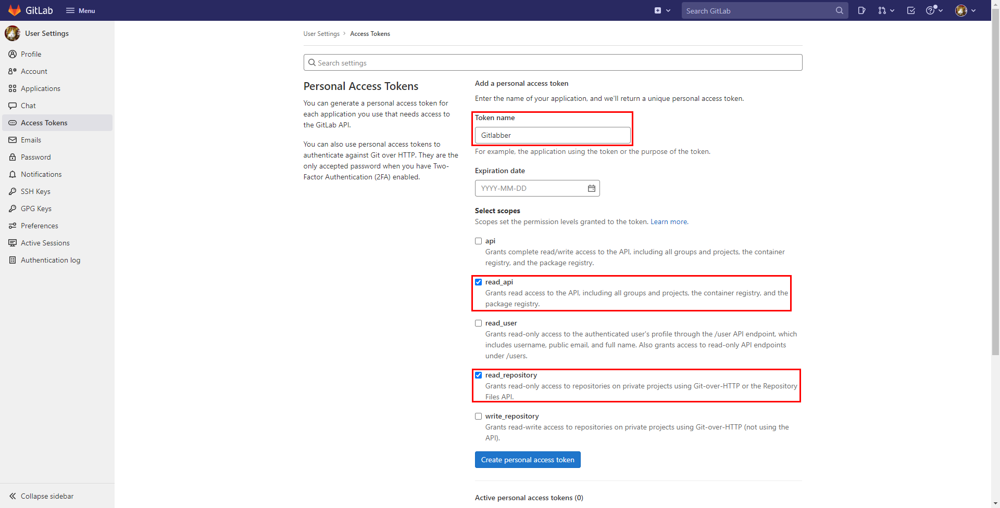
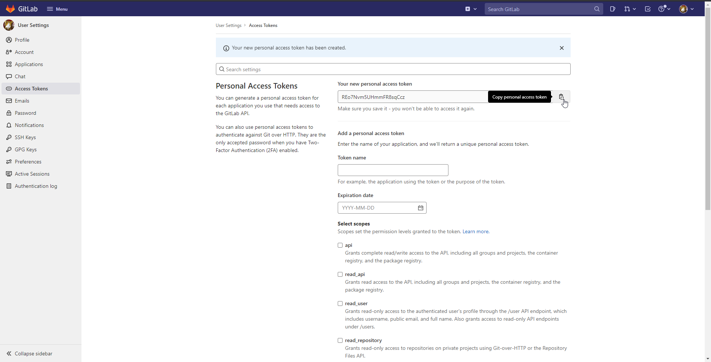

## 前言

每當換電腦或是加入一個新的團隊的時候，把所有和自己相關的 Repo 都 Clone 一份到本機是少不了的工作之一。

如果專案少的話是可以乖乖的一個一個 Repo 慢慢 Clone。

不過，如果和自己有關的專案個數量不是兩隻手數得出來的數量，又或是自己的 Repo 遍佈在多個群組裡面的話，一個一個 Clone 可能就沒那麼有趣了。

這邊就來分享可以一次把所有和自己相關的 Repo Clone 下來的作法。

<!--truncate-->

## 前置條件

今天要介紹的工具 -- gitlabber 基本上是透過 Python 操作 GitLab API 來讓我們達到批次複製 GitLab Repo 的一個工具。

所以要能順執行它，就得先裝好 Python。

### 透過 PyPi 安裝 gitlabber

裝好 Python 之後呢，就可以透過 pip 指令來安裝 gitlabber 了，安裝的語法如下：

```powershell
pip install gitlabber
```

執行結果如果沒有意外的話，應該會如下圖：



### 在 GitLab 上建立 Access Token

如同前面描述的， gitlabber 會去存取 GitLab 的 API，所以我們必需建立一組給 API 使用的 Access Token 讓它使用，方法如下：

1. 登入 GitLab，點選右上角頭像的下拉選單中的 `Edit profile`。

   

2. 點選左邊選單的 `Access Tokens`，接著在右邊的 Token name 與 Select scopes 輸入必要的資料，如下圖：

   

   :::tip 小提示
   1. Token name 可以輸入自己喜歡或是好記、好辯識的名字，之後認得出來就好。
   2. read_api 和 read_repository 兩個權限務必勾選，其它可以不勾。
   :::

3. 輸入完畢之後，按下 `Create personal access token` 按鈕，然後把 `Your new personal access token` 欄位中的內容複製下來。

   

## 透過 gitlabber Clone 所有 Repo

準備工作完成之後，就可以動手把專案拉下來啦!!

### 透過 gitlabber 一次 Clone 所有 Repo

如果要一次把自己所有的 Repo 拉下來的話，指令如下：

```powershell
gitlabber -t {你的 access token} -u {GitLab 的網址} -r {本地目標路徑}
```

例如：

```powershell
gitlabber -t REo7Nvm5UHmmFR8sqCcz -u https://mygitlab.ouch1978.idv -r d:\my_repo
```

等它跑完，你所有的 Repo 就都複製到本機囉!!

是不是很方便快速呢!?
