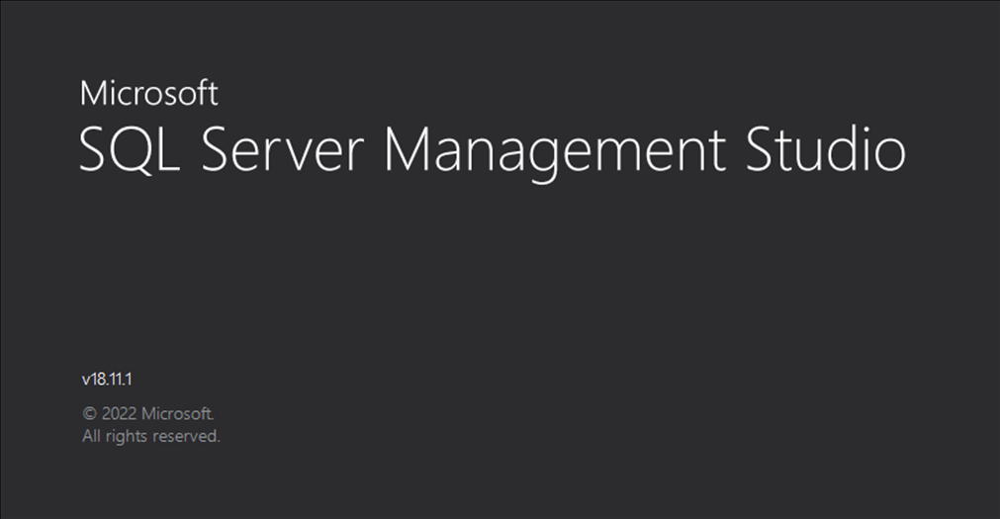
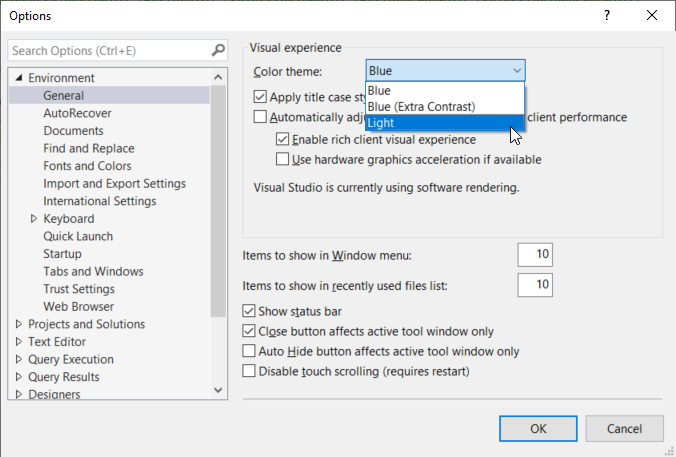
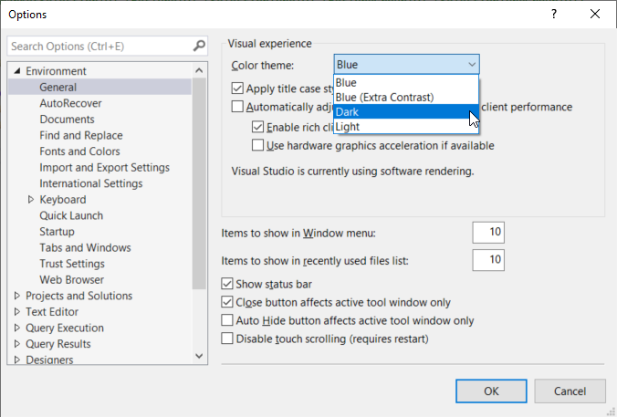
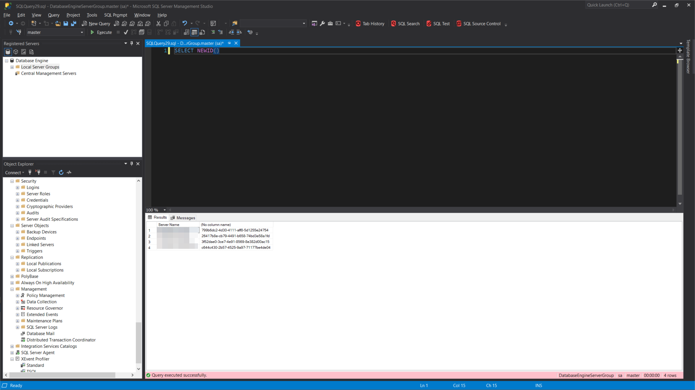

## 前言

我們先來看看兩張圖：

第一張是 SQL Server Management Studio 18 的啟動畫面。



再來是它的設定視窗中，關於主題選擇的部份。



咦!?不給深色模式是想亮瞎我的眼睛嗎!?

好啦，其實呢，SMSS 還是有內建深色主題的，只是被封印起來了(可能還在內部測試的階段)。

這篇文章就來分享怎麼把它解封印。

<!--truncate-->

## 編輯 ssms.pkgundef 設定檔

這個設定檔預設位於 `C:\Program Files (x86)\Microsoft SQL Server Management Studio 18\Common7\IDE` 這個資料夾下。

:::note 小提醒
編輯前請記得先關閉 SQL Server Management Studio 喔!!
:::

只需要以系統管理者身份執行文字編輯器，開啟資料夾中的 ssms.pkgundef 檔，並且搜尋 `Remove Dark theme` 這個關鍵字應該就能找到相關的設定。

接著只需要把 Remove Dark theme 下面那行註解掉就行了。

```diff title="sms.pkgundef"
// Remove Dark theme
-[$RootKey$\Themes\{1ded0138-47ce-435e-84ef-9ec1f439b749}]
+//[$RootKey$\Themes\{1ded0138-47ce-435e-84ef-9ec1f439b749}]
```

修改完存檔之後，再開啟 SMSS，再看看主題下拉選單--深色主題回來了!!



這才是顧目睭的配色啊!!

美中不足的是，目前就算套用深色主題了，會以深色模式顯示的部份還是不如 Visual Studio 那麼全面。

舉例來說，查詢結果表格、已註冊的伺服器、物件總管以及樣版瀏覽器等等視窗或面版都還是白色的底色。



只能希望微軟官方趕快調整完，早日放出正式版囉。
