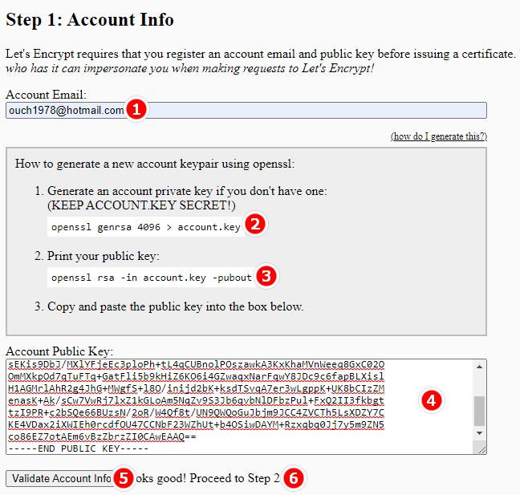
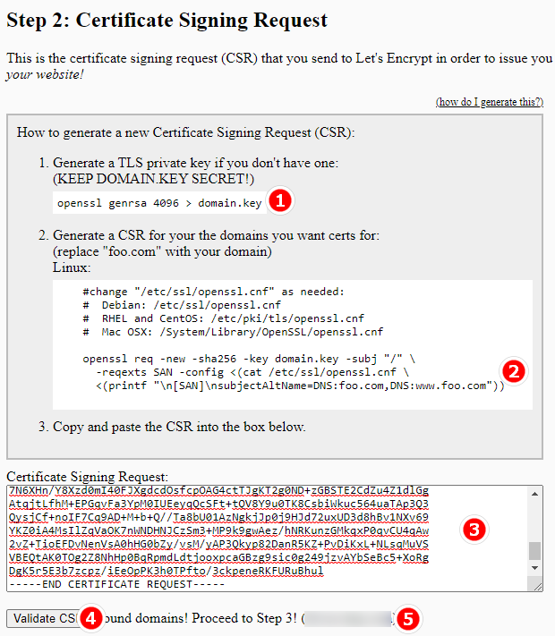
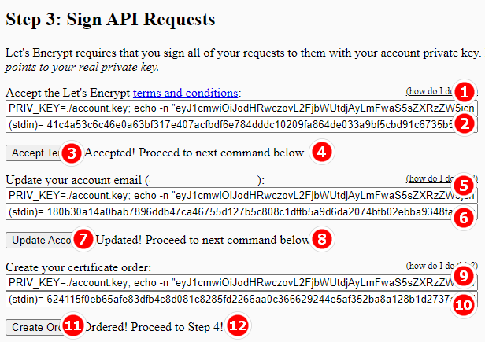
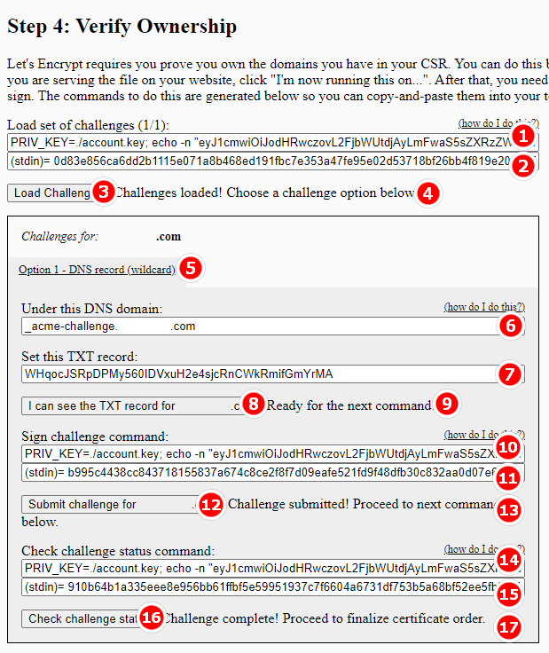
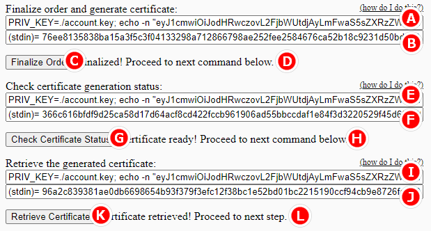

## 前言

雖然 Let's Encrypt 官方提供 ACME 等等工具讓我們能自助產生免費的憑證，甚至可以自動更新憑證，不過對於非宅宅來說，要產出一隻憑證還是蠻麻煩的。

可能為了能吸收不方便使用 ACME 等等工具的族群，越來越多號稱免費產生 HTTPS 憑證的網站也如雨後春筍般的一個一個冒出來。

但是，在號稱免費的背後，其實大部份還是要收費的。(不然他們要賺什麼呢?)

例如我之前覺得還蠻方便的 [ZeroSSL](https://zerossl.com) 這個網站，免費的使用者就只能產三次憑證(renew 也算一次)，超過就得付費。

那有沒有真的不用錢，又不限制憑證數量的網站呢?

有喔!!這篇文章就來跟大家分享~

<!--truncate-->

## 免費取得 HTTPS

自從踩到 ZeroSSL 三次免費憑證的雷之後，我就開始尋找其它非 ACME 的解決方案，後來找到了這個網站：

<https://gethttpsforfree.com/>

基本上，它的原理也是透過 Let's Encrypt 來產生憑證，但是它把整個過程都透過同一個網頁呈現出來。

我們只需要在自己的電腦跟著它上面列的五大步驟一步一步照著作，就可以產出 HTTPS 憑證了。

下面就依照五大步驟，加上相關工具的事先準備加以說明：

### 步驟 0：環境準備

要在電腦上執行申請憑證的相關指令，必需先作好以下準備：

1. 一個可以聯絡到網域所有人的 Email 帳號。

2. 可以執行 openssl 的環境，建議使用 Linux 系列的作業系統。

3. 可以登入到網域管理介面(例如 GoDaddy)的帳號。

準備好上述三樣，就可以一步一步往下作囉!!

:::tip 小提示
接下來幾個步驟的指令都可以透過點擊 <https://gethttpsforfree.com/> 中每個步驟的 `(how do I generate this?)` 連結來顯示說明。
本文為了方便操作，把每個步驟的指令一次收錄。
:::

### 步驟 1：產生公鑰

首先，在網頁的 Account Email 欄位中輸入你的 Email 帳號<sup>①</sup>。

接著在 Console 中輸入下列指令<sup>②</sup>：

```sh
openssl genrsa 4096 > account.key
```

接著輸入<sup>③</sup>

```sh
openssl rsa -in account.key -pubout
```

然後把上述指令回傳的 `-----BEGIN PUBLIC KEY-----` 到 `-----END PUBLIC KEY-----`內容複製貼上到網頁的 Account Public Key 欄位中<sup>④</sup>，按下 <kbd>Validate Account Info</kbd> 按鈕<sup>⑤</sup>。

如果看到 `Looks good! Proceed to Step 2!` 這個訊息<sup>⑥</sup>，就可以繼續作步驟 2 囉。



### 步驟 2：發送憑證簽章請求

在 Console 中輸入<sup>①</sup>：

```sh
openssl genrsa 4096 > domain.key
```

接著輸入<sup>②</sup>：

```sh
openssl req -new -sha256 -key domain.key -subj "/" \
    -reqexts SAN -config <(cat /etc/ssl/openssl.cnf \
    <(printf "\n[SAN]\nsubjectAltName=DNS:ouch1978.tw"))
```

:::tip 小提示
請務必把上面指令中 DNS: 後面的值改成你要申請 HTTPS 憑證的網域。
:::

接著一樣把上述指令輸出的部份複製貼上到網頁的 Certificate Signing Request 欄位中<sup>③</sup>，然後按下 <kbd>Validate CSR</kbd> 按鈕<sup>④</sup>。

如果畫面出現 `Found domains! Proceed to Step 3! (你的網域)` 這個訊息<sup>⑤</sup>，就可以繼續往下作步驟 3 囉。



### 步驟 3：簽署 API 請求

把網頁上 Accept the Let's Encrypt terms and conditions 欄位中的內容複製下來，貼到 Console 中執行<sup>①</sup>。

接著把上述指令回傳的 (stdin)= .... 一整串貼回網頁下方的空白欄位<sup>②</sup>，然後按下 <kbd>Accept Terms</kbd> 按鈕<sup>③</sup>。

如果畫面上顯示 `Accepted! Proceed to next command below.` 的訊息<sup>④</sup>，就可以接著複製 Update your account email 欄位中的指令到 Console 中執行<sup>⑤</sup>。

再來一樣把回傳的 (stdin)= .... 一整串貼回網頁下方的空白欄位<sup>⑥</sup>，然後按下 <kbd>Update Account</kbd> 按鈕<sup>⑦</sup>。

如果畫面上顯示 `Updated! Proceed to next command below.` 的訊息<sup>⑧</sup>，就可以接著複製 Create your certificate order 欄位中的指令到 Console 中繼續執行<sup>⑨</sup>。

接著一樣把回傳的 (stdin)= .... 一整串貼回網頁下方的空白欄位<sup>⑩</sup>，然後按下 <kbd>Create Order</kbd> 按鈕<sup>⑪</sup>。

如果畫面上顯示 `Ordered! Proceed to Step 4!`<sup>⑫</sup>，就可以往第 4 步前進囉!!



### 步驟 4：驗證網域所有權

步驟 4 應該算是整個流程裡面相對比較複雜一點點的部份，要在這個步驟驗證你是否為網域的持有者。

首先，一樣複製 Load set of challenges 中的內容到 Console 中執行<sup>①</sup>。

再來把回傳的 (stdin)= .... 一整串貼回網頁下方的空白欄位<sup>②</sup>，然後按下 <kbd>Load Challenges</kbd> 按鈕<sup>③</sup>。

如果畫面上顯示 `Challenges loaded! Choose a challenge option below.`<sup>④</sup>，就可以繼續下一步。

再來有三條路可以選擇：

1. Option 1 - python server：在伺服器上透過 python 指令驗證網域所有權。

2. Option 2 - file-based：上傳檔案到網站下驗證網域所有權。

3. Option 3 - DNS record<sup>⑤</sup>：在網域管理後台中加入一組 DNS 記錄以驗證網域所有權。

在這邊我會比較建議使用第三種方法，這樣不需要在伺服器已經準備好的狀況下就能驗證。

在網域管理後台中加入一個名稱為 Under this DNS domain 欄位中內容的 TXT 記錄<sup>⑥</sup>，值為 Set this TXT record 欄位中的內容<sup>⑦</sup>。

然後按下 <kbd>I can see the TXT record for [你的網域]</kbd> 按鈕<sup>⑧</sup>。

如果出現 `Ready for the next command!` 訊息的話<sup>⑨</sup>，就可以繼續往下。

接著把 Sign challenge command 欄位中的內容複製貼到上 Console 中執行<sup>⑩</sup>，然後一樣把回傳的 (stdin)= .... 一整串貼回網頁下方的空白欄位<sup>⑪</sup>，再按下
<kbd>Submit challenge for [你的網域]</kbd> 按鈕<sup>⑫</sup>。

如果沒意外的話，畫面應該會出現 `Challenge submitted! Proceed to next command below.` 這個訊息<sup>⑬</sup>。

把 Check challenge status command 的內容複製貼上到 Console 中執行<sup>⑭</sup>，貼回 (stdin)= ... 的內容<sup>⑮</sup>，然後按下 <kbd>Check challenge status</kbd> 按鈕<sup>⑯</sup>。

畫面應該會出現 `Challenge complete! Proceed to finalize certificate order.`<sup>⑰</sup>，快結束了~



把 Finalize order and generate certificate 欄位中的內容貼到 Console 中執行<sup>Ⓐ</sup>，再貼回 (stdin)= ... 的內容<sup>Ⓑ</sup>、按下 <kbd>Finalize Order</kbd> 按鈕<sup>Ⓒ</sup>。

畫面如果出現 `Finalized! Proceed to next command below.`<sup>Ⓓ</sup>，就快大功告成囉~

再把 Check certificate generation status 中的內容貼到 Console 中執行<sup>Ⓔ</sup>、貼回 (stdin)= ... 的內容<sup>Ⓕ</sup>、按下 <kbd>Check certificate Status</kbd> 按鈕<sup>Ⓖ</sup>。

等畫面出現 `Certificate ready! Proceed to next command below.` <sup>Ⓗ</sup>這個訊息再繼續下一步。

將 Retrieve the generated certificate 欄位中的內容貼到 Console 中執行<sup>Ⓘ</sup>、貼回 (stdin)= ... 的內容<sup>Ⓙ</sup>、按下 <kbd>Retrieve Certificate</kbd> 按鈕<sup>Ⓚ</sup>。

如果看到 `Certificate retrieved! Proceed to next step.` 這個訊息<sup>Ⓛ</sup>，那恭禧，憑證已經生出來囉!!



### 步驟 5：安裝憑證

最後，只需要把 Signed Certificate Chain 欄位中第一組 `-----BEGIN CERTIFICATE-----` 到 `-----END CERTIFICATE-----` 的內容另存成 domain.crt 檔。

接著把第二組 `-----BEGIN CERTIFICATE-----` 到 `-----END CERTIFICATE-----` 的內容另存成 intermediate.pem 檔。

再加上先前透過指令產生的 domain.key 檔，就可以拿這三個檔到你的網站伺服器中安裝囉~

## 後記

目前透過 <https://gethttpsforfree.com/> 所產出的憑證效期都是三個月，如果到期的話就只要回來再整個流程重新跑一次即可。

雖然步驟是多了點，不過真的很無腦。

以上。
