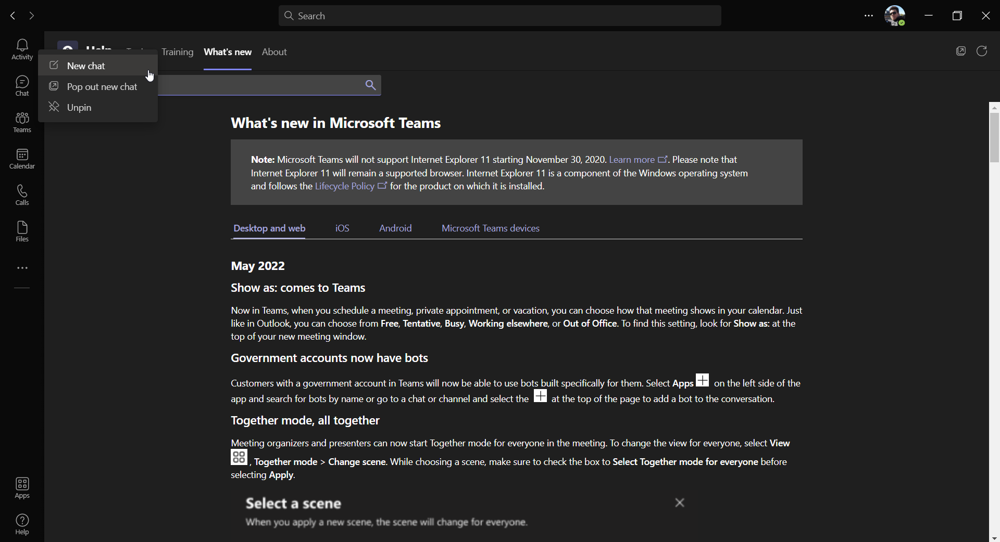
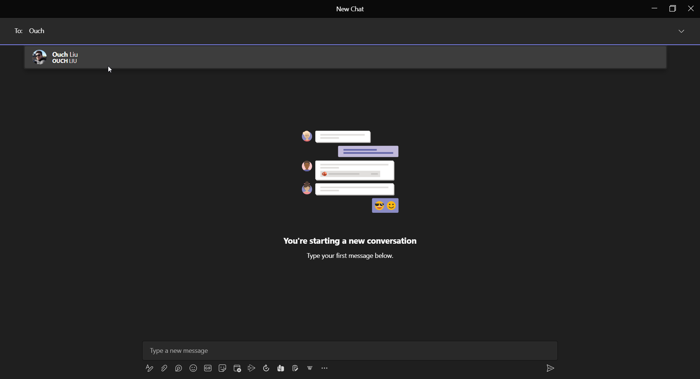
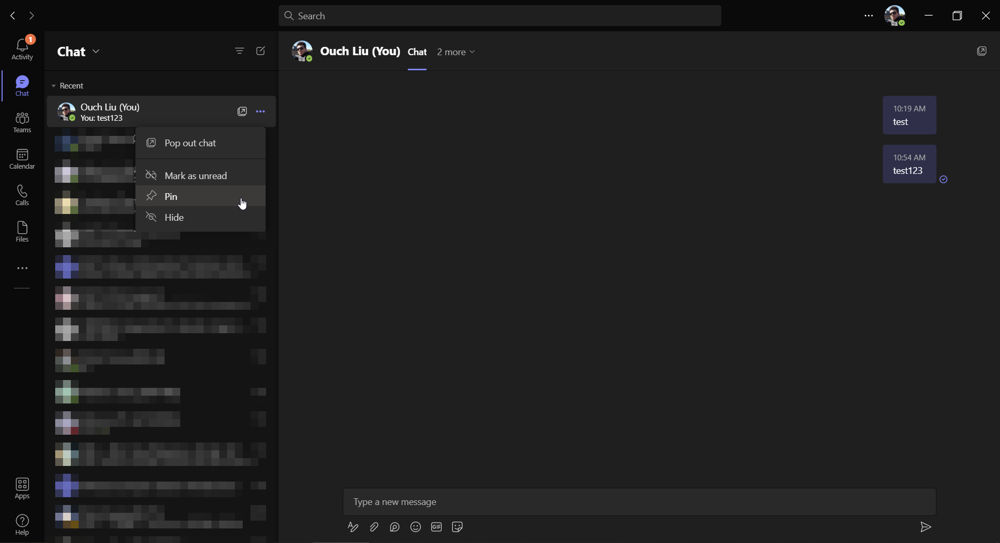
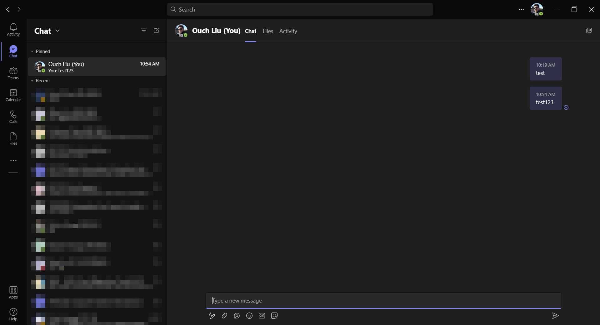

## 前言

對於需要使用 Microsoft Teams 作為主要即時通訊軟體的朋友來說，如果能有一個只有自己看得到的群組，可以用來存放一些筆記或是檔案的話應該是很方便的功能。

不過微軟一直到 2021 年的 Ignite 大會才宣佈會在 Microsoft Teams 裡面增加這個功能，然後到今年的六月才正式發佈。

雖然有點 Lag 了，不過還是來跟大家分享一下用法吧!!~

<!--truncate-->

## 設定方式

在登入 Microsoft Teams 之後，請在左邊工具列的 `Chat` 按鈕上按下滑鼠右鍵，接著點選 `New chat` 或是 `Pop out new chat`。

接著在上面的 `To:` 欄位中輸入自己的名字。

之後就可以跟自己聊天啦!!(咦!?)

## 避免被洗版的小技巧 - 釘選

如果擔心訊息很快就被洗掉的話，也可以使用釘選的功能讓對話保持在最上面喔!!

釘選之後對話就會就被出現在已釘選區自動置頂啦!!

以上。
