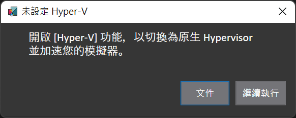
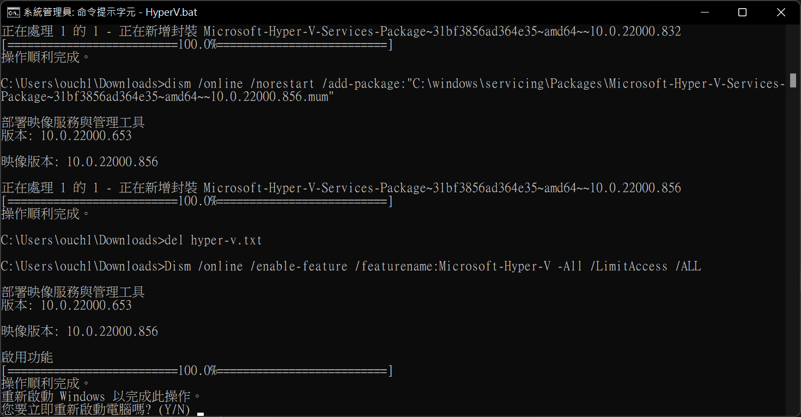
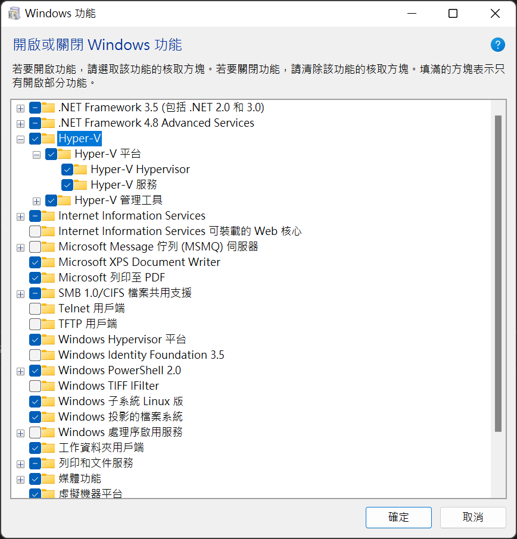

## 前言

目前市售的套裝電腦或是筆電，大多隨附的 Windows 版本都是家用版，也就是不內建 Hyper-V 的版本。

但是身為一個工程師宅宅，沒有 Hyper-V 就會覺得不舒服，寫起程式來也覺得渾身不對勁~~(大誤)~~。

像是看到下面這個視窗，叫我怎麼受得了啊!?



所以，這篇就來分享如何在 Windows 11 家用版中加入並且啟用 Hyper-V。

<!--truncate-->

## 步驟

只需要簡單的三個步驟，就可以為 Windows 11 家用版解除 Hyper-V 的封印喔!!

### 步驟一：建立自動執行檔

請挑選一個用起來順手的文字編輯器來建立一個自動執行檔，內容如下；並且為它取一個你喜歡的名字，例如 EnableHyper-V.bat。

```shell title=EnableHyper-V.bat
pushd "%~dp0"
dir /b %SystemRoot%\servicing\Packages\*Hyper-V*.mum >hyper-v.txt
for /f %%i in ('findstr /i . hyper-v.txt 2^>nul') do dism /online /norestart /add-package:"%SystemRoot%\servicing\Packages\%%i"
del hyper-v.txt
Dism /online /enable-feature /featurename:Microsoft-Hyper-V -All /LimitAccess /ALL
pause
```

### 步驟二：以系統管理員身份執行自動執行檔

直接在剛剛新增的自動執行檔上按下滑鼠右鍵，選擇`以系統管理員身份執行`。

接著讓子彈飛一回兒，整個過程可能會需要花到十分鐘左右。

### 步驟三：重新開機以完成安裝程序

等所有指令都執行完畢之後，會出現是否要重新啟動電腦的訊息。



請將該存檔的檔案都存一存，然後按下鍵盤的 <kbd>Y</kbd> 鈕，等待電腦重新啟動。

## 驗收

Hyper-V 回來了~


