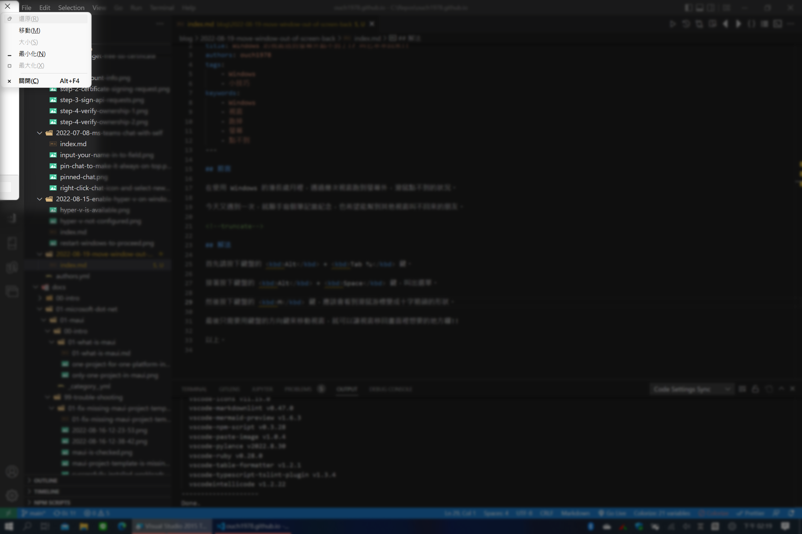
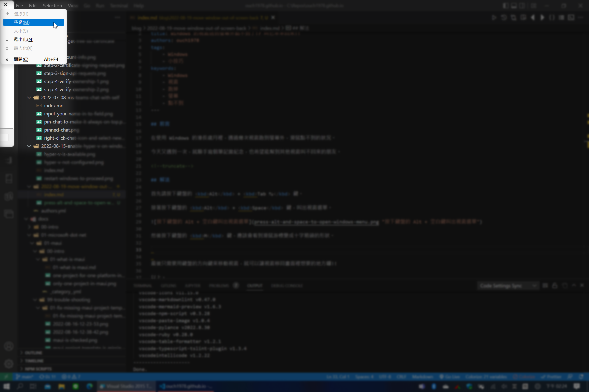
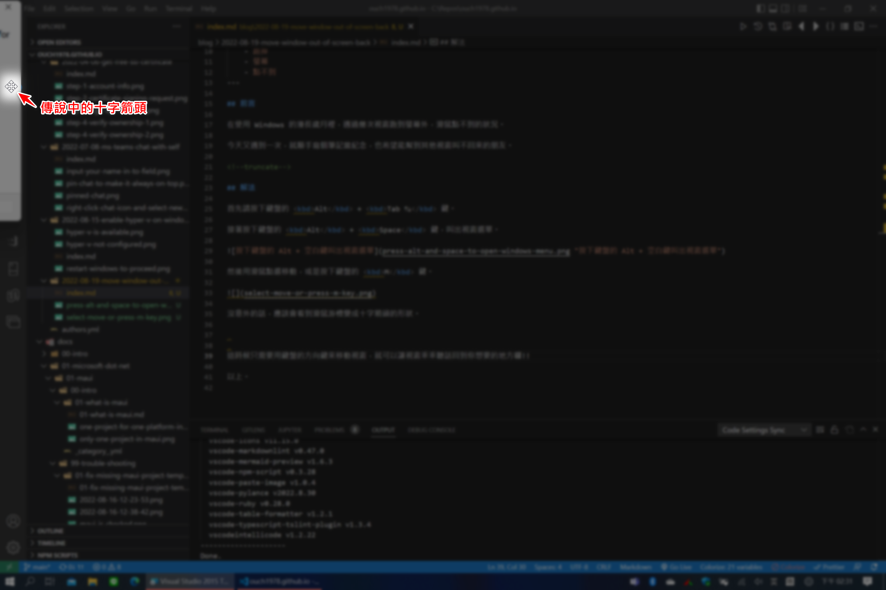

## 前言

在使用 Windows 的漫長歲月裡，遇過幾次視窗跑到螢幕外，滑鼠點不到的狀況。

今天又遇到一次，就順手寫個筆記當紀念，也希望能幫到其他視窗叫不回來的朋友。

<!--truncate-->

## 解法

首先請按下鍵盤的 <kbd>Alt</kbd> + <kbd>Tab ↹</kbd> 鍵，切換到跑出螢幕外的程式。

接著按下鍵盤的 <kbd>Alt</kbd> + <kbd>Space</kbd> 鍵，叫出視窗選單。

然後用滑鼠點選移動，或是按下鍵盤的 <kbd>M</kbd> 鍵。

沒意外的話，應該會看到滑鼠游標變成十字箭頭的形狀。

這時候只需要用鍵盤的方向鍵來移動視窗，就可以讓視窗乖乖聽話回到你想要的地方囉!!

以上。
