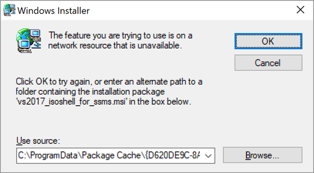
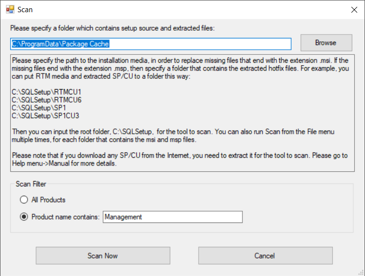
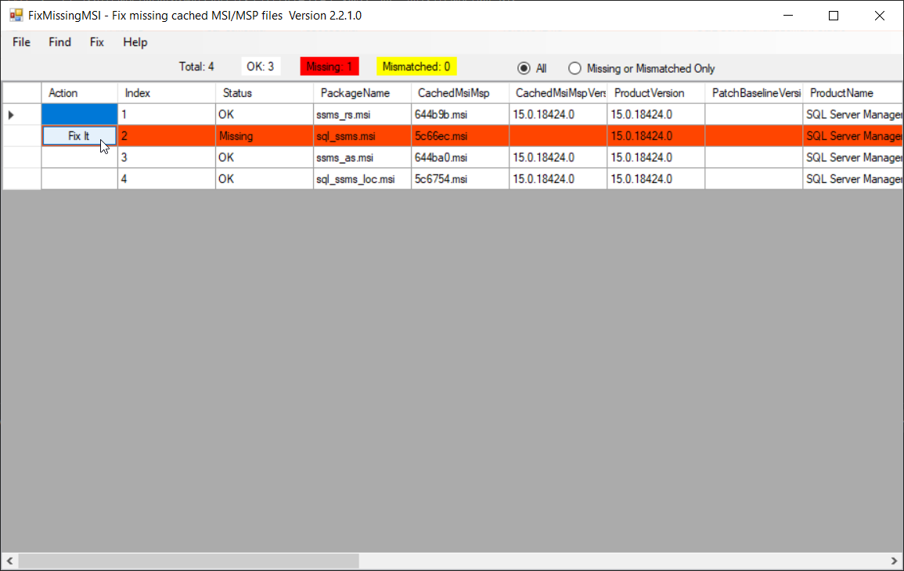

## 前言

最近在更新 SQL Server Management Studio 的時候，裝到一半突然跳出找不到 sql_smss.msi 的的訊息。

本來以為是因為舊的安裝咬住了什麼，但是就連把舊的版本反安裝了，還是會出現一樣的問題。

除了正規的反安裝之外，不管我直接刪檔案、刪登錄檔，也都無濟於事。

這篇就來記錄一下我解決的方法。

<!--truncate-->

## 症狀

我明明要安裝的是 SMSS 18.12 (Build 15.0.18420.0)，但是它一直要我給它 SMSS 18.9 (Build 15.0.18382.0) 的 sql_smss.msi。

錯誤訊息大概就像上圖，但是我遇到的狀況是不只找不到 sql_smss.msi，還有 sql_ssms_loc.msi 和 SsmsPostInstall.msi。

總之就是一直要我指定對的資料夾給它，但是我翻遍了整個硬碟，就是找不到它要的版本。

稍微研究了一下，原來是 Windows Installer 在安裝軟體的時候，會把安裝包快取在 C:\ProgramData\Package Cache 資料夾下。

然後之後有需要用到的時候，就會再到裡面去找。

可能是在安裝的過程中偵測到有安裝過舊的版本，所以會需要舊版的 msi 檔來進行移除，再安裝新的版本。

## 解法

這邊分享兩個我試過的解法，理論上應該都是可行的。

### 重新安裝指定的版本

因為它一直跟我要 15.0.18382.0 這個版本的 sql_smss.msi，所以我就到 [舊版SSMS](https://docs.microsoft.com/zh-tw/sql/ssms/release-notes-ssms?view=sql-server-ver16#previous-ssms-releases "舊版 SSMS") 的下載連結頁面去下載 SMSS 18.9 版。

下載回來之後，先安裝 18.9 版，然後再安裝 18.12 版，就成功了。

### 透過 Fix Missing MSI 工具修復

在我進行 Trouble Shooting 的過程中，爬文找到另一個工具 [Fix Missing MSI](https://github.com/suyouquan/SQLSetupTools/releases/ "Fix Missing MSI")，它可以幫我們掃描系統裡面有沒有什麼丟失的 .msi 檔，然後幫我們找回來。

下載解壓縮並且執行之後，開啟 `FixMissingMSI.exe`，然後輸入目標資料夾和要檢查的套件名稱。

以我的例子來說，資料夾是 `C:\ProgramData\Package Cache` ， Product name contains 則輸入 `Management`，如下圖：

接著按下 `Scan Now` 按鈕，就會開始進行掃描。

如果有掃到有缺少的安裝包，則可以按下 `Fix It` 按鈕進行修復。

然後它就會把遺失的東西裝起來。

## 後記

這個問題應該不太容易遇到，所以用 `sql_smss.msi missing` 這個關鍵字去搜尋也不太找得到解法。

雖然花了不少時間才解決，不過， SMSS 回來了就好。
