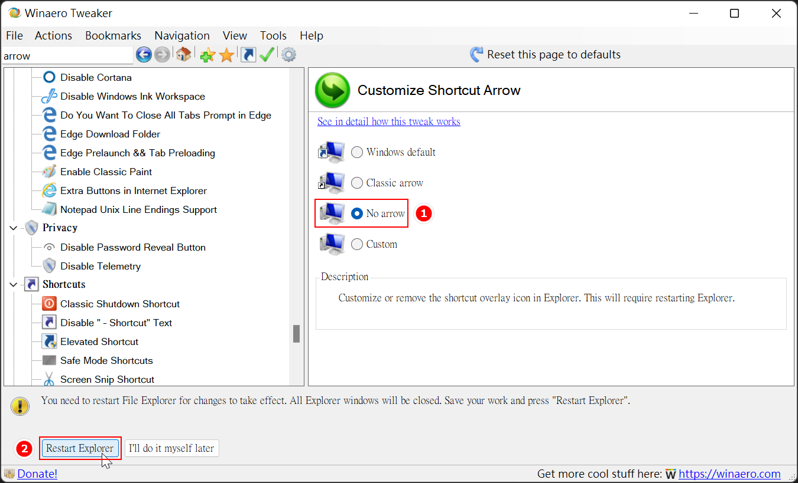

## 前言

每次重灌 Windows 時或是拿到新電腦時，對於桌面捷徑上的小箭頭圖示一直都很反感，每次都要先消滅那些箭頭才會覺得可以繼續工作。

不過，有的時候照著網路上的作法可能當下有效，重新開機或是過沒多久那個可惡的箭頭就又復活了。

特別來寫一篇文章來記錄一下我目前試過最有效的方法。

<!--truncate-->

## 去去，箭頭走

廢話不多說，來消滅箭頭吧!!

### 透過手動的方式修改登錄檔

網路上比較常見的作法應該是把透過調整登錄檔，把圖示改成 Windows 內建在 shell32.dll 中的空白圖示(`%windir%\System32\shell32.dll,-50`)。

但是我實測過幾台電腦之後，發現這個方法在某些不明的狀況下會失效。

比較有效的方法是直接把它改成實體的空白圖示檔，作法如下：

1. 請先按滑鼠右鍵另存新檔下載 [移除捷徑箭頭壓縮包](移除捷徑箭頭.zip "移除捷徑箭頭壓縮包")，然後解壓縮。

2. 把解壓縮之後的空白圖示(`blank.ico`)放到 C:\Windows 下，確保完整路徑為 `C:\Windows\blank.ico`。

   :::tip 小提示
   如果空白圖示儲存的位置不是 C:\Windows 的話，請自行調整移除捷徑箭頭登錄檔的內容，將路徑和檔名調整為修改後的值。
   :::

3. 以滑鼠雙擊執行 `移除捷徑箭頭.reg`。

4. 按下鍵盤的 <kbd>Ctrl</kbd> + <kbd>Shift</kbd> + <kbd>Esc</kbd> 叫出工作管理員，並且重新啟動檔案總管。

   

如果要還原這個設定，讓箭頭回來的話，只需要雙擊執行 `還原捷徑箭頭.reg` ，然後一樣重新啟動檔案總管即可。

### 透過現成的 Windows 調整小工具

網路上應該能找到不少用來移除捷徑箭頭的小工具。

不過我比較習慣使用的是 [Winaero Tweaker](https://winaerotweaker.com/download/ "下載 Winaero Tweaker") ，它除了移除箭頭小圖示之外，還有不少其它的功能。

下載安裝之後，開啟它的執行檔，會先出現使用者授權提示畫面，這邊就直接按下同意就好。

接著在搜尋框中輸入 `arrow`，就可以快速找到修改捷徑箭頭的功能，然後以滑鼠雙擊 'Shortcuts \Shortcut Arrow'。

接著依序點選 'No Arrow' 和左下角的 'Restart Explorer'，就大功告成啦!!

## 碎碎唸

相信應該會有不少人跟我一樣不喜歡那個箭頭，所以才會有不只一種可以把它移除的工具出現。

不過，我也不懂為什麼微軟一直要把這個功能留著，而且不把它改成是可以設定的選項，如果有朋友知道原因的話，不妨在下面留言跟大家分享一下。

還有還有，如果有朋友有找到更簡單的方法的話，也請不吝跟大家分享喔!!
