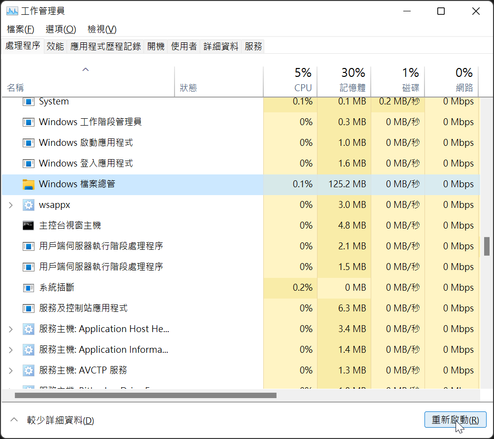
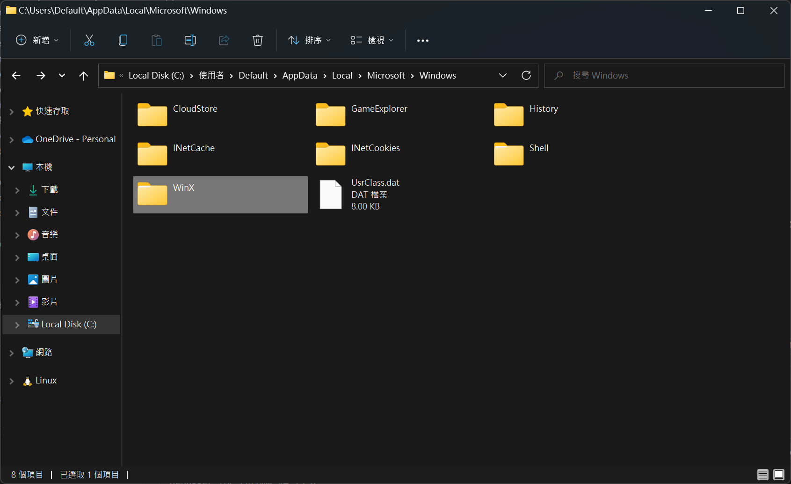
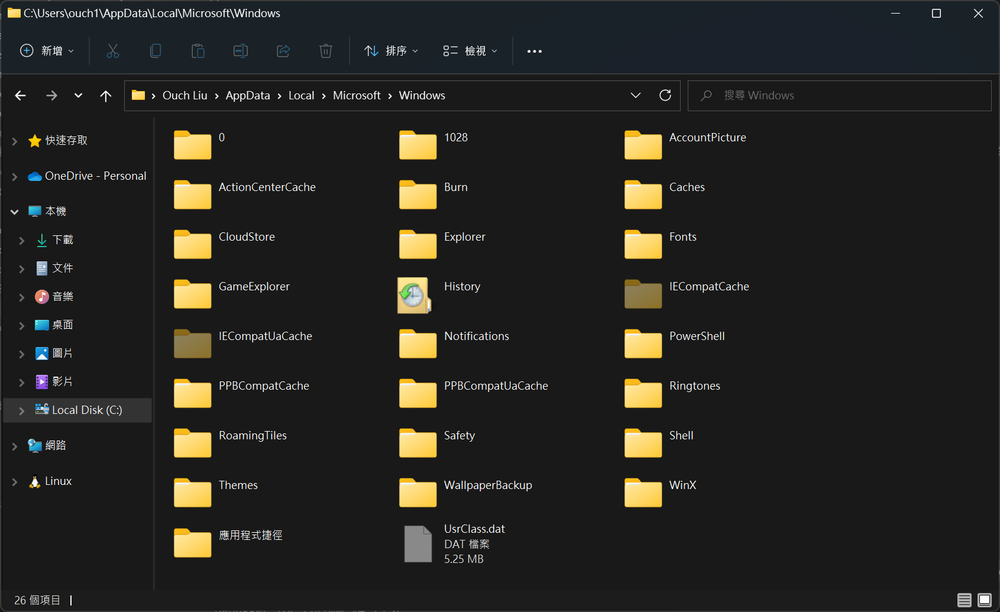

## 前言

昨天安裝了 Windows 11 更新重新開機之後，用著用著，就覺得哪裡怪怪的，在開始功能表上按下右鍵時完全沒有反應。

本來以為是滑鼠右鍵壞了，但是在桌面上或是檔案總管按滑鼠右鍵又可以正常叫出右鍵選單。

上網 Google 了一下，發現原來我並不孤單，還有不少人也遇過相同的狀況。

參考了一下別人的解法，一個一個試，總算讓我在試到第三個方法的時候成功把它救回來了。

這邊就來紀錄一下我試過的方法有哪些。

<!--truncate-->

## 解決過程

先說結論，結果我是一直作到 [方法三：透過登錄檔修復](#方法三透過登錄檔修復) 才成功解決的。

遇到相同狀況的朋友，不妨直接試第三個方法，看看能不能一次就解決。

以下就依照我試過的方法先後順序分享。

### 方法一：重啟檔案總管

按下鍵盤的 <kbd>Ctrl</kbd> + <kbd>Shift</kbd> + <kbd>Esc</kbd> 叫出工作管理員，點選左下角的更多詳細資料之後，找到檔案總管並且按下右下角的`重新啟動`按鈕。

嗯... 沒效!! 下面一位~

### 方法二：複製 WinX 資料夾

複製 `C:\Users\Default\AppData\Local\Microsoft\Windows\WinX` 資料夾。

然後把複製的內容貼到 `%AppData%\..\Local\Microsoft\Windows\` 下。

然後透過 [方法一](#方法一重啟檔案總管) 的步驟來重啟檔案總管。

嗯... 還是沒效，無三不成禮就對了。

### 方法三：透過登錄檔修復

下載 [修復 Windows 11 開始功能表右鍵選單消失登錄檔壓縮包](./%E4%BF%AE%E5%BE%A9%20Windows%2011%20%E9%96%8B%E5%A7%8B%E5%8A%9F%E8%83%BD%E8%A1%A8%E5%8F%B3%E9%8D%B5%E9%81%B8%E5%96%AE%E6%B6%88%E5%A4%B1%E7%99%BB%E9%8C%84%E6%AA%94.zip "修復 Windows 11 開始功能表右鍵選單消失登錄檔壓縮包") 之後解壓縮。

然後以滑鼠雙擊執行裡面的 `fix-windows-11-missing-context-menu-on-start-button.reg` 檔。

最後再透過 [方法一](#方法一重啟檔案總管) 的步驟來重啟檔案總管。

如果你運氣沒有比我差的話，應該就可以看到開始功能表的右鍵選單回來啦!!
