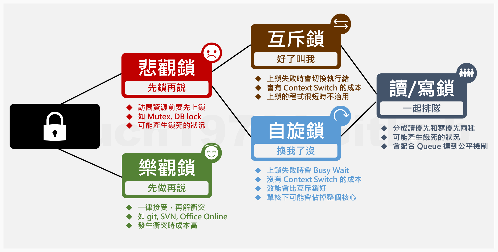

## 前言

在寫程式的世界裡，充斥著各種不同的鎖，不同的鎖適用的情境也有所不同。

不同種類的鎖的特性和使用情境也是面試時常常被拿來當作考題的題目。

這篇文章就簡單的透過一張圖來介紹幾種比較常見的鎖。

<!--truncate-->

## 所以我說，那張圖呢?

下面這張圖就是今天的主角。

## 看圖說故事

### 樂觀鎖

樂觀鎖從字面上來看，它就是很樂觀。(喂!~)

通常它會被用在資源發生衝突的機率很低的情境下，或是就算發生衝突時只要還原成原來的狀態就可以解決的情境。

另一個使用它的要素是上鎖的成本很高，例如每次上鎖的時間都是幾分鐘，甚至幾小時起跳，過程中其它執行緒只能乾等。

當多個執行緒要存取同一個資源時，它會放行所有執行緒，最後再檢查是不是有衝突。

如果真的發生衝突的話就進行回滾(rollback)，放棄這次的操作。

我們常見的 SVN 、 Git 和 O365 的多人共編功能就是使用樂觀鎖的概念實作出來的。

所以大家都可以很開心的一起編輯，很開心的存檔或是 Commit，然後很開心的解衝突。(咦!?)

當然，我們可以選擇花更多的時間解決衝突，或是放棄努力好幾個小時的成果，這就是使用樂觀鎖可能增加的成本。

### 悲觀鎖

悲觀鎖的悲觀指的是：資源有很大的機會同時被多個執行緒存取，所以要透過上鎖的機制來確保資料的正確性。

在使用上需要特別注意，每次上鎖的時間越短越好，否則會造成極大的資源浪費。

大家可以試著想像看看：

一個有著十個人的開發團隊，一起撰寫同一個專案，但是同時只允許一個人進行開發。

一旦有一個人 check out 程式碼，其他人就不能對整份程式碼進行任何修改，直到程式碼被 check in ，交出存取權為止。

如果有人忘記交出存取權，其他人就只能一直乾等，那將會是多可怕的一件事啊~(~~開心，大家都可以回家啦!!~~)

#### 互斥鎖

互斥鎖就是我們常看到的 Mutex。

最常見的用法就是在多執行緒中避免兩個執行緒同時存取同一個資源。

和自旋鎖的差別是，當執行緒遇到上鎖的物件時，它會進行 Sleep Waiting，等到鎖被釋放通知它之後才繼續存取的動作。

#### 自旋鎖

自旋鎖的特色是當執行緒遇到上鎖的物件時，它會進行 Busy Waiting，不斷反覆的去詢問鎖釋放了沒，直到它可以存取為止。

由於自旋鎖會不斷的去做詢問的動作，所以會比互斥所更快獲取下一次存取物件的機會(效能相對好)。

但是隨之而來的副作用是：和互斥鎖相比，自旋鎖會佔用相對多的 CPU 資源。

而且，自旋鎖在 CPU 只有單核單緒的情況下是無法發揮作用的(整顆 CPU 的執行緒都被它整碗端走了啊~~)。

:::tip 小提示
如果能保證每次上鎖的時間很短的情境下，使用自旋鎖的效能會比使用互斥鎖來得好。
:::

#### 讀/寫鎖

顧名思義，讀/寫鎖分為讀鎖和寫鎖兩種。

更精準的說，應該分為`讀優先鎖`和`寫優先鎖`。

為了確保資料的正確性，寫鎖通常會確保同時只有一個執行緒可以修改資料(獨佔鎖)。

寫優先鎖會讓寫入的動作完成之後，才讓讀取的動作進行，以確保讀取時都是讀取到最新的資料。

讀取的動作在物件沒被上鎖時，則會允許多個執行緒同時讀取它(共享鎖)，因為大家讀到的資料都一樣，沒有先後的問題。

讀優先鎖則是會儘可能讓多個執行緒讀取的動作先作完，再放行寫入的動作。

大多數情境下的讀/寫鎖也都會藉由實作互斥鎖或是自旋鎖來實現。

## 結語

本來只想放一張圖就好的，但是還是忍不住寫了一大堆字。

關於執行緒餓死和鎖死的原理就先跳過不說了。

如果有覺得應該要被加在圖裡的鎖或是希望補充的內容，也歡迎提供建議喔!!
