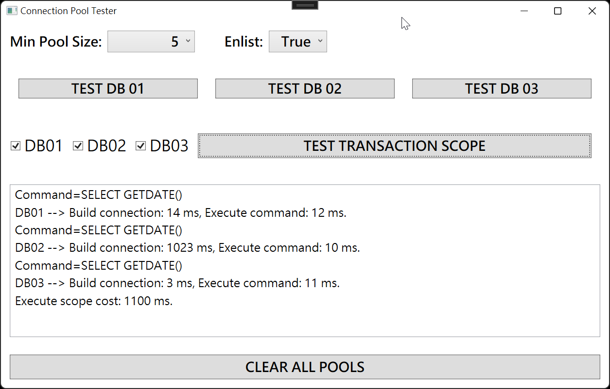

## 前言

之前有同事跑來問我，為什麼我們的 ASP.NET WebAPI 閒置一段時間之後，被呼叫的第一個 API 呼叫都會因為超時而失敗?

(這裡指的超時是呼叫端設定了兩秒沒收到回應就會直接當作超時處理)

而且很有趣的是，當把 Load Balancer 後面的伺服器移到只剩一台的時候，這個問題就不會發生。

一旦掛上兩台以上的機器，比較不那麼忙的那台就很容易重現這個問題。

當下我一開始很直覺的認為，應該是系統沒有作好預載(Preload)的動作，導致 Application Pool 被回收之後重啟的過程花費太多時間。

但是人生往往不是這麼簡單，在我們對系統加上預載相關設定之後，隔一段時間的第一個 API 呼叫都還是會超時。

經過一番抽絲剝繭之後，才發現原來真兇是 MSDTC…

<!--truncate-->

## 問題重現與驗證

當初還有一個很有趣的現象，只要系統閒置大約十分鐘左右，這個問題就會重現。

所以看起來更不像是因為沒做預載造成的問題。

所以我用 WPF 寫了一個小測試程式(這樣就可以證明不是因為沒有預載造成的)，情境如下：

1. 在一個 Transaction Scope 裡面使用同一個 SQL Server Instance 裡三個不同的資料庫，用不同順序的排列組合去連它們。

2. 連上資料庫之後只執行簡單的 `SELECT GETDATE()` 指令。

3. 觀察和每個資料庫進行連線所花費的時間以及執行命令所花費的時間。

4. 程式開著放十分鐘以上，再測一輪。

而我得到的結論是：

不管是哪種排列組合，在連到第一顆資料庫的時候都很快，只會花費十幾毫秒。

但是當在建立和第二顆資料庫的連線時就會花費很長的時間，甚至可能長到超過兩千毫秒以上，在連第三顆的時候又很快，通常也在十毫秒之內。

第一輪執行完畢之後如果馬上執行第二輪的話，在 Transaction Scope 裡使用這三顆資料庫的任意排列組合，都還是可以很快的跑完。

但是一旦放了超過十分鐘，就會再慢一次。

有興趣的話也不妨在自己的電腦試看看是不是和我看到的結果是一致的。

## 魔鬼藏在細節裡

經過一番驗證之後，確認是因為在連到第二顆資料庫時，系統會多一個判斷是否要將交易提升為分散式交易的動作。

:::note 註記
在 SQL Server 2008 之前的版本，只要是 Transaction Scope 包含一條以上的資料庫連線，系統就會把它判定為分散式交易。
但是從 SQL Server 2008 之後，要連到一個以上的資料庫才會被判定為分散式交易。
:::

如果是分散式交易，MSDTC Client 就會去確認是否有現成的連線可用，如果沒有，就會重新建立連線。

就是這個聽起來很簡單的小動作，造成建立連線的時間比平常多了 100 倍以上。

### 關於那神秘的十分鐘呢?

為了找出到底為什麼是十分鐘這件事，還真的花了不少時間和心力。

除了用各種相關的關鍵字問 Google 大神之外，也請教了台灣微軟的技術客服。

錄封包、DTC Ping 這些招式也都搬出來了，可是還是看不出個所以然。

後來因為當時有一個應急措施可以避免這個問題，我就沒把它放心上了。

直到某一天我心血來潮，想說再查看看有沒有相關的資料，總算讓我找到一篇微軟的 KB 備份。

裡面提到一個關鍵：

> 交易管理器預設每`六秒`會檢查一次連線狀態，如果連續`一百次`得到的狀態都是閒置的，就會將連線關閉。

這不就是那神秘的十分鐘嗎!?

那份 KB 裡面也提到`六秒`和`一百次`這兩個預設值的改法。

## 所以我說，那個解法是什麼?

又過了一段時間之後，收到微軟的技術客服的來信，信裡的建議和我當初看到的 KB 備份提到的修改方法一模一樣。

果然原廠還是原廠啊!!

解決的方法如下：

在所有的 Application Server 中都新增下列登錄機碼：

機碼 Key： `HKLM\SOFTWARE\Microsoft\MSDTC`

名稱： `CmMaxIdlePings`

型別： `REG_DWORD`

數值： `0xFFFFFFFF`

在所有的 SQL Server 中都新增下列登錄機碼：

機碼 Key： `HKLM\CLUSTER\Resources\<MSDTC resource GUID>\MSDTCPRIVATE\MSDTC`

名稱： `CmMaxIdlePings`

型別： `REG_DWORD`

數值： `0xFFFFFFFF`

修改完畢之後記得要重新啟動 Server，然後之後的 MSDTC 連線一旦建立起來就再也不會被關掉了。

:::note 註記
1. 這邊使用的改法是去修改那個一百次，讓它一直檢查下去。
2. 不建議修改六秒 (`CmPingFreqSecs`) 的值，因為根據微軟的說法，更改它可能會造成 DTC 不穩定。
:::

### 關於那傳說中的 KB 備份

那篇的編號是 `KB197810`，不過現在應該已經屍骨無存了。

不過還好[這邊](https://www.betaarchive.com/wiki/index.php/Microsoft_KB_Archive/197810 "Microsoft KB Archive/197810")有它的備份。

## 後記

人家當初是為了縮短連線被佔用的時間以及降低重複檢查連線狀態所消耗的資源，才把時間從十小時縮短到十分鐘。

KB 的內容也是教我們怎麼把時間縮到更短，沒想到我們卻想把它拉長。

還是早點擺脫用 Transaction Scope 達到分散式交易的目的，才不用老是在通靈或是改這些登錄機碼。

另外，十七年前的 KB，真的是時代的眼淚啊~~
