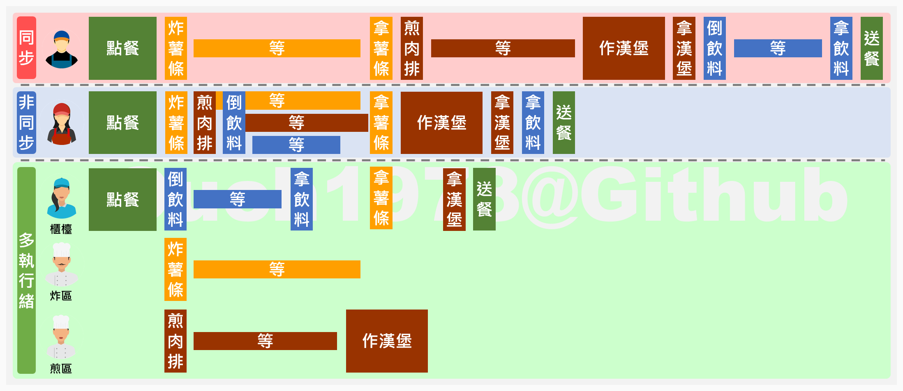

## 前言

同步、非同步和多執行緒的差別常常是面試的必考題之一。

應該也有很多人不只看過、用過，甚至已經寫到用起來像吃飯喝水一樣的自然。

但是，當遇到有人要求用比較淺顯易懂的方式來解釋這三者的差別時，我敢說，有很多人就是講不出來。

我幾乎敢這樣講，但我也不敢完全否認，還是有些人可以回答得出來。(喂!~)

<!--truncate-->

## 所以，我說那張圖呢?

這邊就以常見的速食店當例子，來說明同步、非同步和多執行緒的差異。

:::tip 小提示
1. 可以把店員看作是執行緒，就可以和程式運作的方式互相對應。
2. 倒飲料、炸薯條和煎肉排等等動作可以對應到程式中需要等待 I/O 的各種動作。
:::

### 同步

同步的運作方式應該是最常見的程式運作方式。

從圖裡我們可以看到，當店員作了一個動作之後，一定得要等到該動作完成、取得回應之後，才能繼續下一個動作。

在這樣的運作方式下，會花極大的時間在空轉和等待上。

所以在大部份的同步處理下，效率都是相對差的。

### 非同步

非同步和同步最大的差別，就是店員不用傻傻的等待上一個動作完成，就可以開始去處理下一個動作。

等到前面的工作完成，他再繼續往後處理就好。

從圖裡可以明顯的看得出來，非同步和同步相比，雖然都是只有一個店員，但是整個出餐速度快了許多。

也因為等待的時間還可以處理其它工作的關係，真正閒置的時間也大幅的縮短。

所以都在單一員工的情況下，非同步的效率是相對高的。

:::warning 警告
非同步並不會多生出一個執行緒!! 
非同步並不會多生出一個執行緒!! 
非同步並不會多生出一個執行緒!! 

很重要，所以要說三次。
:::

### 多執行緒

多執行緒最接近現實生活中快餐店的運作方式。

由一個櫃檯負責點餐和收集所有餐點，其它工作則由其他的人負責，而且三個人都是同時平行處理的。

在大多數的正常情況下，多執行緒的效率會是三者裡面最好的。

不過，在店員越多的情況下，溝通的成本就越高，一個人出錯就可能影響到整個出餐的流程。

使用多執行緒時也一樣，執行緒越多，Context switch 的成本也越高，對協調各執行緒的要求就越嚴格，各執行緒的容錯率也越低。

在現實生活中的速食店裡，也常常可以看到當店裡一忙起來之後，有人開始介入其他人的工作，接著就整個場面開始大亂，有打工過的朋友應該很能體會。

:::tip 小提示
上面的圖很刻意的避開資源共用的問題，但是在現實的程式裡面，解決各資源之間的衝突也是很重要的一環。
:::

## 結語

希望這篇文章可以幫助到已經用到麻木，但是還想不出一個簡單解釋這三者的朋友。

尤其是需要面試的朋友，總不能回面試官再問就是居心叵測，畢竟機會可能只有一次，晚了人家就不要了。(逃~~)
