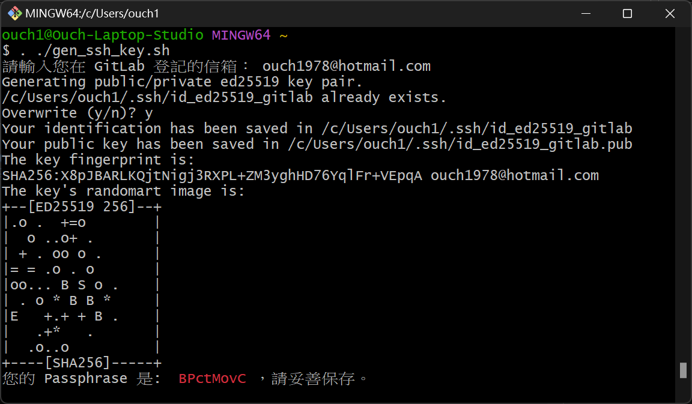
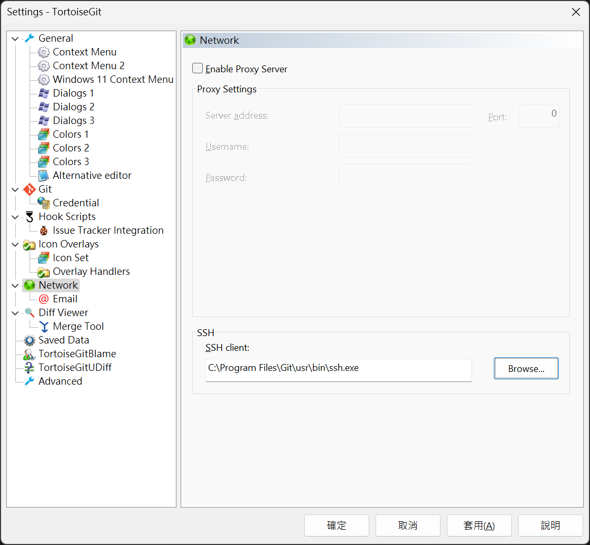
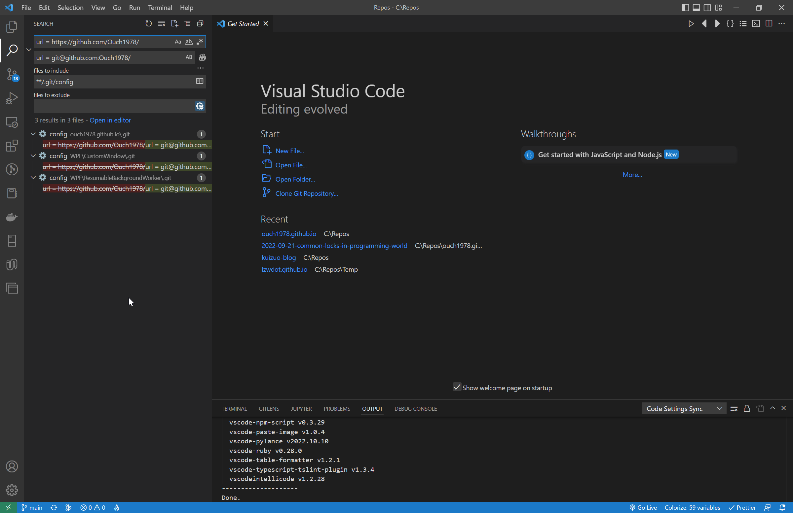

## 前言

雖然說 Git 一直以來都支援 HTTPS 和 SSH 這兩種通訊協定，不過近年來不論是 GitHub 還是 GitLab 都建議使用 SSH 來存取 Repository。

這篇文章就分享一下在 Windows 上快速設定使用 SSH 存取 GitLab Repository 的方法。

<!--truncate-->

## 事前準備

在繼續之前，請先確認電腦已經安裝好下列工具：

1. Git for Windows (建議使用預設安裝，包含 Git Bash 和 SSH 等工具)。
2. VSCode 或是 NotePad++ 等文字檔編輯工具(用來批次把原來使用 HTTPS 通訊協定的 Repo 改成使用 SSH)。

另外，請把 GitLab 的 URL、你的 Email、可以存取 API 的 Personal Access Token 先記在方便取用的文字檔或是剪貼簿裡。

## 廢話不多說，開工

接著，請照下面步驟操作(大部份指令都可以直接照抄就好)。

### 透過 SSH-Keygen 產出公鑰和私鑰

:::warning 警告
1. 有些人會建議不要設定金鑰的 Passphrase，免得之後每次都要輸入，但是其實我們可以透過 SSH Agent 來解決這個問題。
基於安全性考量，這邊還是建議大家不要省略這個重要的步驟，畢竟我們還是不會希望金鑰被別人拿去使用。
2. 這邊為了方便，會自動產生 Passphrase，請各位複製之後妥善保存，或是使用自己喜歡的密碼。
:::

我寫了一個 Script 可以直接在 Git Bash 裡執行，內容如下：

```bash title="gen_ssh_key.sh"
#!/bin/bash
#產生 Passphrase 並且存入環境變數
export MY_PASSPHRASE=$(< /dev/urandom tr -dc _A-Z-a-z-0-9 | head -c8)

#輸入你在 GitLab 中使用的 Email
read -p '請輸入您在 GitLab 登記的信箱： ' email

#產出公、私鑰
ssh-keygen -t ed25519 -N $MY_PASSPHRASE -C $email -f ~/.ssh/id_ed25519_gitlab

echo -e "您的 Passphrase 是: ${RED} $MY_PASSPHRASE ${NC}，請妥善保存。"
```

直接把上述內容儲存到 %USERPROFILE% 資料夾下，然後在 Git Bash 中輸入 `. ./gen_ssh_key.sh` 執行即可。

執行結果如下圖：


### 透過 SSH Agent 管理金鑰

接著的指令一樣接著在 Git Bash 中執行：

```bash
#將金鑰交給 SSH Agent 託管
ssh-agent bash
ssh-add "C:\\Users\\$USERNAME/.ssh/id_ed25519_gitlab"
```

詢問 Passphrase 的時候，直接輸入上一個步驟產出的 Passphrase 就行了。

再以系統管理員的身份開啟 PowerShell，輸入下列指令：

```powershell
Get-Service ssh-agent | Set-Service -StartupType Automatic -PassThru | Start-Service
ssh-agent
cd $env:USERPROFILE\.ssh
ssh-add .\id_ed25519_gitlab
git config --global core.sshCommand C:\\Windows\\System32\\OpenSSH\\ssh.exe
```

### 將公鑰設定到 GitLab

這邊我一樣準備了一個 Script 在 Git Bash 裡執行：

```bash title="set_ssh_key_to_gitlab.sh"
#!/bin/bash
#輸入 GitLab 的網址
read -p '請輸入 GitLab 的網址： ' gitlab_url

#輸 GitLab 的 Personal Access Token
read -p '請輸入您的 Personal Access Token： ' personal_access_token

#讀取 id_ed25519_gitlab 的內容
key=$(cat ~/.ssh/id_ed25519_gitlab.pub)

#透過 CURL 將公鑰上傳到 GitLab
curl -X POST -F "private_token=$personal_access_token" -F "title=MY_SSH_KEY" -F "key=$key" "$gitlab_url/api/v4/user/keys"
```

直接把上述內容儲存到 %USERPROFILE% 資料夾下，然後在 Git Bash 中輸入 `. ./set_ssh_key_to_gitlab.sh` 執行即可。

:::tip 小提醒
需依據 GitLab 的版本調整使用的 API 版本，如果使用的 GitLab 為 9.5 版之前的版本請改用 v3 取代 v4。
:::

### 設定 SSH Config

一樣在 Git Bash 中繼續執行下列指令：

```bash
   nano ~/.ssh/config
```

加入下面的內容來告訴 SSH 在連線到哪些主機的時候要使用哪個金鑰：

```txt title="~/.ssh/config"
Host gitlab.ouch1978.com
   HostName gitlab.ouch1978.com
   AddKeysToAgent yes
   PreferredAuthentications publickey
   User git
   IdentityFile ~/.ssh/id_ed25519_gitlab
```

:::tip 小提示
1. 請務必依照你的環境和需求調整 `Host` 和 `HostName` 這兩個值。
2. 關於詳細調整的方式可以參考 [Alan Tsai](https://blog.alantsai.net/about) 的 [文章](https://blog.alantsai.net/posts/2016/03/ssh-config-ssh-agent-passphrase-management "如何用config管理多個網站的ssh key和如何不用每一組輸入ssh的Pass Phrase") 裡面 `config 的 alias作用` 一節。
:::

### 驗收

可以先到 GitLab 看看 SSH Key 是否已經正確的被加入。

再使用命令提示字元、Git Client 和 IDE 試著 Clone 專案看看，如果都成功就大功告成囉!!

## 疑難排解

### TortoiseGit 顯示 No supported authentication methods available(sever sent: publickey) 錯誤

將預設的 SSH Client 改為 Git 的 SSH Client (路徑為：`C:\Windows\System32\OpenSSH\ssh.exe`)即可，如下圖：



### Visual Studio 顯示 fatal: detected dubious ownership in repository

在 PowerShell 中輸入：

```powershell
git config --global --add safe.directory '*'
```

## 額外收錄

### 怎麼把原先透過 HTTPS 存取的 Repo 改為用 SSH?

直接在 Repo 的資料夾下指令更改 remote 的 URL 即可，例如：

```bash
git remote set-url origin git@gitlab.ouch1978.com:pocs/dotnetcoretest.git
```

### 如果已經有一堆透過 HTTPS 存取的 Repo 呢?

:::tip 小提示
.git 資料夾在 VSCode 中預設是會被隱藏起來的，比較習慣使用 NotePad++ 的朋友可以考慮使用 NotePad ++ 修改。
或是參考[在 VSCode 裡顯示隱藏的資料夾和檔案](./../2022-10-10-show-hidden-items-in-vscode/index.md) 這篇文章來調整 VSCode 的設定。
:::

直接以 VSCode 開啟所有 Repo 的根目錄，然後透過搜尋所有 `.git/config` 檔，然後取代 url 的值，如下圖：



## 參考資料

- [如何用config管理多個網站的ssh key和如何不用每一組輸入ssh的Pass Phrase](https://blog.alantsai.net/posts/2016/03/ssh-config-ssh-agent-passphrase-management "如何用config管理多個網站的ssh key和如何不用每一組輸入ssh的Pass Phrase")

- [10 Ways to Generate a Random Password from the Linux Command Line](https://www.howtogeek.com/howto/30184/10-ways-to-generate-a-random-password-from-the-command-line/ "10 Ways to Generate a Random Password from the Linux Command Line")

- [HTTPS vs SSH in git](https://ourtechroom.com/tech/https-vs-ssh-in-git/ "HTTPS vs SSH in git")
